[TOC]

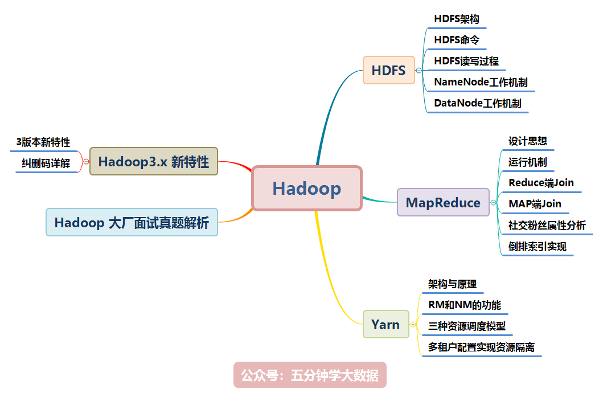

# 一、HDFS

## 1. HDFS概述

Hadoop 分布式系统框架中，首要的基础功能就是文件系统，在 Hadoop 中使用 FileSystem 这个抽象类来表示我们的文件系统，这个抽象类下面有很多子实现类，究竟使用哪一种，需要看我们具体的实现类，在我们实际工作中，用到的最多的就是HDFS(分布式文件系统)以及LocalFileSystem(本地文件系统)了。

在现代的企业环境中，单机容量往往无法存储大量数据，需要跨机器存储。统一管理分布在集群上的文件系统称为**分布式文件系统**。

HDFS（Hadoop  Distributed  File  System）是 Hadoop 项目的一个子项目。是 Hadoop 的核心组件之一，  Hadoop 非常适于存储大型数据 (比如 TB 和 PB)，其就是使用 HDFS 作为存储系统. HDFS 使用多台计算机存储文件，并且提供统一的访问接口，像是访问一个普通文件系统一样使用分布式文件系统。

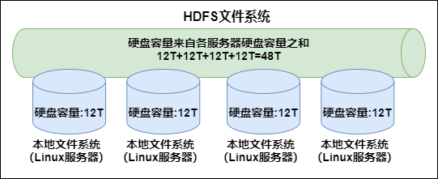

## 2. HDFS架构


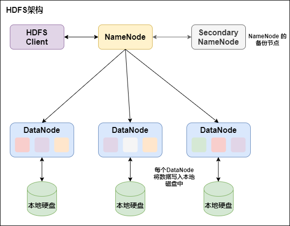

HDFS是一个主/从（Mater/Slave）体系结构，由三部分组成：**NameNode** 和 **DataNode** 以及 **SecondaryNamenode**：

- NameNode 负责管理整个**文件系统的元数据**，以及每一个路径（文件）所对应的数据块信息。
- DataNode 负责管理用户的**文件数据块**，每一个数据块都可以在多个 DataNode 上存储多个副本，默认为3个。
- Secondary NameNode 用来监控 HDFS 状态的辅助后台程序，每隔一段时间获取 HDFS 元数据的快照。最主要作用是**辅助 NameNode 管理元数据信息**。


## 3. HDFS的特性

首先，它是一个文件系统，用于存储文件，通过统一的命名空间目录树来定位文件；

其次，它是分布式的，由很多服务器联合起来实现其功能，集群中的服务器有各自的角色。

**1. master/slave 架构**（主从架构）

> HDFS 采用 master/slave 架构。一般一个 HDFS 集群是有一个 Namenode 和一定数目的 Datanode 组成。Namenode 是 HDFS 集群主节点，Datanode 是 HDFS 集群从节点，两种角色各司其职，共同协调完成分布式的文件存储服务。

**2. 分块存储**

> HDFS 中的文件在物理上是分块存储（block）的，块的大小可以通过配置参数来规定，默认大小在 hadoop2.x 版本中是 128M。

**3. 名字空间（NameSpace）**

> HDFS 支持传统的层次型文件组织结构。用户或者应用程序可以创建目录，然后将文件保存在这些目录里。文件系统名字空间的层次结构和大多数现有的文件系统类似：用户可以创建、删除、移动或重命名文件。
> Namenode 负责维护文件系统的名字空间，任何对文件系统名字空间或属性的修改都将被 Namenode 记录下来。
> HDFS 会给客户端提供一个统一的抽象目录树，客户端通过路径来访问文件，形如：hdfs://namenode:port/dir-a/dir-b/dir-c/file.data。

**4. NameNode 元数据管理**

> 我们把目录结构及文件分块位置信息叫做元数据。NameNode 负责维护整个 HDFS 文件系统的目录树结构，以及每一个文件所对应的 block 块信息（block 的 id，及所在的 DataNode 服务器）。

**5. DataNode 数据存储**

> 文件的各个 block 的具体存储管理由 DataNode 节点承担。每一个 block 都可以在多个 DataNode 上。DataNode 需要定时向 NameNode 汇报自己持有的 block 信息。存储多个副本（副本数量也可以通过参数设置 dfs.replication，默认是 3）

**6. 副本机制**

> 为了容错，文件的所有 block 都会有副本。每个文件的 block 大小和副本系数都是可配置的。应用程序可以指定某个文件的副本数目。副本系数可以在文件创建的时候指定，也可以在之后改变。

**7. 一次写入，多次读出**

> HDFS 是设计成适应一次写入，多次读出的场景，且不支持文件的修改。正因为如此，HDFS 适合用来做大数据分析的底层存储服务，并不适合用来做网盘等应用，因为修改不方便，延迟大，网络开销大，成本太高。

## 4. HDFS 的命令行使用

> 如果没有配置 hadoop 的环境变量，则在 hadoop 的安装目录下的bin目录中执行以下命令，如已配置 hadoop 环境变量，则可在任意目录下执行

help

```
格式:  hdfs dfs -help 操作命令
作用: 查看某一个操作命令的参数信息
```

ls

```
格式：hdfs dfs -ls  URI
作用：类似于Linux的ls命令，显示文件列表
```

lsr

```
格式  :   hdfs  dfs -lsr URI
作用  : 在整个目录下递归执行ls, 与UNIX中的ls-R类似
```

mkdir

```
格式 ：hdfs  dfs  -mkdir [-p] <paths>
作用 :   以<paths>中的URI作为参数，创建目录。使用-p参数可以递归创建目录
```

put

```
格式   ：hdfs dfs -put <localsrc >  ... <dst>
作用 ：  将单个的源文件src或者多个源文件srcs从本地文件系统拷贝到目标文件系统中（<dst>对应的路径）。也可以从标准输入中读取输入，写入目标文件系统中
hdfs dfs -put  /rooot/bigdata.txt  /dir1
```

moveFromLocal

```
格式：hdfs  dfs -moveFromLocal  <localsrc>   <dst>
作用:  和put命令类似，但是源文件localsrc拷贝之后自身被删除
hdfs  dfs -moveFromLocal  /root/bigdata.txt  /
```

copyFromLocal

```
格式:  hdfs dfs -copyFromLocal <localsrc> ... <dst>
作用: 从本地文件系统中拷贝文件到hdfs路径去
```

appendToFile

```
格式: hdfs dfs -appendToFile <localsrc> ... <dst>
作用: 追加一个或者多个文件到hdfs指定文件中.也可以从命令行读取输入.
 hdfs dfs -appendToFile  a.xml b.xml  /big.xml
```

moveToLocal

```
在 hadoop 2.6.4 版本测试还未未实现此方法
格式：hadoop  dfs  -moveToLocal [-crc] <src> <dst>
作用：将本地文件剪切到 HDFS
```

get

```
格式   hdfs dfs  -get [-ignorecrc ]  [-crc]  <src> <localdst>

作用：将文件拷贝到本地文件系统。CRC 校验失败的文件通过-ignorecrc选项拷贝。 文件和CRC校验可以通过-CRC选项拷贝
hdfs dfs  -get   /bigdata.txt  /export/servers
```

getmerge

```
格式: hdfs dfs -getmerge <src> <localdst>
作用: 合并下载多个文件，比如hdfs的目录 /aaa/下有多个文件:log.1, log.2,log.3,...
```

copyToLocal

```
格式:  hdfs dfs -copyToLocal <src> ... <localdst>
作用:  从hdfs拷贝到本地
```

mv

```
格式  ：hdfs  dfs -mv URI   <dest>
作用： 将hdfs上的文件从原路径移动到目标路径（移动之后文件删除），该命令不能跨文件系统
hdfs  dfs  -mv  /dir1/bigdata.txt   /dir2
```

rm

```
格式：hdfs dfs -rm [-r] 【-skipTrash】 URI 【URI 。。。】
作用： 删除参数指定的文件，参数可以有多个。  此命令只删除文件和非空目录。
如果指定-skipTrash选项，那么在回收站可用的情况下，该选项将跳过回收站而直接删除文件；
否则，在回收站可用时，在HDFS Shell 中执行此命令，会将文件暂时放到回收站中。
hdfs  dfs  -rm  -r  /dir1
```

cp

```
格式: hdfs  dfs  -cp URI [URI ...] <dest>
作用： 将文件拷贝到目标路径中。如果<dest>  为目录的话，可以将多个文件拷贝到该目录下。
-f
选项将覆盖目标，如果它已经存在。
-p
选项将保留文件属性（时间戳、所有权、许可、ACL、XAttr）。
hdfs dfs -cp /dir1/a.txt  /dir2/bigdata.txt
```

cat

```
hdfs dfs  -cat  URI [uri  ...]
作用：将参数所指示的文件内容输出到stdout
hdfs dfs  -cat /bigdata.txt
```

tail

```
格式: hdfs dfs -tail path
作用: 显示一个文件的末尾
```

text

```
格式:hdfs dfs -text path
作用: 以字符形式打印一个文件的内容
```

chmod

```
格式:hdfs  dfs  -chmod  [-R]  URI[URI  ...]
作用：改变文件权限。如果使用  -R 选项，则对整个目录有效递归执行。使用这一命令的用户必须是文件的所属用户，或者超级用户。
hdfs dfs -chmod -R 777 /bigdata.txt
```

chown

```
格式:  hdfs  dfs  -chmod  [-R]  URI[URI ...]
作用：  改变文件的所属用户和用户组。如果使用  -R 选项，则对整个目录有效递归执行。使用这一命令的用户必须是文件的所属用户，或者超级用户。
hdfs  dfs  -chown  -R hadoop:hadoop  /bigdata.txt
```

df

```
格式: hdfs dfs  -df  -h  path
作用: 统计文件系统的可用空间信息
```

du

```
格式: hdfs dfs -du -s -h path
作用: 统计文件夹的大小信息
```

count

```
格式: hdfs dfs -count path
作用: 统计一个指定目录下的文件节点数量
```

setrep

```
格式:  hdfs dfs -setrep num filePath
作用: 设置hdfs中文件的副本数量
注意: 即使设置的超过了datanode的数量,副本的数量也最多只能和datanode的数量是一致的
```

expunge (慎用)

```
格式:  hdfs dfs  -expunge
作用: 清空hdfs垃圾桶 
```

## 5. hdfs的高级使用命令

### 5.1 HDFS文件限额配置

在多人共用HDFS的环境下，配置设置非常重要。特别是在 Hadoop 处理大量资料的环境，如果没有配额管理，很容易把所有的空间用完造成别人无法存取。**HDFS 的配额设定是针对目录而不是针对账号，可以让每个账号仅操作某一个目录，然后对目录设置配置**。

HDFS 文件的限额配置允许我们以文件个数，或者文件大小来限制我们在某个目录下上传的文件数量或者文件内容总量，以便达到我们类似百度网盘网盘等限制每个用户允许上传的最大的文件的量。

```
 hdfs dfs -count -q -h /user/root/dir1  #查看配额信息
```

结果：

#### 5.1.1 数量限额

```
hdfs dfs  -mkdir -p /user/root/dir    #创建hdfs文件夹
hdfs dfsadmin -setQuota 2  dir      # 给该文件夹下面设置最多上传两个文件，发现只能上传一个文件
```

------

```
hdfs dfsadmin -clrQuota /user/root/dir  # 清除文件数量限制
```

#### 5.1.2 空间大小限额

在设置空间配额时，设置的空间至少是 block_size * 3 大小

```
hdfs dfsadmin -setSpaceQuota 4k /user/root/dir   # 限制空间大小4KB
hdfs dfs -put  /root/a.txt  /user/root/dir 
```

生成任意大小文件的命令:

```
dd if=/dev/zero of=1.txt  bs=1M count=2     #生成2M的文件
```

清除空间配额限制

```
hdfs dfsadmin -clrSpaceQuota /user/root/dir
```

### 5.2 HDFS 的安全模式

**安全模式是hadoop的一种保护机制，用于保证集群中的数据块的安全性**。当集群启动的时候，会首先进入安全模式。当系统处于安全模式时会检查数据块的完整性。

假设我们设置的副本数（即参数dfs.replication）是3，那么在datanode上就应该有3个副本存在，假设只存在2个副本，那么比例就是2/3=0.666。hdfs默认的副本率0.999。我们的副本率0.666明显小于0.999，因此系统会自动的复制副本到其他dataNode，使得副本率不小于0.999。如果系统中有5个副本，超过我们设定的3个副本，那么系统也会删除多于的2个副本。

**在安全模式状态下，文件系统只接受读数据请求，而不接受删除、修改等变更请求**。在，当整个系统达到安全标准时，HDFS自动离开安全模式。30s

安全模式操作命令

```
    hdfs  dfsadmin  -safemode  get #查看安全模式状态
    hdfs  dfsadmin  -safemode  enter #进入安全模式
    hdfs  dfsadmin  -safemode  leave #离开安全模式
```

## 6. HDFS 的 block 块和副本机制

HDFS 将所有的文件全部抽象成为 block 块来进行存储，不管文件大小，全部一视同仁都是以 block 块的统一大小和形式进行存储，方便我们的分布式文件系统对文件的管理。

所有的文件都是以 block 块的方式存放在 hdfs 文件系统当中，在 Hadoop 1 版本当中，文件的 block 块默认大小是 64M，Hadoop 2 版本当中，文件的 block 块大小默认是128M，block块的大小可以通过 hdfs-site.xml 当中的配置文件进行指定。

```
<property>
    <name>dfs.block.size</name>
    <value>块大小 以字节为单位</value> //只写数值就可以
</property>
```

### 6.1 抽象为block块的好处

- 

- 1. 一个文件有可能大于集群中任意一个磁盘 10T*3/128 = xxx块 2T，2T，2T 文件方式存—–>多个block块，这些block块属于一个文件

- 

- 1. 使用块抽象而不是文件可以简化存储子系统

- 

- 1. 块非常适合用于数据备份进而提供数据容错能力和可用性

### 6.2 块缓存

**通常 DataNode 从磁盘中读取块，但对于访问频繁的文件，其对应的块可能被显示的缓存在 DataNode 的内存中，以堆外块缓存的形式存在**。默认情况下，一个块仅缓存在一个DataNode的内存中，当然可以针对每个文件配置DataNode的数量。**作业调度器通过在缓存块的DataNode上运行任务，可以利用块缓存的优势提高读操作的性能**。

例如：连接（join）操作中使用的一个小的查询表就是块缓存的一个很好的候选。用户或应用通过在缓存池中增加一个cache directive来告诉namenode需要缓存哪些文件及存多久。缓存池（cache pool）是一个拥有管理缓存权限和资源使用的管理性分组。

例如:

一个文件 130M，会被切分成2个block块，保存在两个block块里面，实际占用磁盘130M空间，而不是占用256M的磁盘空间

### 6.3 hdfs的文件权限验证

hdfs的文件权限机制与linux系统的文件权限机制类似

r:read  w:write  x:execute
权限x对于文件表示忽略，对于文件夹表示是否有权限访问其内容

如果linux系统用户zhangsan使用hadoop命令创建一个文件，那么这个文件在HDFS当中的owner就是zhangsan

HDFS文件权限的目的，防止好人做错事，而不是阻止坏人做坏事。HDFS相信你告诉我你是谁，你就是谁

### 6.4 hdfs的副本因子

为了保证block块的安全性，也就是数据的安全性，在hadoop2当中，文件默认保存三个副本，我们可以更改副本数以提高数据的安全性

在hdfs-site.xml当中修改以下配置属性，即可更改文件的副本数

```
<property>
     <name>dfs.replication</name>
     <value>3</value>
</property>
```

## 7. HDFS 文件写入过程（非常重要）

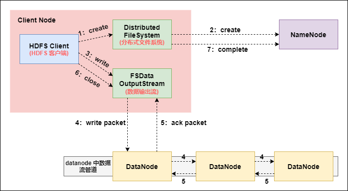

HDFS 文件写入过程

1. Client 发起文件上传请求，通过 RPC 与 NameNode 建立通讯, NameNode 检查目标文件是否已存在，父目录是否存在，返回是否可以上传；
2. Client 请求第一个 block 该传输到哪些 DataNode 服务器上；
3. NameNode 根据配置文件中指定的备份数量及机架感知原理进行文件分配, 返回可用的 DataNode 的地址如：A, B, C；

> Hadoop 在设计时考虑到数据的安全与高效， 数据文件默认在 HDFS 上存放三份， 存储策略为本地一份，同机架内其它某一节点上一份，不同机架的某一节点上一份。

1. Client 请求 3 台 DataNode 中的一台 A 上传数据（本质上是一个 RPC 调用，建立 pipeline ），A 收到请求会继续调用 B，然后 B 调用 C，将整个 pipeline 建立完成， 后逐级返回 client；
2. **Client 开始往 A 上传第一个 block（先从磁盘读取数据放到一个本地内存缓存），以 packet 为单位（默认64K），A 收到一个 packet 就会传给 B，B 传给 C**。A 每传一个 packet 会放入一个应答队列等待应答；
3. 数据被分割成一个个 packet 数据包在 pipeline 上依次传输，在 pipeline 反方向上， 逐个发送 ack（命令正确应答），最终由 pipeline 中第一个 DataNode 节点 A 将 pipelineack 发送给 Client；
4. 当一个 block 传输完成之后，Client 再次请求 NameNode 上传第二个 block，重复步骤 2；

### 7.1 网络拓扑概念

在本地网络中，两个节点被称为“彼此近邻”是什么意思？在海量数据处理中，其主要限制因素是节点之间数据的传输速率——带宽很稀缺。这里的想法是将两个节点间的带宽作为距离的衡量标准。

节点距离：两个节点到达最近的共同祖先的距离总和。

例如，假设有数据中心d1机架r1中的节点n1。该节点可以表示为/d1/r1/n1。利用这种标记，这里给出四种距离描述。

Distance(/d1/r1/n1, /d1/r1/n1)=0（同一节点上的进程）

Distance(/d1/r1/n1, /d1/r1/n2)=2（同一机架上的不同节点）

Distance(/d1/r1/n1, /d1/r3/n2)=4（同一数据中心不同机架上的节点）

Distance(/d1/r1/n1, /d2/r4/n2)=6（不同数据中心的节点）


### 7.2 机架感知（副本节点选择）

1. 低版本Hadoop副本节点选择

第一个副本在client所处的节点上。如果客户端在集群外，随机选一个。

第二个副本和第一个副本位于不相同机架的随机节点上。

第三个副本和第二个副本位于相同机架，节点随机。

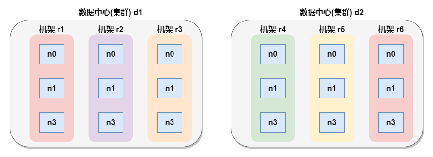


## 8.HDFS 文件读取过程（非常重要）

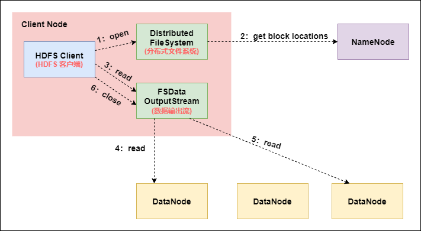

1. Client向NameNode发起RPC请求，来确定请求文件block所在的位置；
2. NameNode会视情况返回文件的部分或者全部block列表，对于每个block，NameNode 都会返回含有该 block 副本的 DataNode 地址； 这些返回的 DN 地址，会按照集群拓扑结构得出 DataNode 与客户端的距离，然后进行排序，排序两个规则：网络拓扑结构中距离 Client 近的排靠前；心跳机制中超时汇报的 DN 状态为 STALE，这样的排靠后；
3. Client 选取排序靠前的 DataNode 来读取 block，如果客户端本身就是DataNode，那么将从本地直接获取数据(短路读取特性)；
4. 底层上本质是建立 Socket Stream（FSDataInputStream），重复的调用父类 DataInputStream 的 read 方法，直到这个块上的数据读取完毕；
5. 当读完列表的 block 后，若文件读取还没有结束，客户端会继续向NameNode 获取下一批的 block 列表；
6. 读取完一个 block 都会进行 checksum 验证，如果读取 DataNode 时出现错误，客户端会通知 NameNode，然后再从下一个拥有该 block 副本的DataNode 继续读。
7. **read 方法是并行的读取 block 信息，不是一块一块的读取**；NameNode 只是返回Client请求包含块的DataNode地址，并不是返回请求块的数据；
8. 最终读取来所有的 block 会合并成一个完整的最终文件。

> 从 HDFS 文件读写过程中，可以看出，HDFS 文件写入时是串行写入的，数据包先发送给节点A，然后节点A发送给B，B在给C；而HDFS文件读取是并行的， 客户端 Client 直接并行读取block所在的节点。

## 9. NameNode 工作机制以及元数据管理（重要）


### 9.1 namenode 与 datanode 启动

- **namenode工作机制**

1. 第一次启动namenode格式化后，创建fsimage和edits文件。如果不是第一次启动，直接加载编辑日志和镜像文件到内存。
2. 客户端对元数据进行增删改的请求。
3. namenode记录操作日志，更新滚动日志。
4. namenode在内存中对数据进行增删改查。

- **secondary namenode**

1. secondary namenode询问 namenode 是否需要 checkpoint。直接带回 namenode 是否检查结果。
2. secondary namenode 请求执行 checkpoint。
3. namenode 滚动正在写的edits日志。
4. 将滚动前的编辑日志和镜像文件拷贝到 secondary namenode。
5. secondary namenode 加载编辑日志和镜像文件到内存，并合并。
6. 生成新的镜像文件 fsimage.chkpoint。
7. 拷贝 fsimage.chkpoint 到 namenode。
8. namenode将 fsimage.chkpoint 重新命名成fsimage。

### 9.2 FSImage与edits详解

所有的元数据信息都保存在了FsImage与Eidts文件当中，这两个文件就记录了所有的数据的元数据信息，元数据信息的保存目录配置在了 **hdfs-site.xml** 当中

```
  <!--fsimage文件存储的路径-->
  <property>
                <name>dfs.namenode.name.dir</name>
                <value>file:///opt/hadoop-2.6.0-cdh5.14.0/hadoopDatas/namenodeDatas</value>
        </property>
        <!-- edits文件存储的路径 -->
  <property>
                <name>dfs.namenode.edits.dir</name>
                <value>file:///opt/hadoop-2.6.0-cdh5.14.0/hadoopDatas/dfs/nn/edits</value>
    </property>
```

客户端对hdfs进行写文件时会首先被记录在edits文件中。

edits修改时元数据也会更新。

每次hdfs更新时edits先更新后客户端才会看到最新信息。

fsimage：是namenode中关于元数据的镜像，一般称为检查点。

一般开始时对namenode的操作都放在edits中，为什么不放在fsimage中呢？

因为fsimage是namenode的完整的镜像，内容很大，如果每次都加载到内存的话生成树状拓扑结构，这是非常耗内存和CPU。

fsimage内容包含了namenode管理下的所有datanode中文件及文件block及block所在的datanode的元数据信息。随着edits内容增大，就需要在一定时间点和fsimage合并。

### 9.3 FSimage文件当中的文件信息查看

- 使用命令 hdfs  oiv

```
cd  /opt/hadoop-2.6.0-cdh5.14.0/hadoopDatas/namenodeDatas/current
hdfs oiv -i fsimage_0000000000000000112 -p XML -o hello.xml
```

### 9.4 edits当中的文件信息查看

- 查看命令 hdfs  oev

```
cd  /opt/hadoop-2.6.0-cdh5.14.0/hadoopDatas/dfs/nn/edits
hdfs oev -i  edits_0000000000000000112-0000000000000000113 -o myedit.xml -p XML
```

### 9.5 secondarynameNode如何辅助管理FSImage与Edits文件

1. secnonaryNN通知NameNode切换editlog。
2. secondaryNN从NameNode中获得FSImage和editlog(通过http方式)。
3. secondaryNN将FSImage载入内存，然后开始合并editlog，合并之后成为新的fsimage。
4. secondaryNN将新的fsimage发回给NameNode。
5. NameNode用新的fsimage替换旧的fsimage。

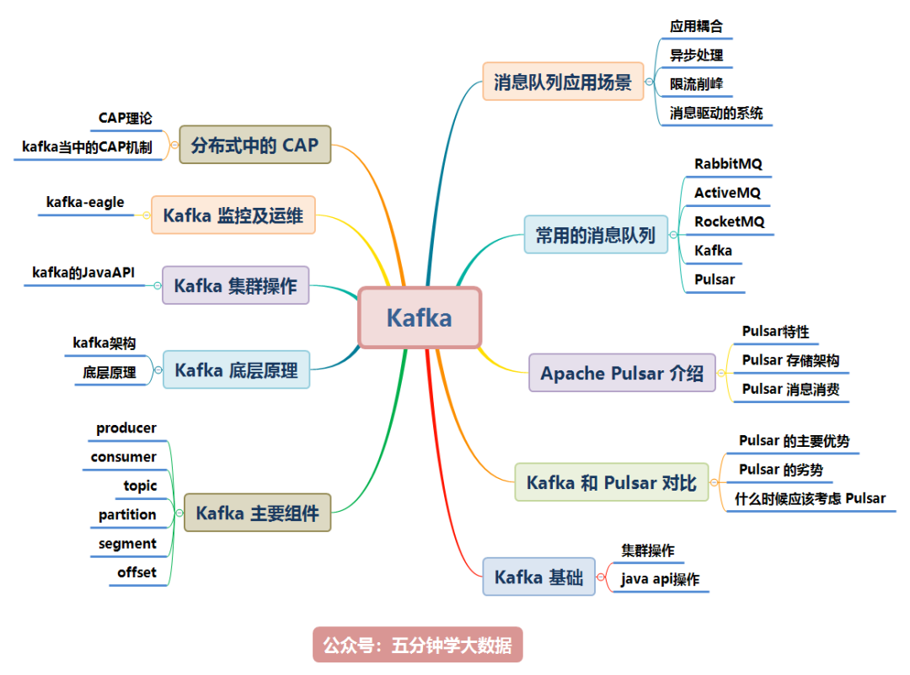

完成合并的是 secondarynamenode，会请求namenode停止使用edits，暂时将新写操作放入一个新的文件中（edits.new)。

secondarynamenode从namenode中**通过http get获得edits**，因为要和fsimage合并，所以也是通过http get 的方式把fsimage加载到内存，然后逐一执行具体对文件系统的操作，与fsimage合并，生成新的fsimage，然后把fsimage发送给namenode，**通过http post的方式**。

namenode从secondarynamenode获得了fsimage后会把原有的fsimage替换为新的fsimage，把edits.new变成edits。同时会更新fsimage。

hadoop进入安全模式时需要管理员使用dfsadmin的save namespace来创建新的检查点。

secondarynamenode在合并edits和fsimage时需要消耗的内存和namenode差不多，所以一般把namenode和secondarynamenode放在不同的机器上。

fsimage与edits的合并时机取决于两个参数，第一个参数是默认1小时fsimage与edits合并一次。

- 第一个参数：时间达到一个小时fsimage与edits就会进行合并

```
dfs.namenode.checkpoint.period     3600
```

- 第二个参数：hdfs操作达到1000000次也会进行合并

```
dfs.namenode.checkpoint.txns       1000000
```

- 第三个参数：每隔多长时间检查一次hdfs的操作次数

```
dfs.namenode.checkpoint.check.period   60
```

### 9.6 namenode元数据信息多目录配置

为了保证元数据的安全性，我们一般都是先确定好我们的磁盘挂载目录，将元数据的磁盘做RAID1

namenode的本地目录可以配置成多个，且每个目录存放内容相同，增加了可靠性。

- 具体配置方案:

  **hdfs-site.xml**

```
 <property>
         <name>dfs.namenode.name.dir</name>
         <value>file:///export/servers/hadoop-2.6.0-cdh5.14.0/hadoopDatas/namenodeDatas</value>
    </property>
```

### 9.7 namenode故障恢复

在我们的secondaryNamenode对namenode当中的fsimage和edits进行合并的时候，每次都会先将namenode的fsimage与edits文件拷贝一份过来，所以fsimage与edits文件在secondarNamendoe当中也会保存有一份，如果namenode的fsimage与edits文件损坏，那么我们可以将secondaryNamenode当中的fsimage与edits拷贝过去给namenode继续使用，只不过有可能会丢失一部分数据。这里涉及到几个配置选项

- namenode保存fsimage的配置路径

```
<!--  namenode元数据存储路径，实际工作当中一般使用SSD固态硬盘，并使用多个固态硬盘隔开，冗余元数据 -->
 <property>
  <name>dfs.namenode.name.dir</name>
  <value>file:///export/servers/hadoop-2.6.0-cdh5.14.0/hadoopDatas/namenodeDatas</value>
 </property>
```

- namenode保存edits文件的配置路径

```
<property>
  <name>dfs.namenode.edits.dir</name>
  <value>file:///export/servers/hadoop-2.6.0-cdh5.14.0/hadoopDatas/dfs/nn/edits</value>
</property>
```

- secondaryNamenode保存fsimage文件的配置路径

```
<property>
  <name>dfs.namenode.checkpoint.dir</name>
  <value>file:///export/servers/hadoop-2.6.0-cdh5.14.0/hadoopDatas/dfs/snn/name</value>
</property>
```

- secondaryNamenode保存edits文件的配置路径

```
<property>
  <name>dfs.namenode.checkpoint.edits.dir</name>
  <value>file:///export/servers/hadoop-2.6.0-cdh5.14.0/hadoopDatas/dfs/nn/snn/edits</value>
</property>
```

**接下来我们来模拟namenode的故障恢复功能**

1. 杀死namenode进程: 使用jps查看namenode的进程号 , kill -9 直接杀死。
2. 删除namenode的fsimage文件和edits文件。

> 根据上述配置, 找到namenode放置fsimage和edits路径. 直接全部rm -rf 删除。

1. 拷贝secondaryNamenode的fsimage与edits文件到namenode的fsimage与edits文件夹下面去。

> 根据上述配置, 找到secondaryNamenode的fsimage和edits路径, 将内容 使用cp -r 全部复制到namenode对应的目录下即可。

1. 重新启动namenode, 观察数据是否存在。

## 10. datanode工作机制以及数据存储

- **datanode工作机制**

1. 一个数据块在datanode上以文件形式存储在磁盘上，包括两个文件，一个是数据本身，一个是元数据包括数据块的长度，块数据的校验和，以及时间戳。
2. DataNode启动后向namenode注册，通过后，周期性（1小时）的向namenode上报所有的块信息。(dfs.blockreport.intervalMsec)。
3. 心跳是每3秒一次，心跳返回结果带有namenode给该datanode的命令如复制块数据到另一台机器，或删除某个数据块。如果超过10分钟没有收到某个datanode的心跳，则认为该节点不可用。
4. 集群运行中可以安全加入和退出一些机器。

- **数据完整性**

1. 当DataNode读取block的时候，它会计算checksum。
2. 如果计算后的checksum，与block创建时值不一样，说明block已经损坏。
3. client读取其他DataNode上的block。
4. datanode在其文件创建后周期验证checksum。

- **掉线时限参数设置**

datanode进程死亡或者网络故障造成datanode无法与namenode通信，namenode不会立即把该节点判定为死亡，要经过一段时间，这段时间暂称作超时时长。HDFS默认的超时时长为10分钟+30秒。如果定义超时时间为timeout，则超时时长的计算公式为：

**timeout  = 2 \* dfs.namenode.heartbeat.recheck-interval + 10 \* dfs.heartbeat.interval。**

而默认的dfs.namenode.heartbeat.recheck-interval 大小为5分钟，dfs.heartbeat.interval默认为3秒。

需要注意的是hdfs-site.xml **配置文件中的heartbeat.recheck.interval的单位为毫秒**，**dfs.heartbeat.interval的单位为秒**。

```
<property>
    <name>dfs.namenode.heartbeat.recheck-interval</name>
    <value>300000</value>
</property>
<property>
    <name>dfs.heartbeat.interval </name>
    <value>3</value>
</property>
```

- **DataNode的目录结构**

  和namenode不同的是，datanode的存储目录是初始阶段自动创建的，不需要额外格式化。

在/opt/hadoop-2.6.0-cdh5.14.0/hadoopDatas/datanodeDatas/current这个目录下查看版本号

```
    cat VERSION 
    
    #Thu Mar 14 07:58:46 CST 2019
    storageID=DS-47bcc6d5-c9b7-4c88-9cc8-6154b8a2bf39
    clusterID=CID-dac2e9fa-65d2-4963-a7b5-bb4d0280d3f4
    cTime=0
    datanodeUuid=c44514a0-9ed6-4642-b3a8-5af79f03d7a4
    storageType=DATA_NODE
    layoutVersion=-56
```

具体解释:

storageID：存储id号。

clusterID集群id，全局唯一。

cTime属性标记了datanode存储系统的创建时间，对于刚刚格式化的存储系统，这个属性为0；但是在文件系统升级之后，该值会更新到新的时间戳。

datanodeUuid：datanode的唯一识别码。

storageType：存储类型。

layoutVersion是一个负整数。通常只有HDFS增加新特性时才会更新这个版本号。

- **datanode多目录配置**

datanode也可以配置成多个目录，每个目录存储的数据不一样。即：数据不是副本。具体配置如下：- 只需要在value中使用逗号分隔出多个存储目录即可

```
  cd /opt/hadoop-2.6.0-cdh5.14.0/etc/hadoop
  <!--  定义dataNode数据存储的节点位置，实际工作中，一般先确定磁盘的挂载目录，然后多个目录用，进行分割  -->
          <property>
                  <name>dfs.datanode.data.dir</name>
                  <value>file:///opt/hadoop-2.6.0-cdh5.14.0/hadoopDatas/datanodeDatas</value>
          </property>
```

### 10.1 服役新数据节点

需求说明:

随着公司业务的增长，数据量越来越大，原有的数据节点的容量已经不能满足存储数据的需求，需要在原有集群基础上动态添加新的数据节点。

#### 10.1.1 环境准备

1. 复制一台新的虚拟机出来

> 将我们纯净的虚拟机复制一台出来，作为我们新的节点

1. 修改mac地址以及IP地址

```
修改mac地址命令
 vim /etc/udev/rules.d/70-persistent-net.rules
修改ip地址命令
 vim /etc/sysconfig/network-scripts/ifcfg-eth0
```

1. 关闭防火墙，关闭selinux

```
关闭防火墙
 service iptables stop
关闭selinux
 vim /etc/selinux/config
```

1. 更改主机名

```
更改主机名命令，将node04主机名更改为node04.hadoop.com
vim /etc/sysconfig/network
```

1. 四台机器更改主机名与IP地址映射

```
四台机器都要添加hosts文件
vim /etc/hosts

192.168.52.100 node01.hadoop.com  node01
192.168.52.110 node02.hadoop.com  node02
192.168.52.120 node03.hadoop.com  node03
192.168.52.130 node04.hadoop.com  node04
```

1. node04服务器关机重启

```
node04执行以下命令关机重启
 reboot -h now
```

1. node04安装jdk

```
node04统一两个路径
 mkdir -p /export/softwares/
 mkdir -p /export/servers/
```

**然后解压jdk安装包，配置环境变量**

1. 解压hadoop安装包

```
在node04服务器上面解压hadoop安装包到/export/servers , node01执行以下命令将hadoop安装包拷贝到node04服务器
 cd /export/softwares/
 scp hadoop-2.6.0-cdh5.14.0-自己编译后的版本.tar.gz node04:$PWD

node04解压安装包
 tar -zxf hadoop-2.6.0-cdh5.14.0-自己编译后的版本.tar.gz -C /export/servers/
```

1. 将node01关于hadoop的配置文件全部拷贝到node04

```
node01执行以下命令，将hadoop的配置文件全部拷贝到node04服务器上面
 cd /export/servers/hadoop-2.6.0-cdh5.14.0/etc/hadoop/
 scp ./* node04:$PWD
```

#### 10.1.2 服役新节点具体步骤

1. 创建dfs.hosts文件

```
在node01也就是namenode所在的机器的/export/servers/hadoop-2.6.0-cdh5.14.0/etc/hadoop目录下创建dfs.hosts文件

[root@node01 hadoop]# cd /export/servers/hadoop-2.6.0-cdh5.14.0/etc/hadoop
[root@node01 hadoop]# touch dfs.hosts
[root@node01 hadoop]# vim dfs.hosts

添加如下主机名称（包含新服役的节点）
node01
node02
node03
node04
```

1. node01编辑hdfs-site.xml添加以下配置

> 在namenode的hdfs-site.xml配置文件中增加dfs.hosts属性

```
node01执行以下命令 :

cd /export/servers/hadoop-2.6.0-cdh5.14.0/etc/hadoop
vim hdfs-site.xml

# 添加一下内容
 <property>
         <name>dfs.hosts</name>
         <value>/export/servers/hadoop-2.6.0-cdh5.14.0/etc/hadoop/dfs.hosts</value>
    </property>
    <!--动态上下线配置: 如果配置文件中有, 就不需要配置-->
    <property>
  <name>dfs.hosts</name>
  <value>/export/servers/hadoop-2.6.0-cdh5.14.0/etc/hadoop/accept_host</value>
 </property>
 
 <property>
  <name>dfs.hosts.exclude</name>
  <value>/export/servers/hadoop-2.6.0-cdh5.14.0/etc/hadoop/deny_host</value>
 </property>
```

1. 刷新namenode

- node01执行以下命令刷新namenode

```
[root@node01 hadoop]# hdfs dfsadmin -refreshNodes
Refresh nodes successful
```

1. 更新resourceManager节点

- node01执行以下命令刷新resourceManager

```
[root@node01 hadoop]# yarn rmadmin -refreshNodes
19/03/16 11:19:47 INFO client.RMProxy: Connecting to ResourceManager at node01/192.168.52.100:8033
```

1. namenode的slaves文件增加新服务节点主机名称

> node01编辑slaves文件，并添加新增节点的主机，更改完后，slaves文件不需要分发到其他机器上面去

```
node01执行以下命令编辑slaves文件 :
 cd /export/servers/hadoop-2.6.0-cdh5.14.0/etc/hadoop
 vim slaves
 
添加一下内容:  
node01
node02
node03
node04
```

1. 单独启动新增节点

```
node04服务器执行以下命令，启动datanode和nodemanager : 
 cd /export/servers/hadoop-2.6.0-cdh5.14.0/
 sbin/hadoop-daemon.sh start datanode
 sbin/yarn-daemon.sh start nodemanager
```

1. 使用负载均衡命令，让数据均匀负载所有机器

```
node01执行以下命令 : 
 cd /export/servers/hadoop-2.6.0-cdh5.14.0/
 sbin/start-balancer.sh
```

### 10.2 退役旧数据

1. 创建dfs.hosts.exclude配置文件

在namenod所在服务器的/export/servers/hadoop-2.6.0-cdh5.14.0/etc/hadoop目录下创建dfs.hosts.exclude文件，并添加需要退役的主机名称

```
node01执行以下命令 : 
 cd /export/servers/hadoop-2.6.0-cdh5.14.0/etc/hadoop
 touch dfs.hosts.exclude
 vim dfs.hosts.exclude
添加以下内容:
 node04.hadoop.com

特别注意：该文件当中一定要写真正的主机名或者ip地址都行，不能写node04
```

1. 编辑namenode所在机器的hdfs-site.xml

> 编辑namenode所在的机器的hdfs-site.xml配置文件，添加以下配置

```
cd /export/servers/hadoop-2.6.0-cdh5.14.0/etc/hadoop
vim hdfs-site.xml

#添加一下内容:
 <property>
         <name>dfs.hosts.exclude</name>
         <value>/export/servers/hadoop-2.6.0-cdh5.14.0/etc/hadoop/dfs.hosts.exclude</value>
   </property>
```

1. 刷新namenode，刷新resourceManager

```
在namenode所在的机器执行以下命令，刷新namenode，刷新resourceManager : 

hdfs dfsadmin -refreshNodes
yarn rmadmin -refreshNodes
```

1. 节点退役完成，停止该节点进程

等待退役节点状态为decommissioned（所有块已经复制完成），停止该节点及节点资源管理器。注意：如果副本数是3，服役的节点小于等于3，是不能退役成功的，需要修改副本数后才能退役。

```
node04执行以下命令，停止该节点进程 : 
 cd /export/servers/hadoop-2.6.0-cdh5.14.0
 sbin/hadoop-daemon.sh stop datanode
 sbin/yarn-daemon.sh stop nodemanager
```

1. 从include文件中删除退役节点

```
namenode所在节点也就是node01执行以下命令删除退役节点 :
 cd /export/servers/hadoop-2.6.0-cdh5.14.0/etc/hadoop
 vim dfs.hosts
 
删除后的内容: 删除了node04
node01
node02
node03
```

1. node01执行一下命令刷新namenode，刷新resourceManager

```
hdfs dfsadmin -refreshNodes
yarn rmadmin -refreshNodes
```

1. 从namenode的slave文件中删除退役节点

```
namenode所在机器也就是node01执行以下命令从slaves文件中删除退役节点 : 
 cd /export/servers/hadoop-2.6.0-cdh5.14.0/etc/hadoop
 vim slaves
删除后的内容: 删除了 node04 
node01
node02
node03
```

1. 如果数据负载不均衡，执行以下命令进行均衡负载

```
node01执行以下命令进行均衡负载
 cd /export/servers/hadoop-2.6.0-cdh5.14.0/
 sbin/start-balancer.sh
```

## 11. block块手动拼接成为完整数据

所有的数据都是以一个个的block块存储的，只要我们能够将文件的所有block块全部找出来，拼接到一起，又会成为一个完整的文件，接下来我们就来通过命令将文件进行拼接:

1. 上传一个大于128M的文件到hdfs上面去

我们选择一个大于128M的文件上传到hdfs上面去，只有一个大于128M的文件才会有多个block块。

这里我们选择将我们的jdk安装包上传到hdfs上面去。

node01执行以下命令上传jdk安装包

```
cd /export/softwares/
hdfs dfs -put jdk-8u141-linux-x64.tar.gz  /
```

1. web浏览器界面查看jdk的两个block块id

这里我们看到两个block块id分别为

1073742699和1073742700

那么我们就可以通过blockid将我们两个block块进行手动拼接了。

1. 根据我们的配置文件找到block块所在的路径

```
根据我们hdfs-site.xml的配置，找到datanode所在的路径
<!--  定义dataNode数据存储的节点位置，实际工作中，一般先确定磁盘的挂载目录，然后多个目录用，进行分割  -->
        <property>
                <name>dfs.datanode.data.dir</name>
                <value>file:///export/servers/hadoop-2.6.0-cdh5.14.0/hadoopDatas/datanodeDatas</value>
        </property>
        
        
进入到以下路径 : 此基础路径为 上述配置中value的路径
cd /export/servers/hadoop-2.6.0-cdh5.14.0/hadoopDatas/datanodeDatas/current/BP-557466926-192.168.52.100-1549868683602/current/finalized/subdir0/subdir3
```

1. 执行block块的拼接

```
将不同的各个block块按照顺序进行拼接起来，成为一个完整的文件
cat blk_1073742699 >> jdk8u141.tar.gz
cat blk_1073742700 >> jdk8u141.tar.gz
移动我们的jdk到/export路径，然后进行解压
mv  jdk8u141.tar.gz /export/
cd /export/
tar -zxf jdk8u141.tar.gz
正常解压，没有问题，说明我们的程序按照block块存储没有问题
```

## 12. HDFS其他重要功能

### 1. 多个集群之间的数据拷贝

在我们实际工作当中，极有可能会遇到将测试集群的数据拷贝到生产环境集群，或者将生产环境集群的数据拷贝到测试集群，那么就需要我们在多个集群之间进行数据的远程拷贝，hadoop自带也有命令可以帮我们实现这个功能

1. 本地文件拷贝scp

```
cd /export/softwares/

scp -r jdk-8u141-linux-x64.tar.gz root@node02:/export/
```

1. 集群之间的数据拷贝distcp

```
cd /export/servers/hadoop-2.6.0-cdh5.14.0/

bin/hadoop distcp hdfs://node01:8020/jdk-8u141-linux-x64.tar.gz  hdfs://cluster2:8020/
```

### 2. hadoop归档文件archive

每个文件均按块存储，每个块的元数据存储在namenode的内存中，因此hadoop存储小文件会非常低效。因为大量的小文件会耗尽namenode中的大部分内存。但注意，存储小文件所需要的磁盘容量和存储这些文件原始内容所需要的磁盘空间相比也不会增多。例如，一个1MB的文件以大小为128MB的块存储，使用的是1MB的磁盘空间，而不是128MB。

Hadoop存档文件或HAR文件，是一个更高效的文件存档工具，它将文件存入HDFS块，在减少namenode内存使用的同时，允许对文件进行透明的访问。具体说来，Hadoop存档文件可以用作MapReduce的输入。

创建归档文件

- 第一步：创建归档文件

  注意：归档文件一定要保证yarn集群启动

```
cd /export/servers/hadoop-2.6.0-cdh5.14.0

bin/hadoop archive -archiveName myhar.har -p /user/root /user
```

- 第二步：查看归档文件内容

```
hdfs dfs -lsr /user/myhar.har

hdfs dfs -lsr har:///user/myhar.har
```

- 第三步：解压归档文件

```
hdfs dfs -mkdir -p /user/har
hdfs dfs -cp har:///user/myhar.har/* /user/har/
```

### 3. hdfs快照snapShot管理

快照顾名思义，就是相当于对我们的hdfs文件系统做一个备份，我们可以通过快照对我们指定的文件夹设置备份，但是添加快照之后，并不会立即复制所有文件，而是指向同一个文件。当写入发生时，才会产生新文件

1. 快照使用基本语法

```
1、 开启指定目录的快照功能
 hdfs dfsadmin  -allowSnapshot  路径 
2、禁用指定目录的快照功能（默认就是禁用状态）
 hdfs dfsadmin  -disallowSnapshot  路径
3、给某个路径创建快照snapshot
 hdfs dfs -createSnapshot  路径
4、指定快照名称进行创建快照snapshot
 hdfs dfs  -createSanpshot 路径 名称    
5、给快照重新命名
 hdfs dfs  -renameSnapshot  路径 旧名称  新名称
6、列出当前用户所有可快照目录
 hdfs lsSnapshottableDir  
7、比较两个快照的目录不同之处
 hdfs snapshotDiff  路径1  路径2
8、删除快照snapshot
 hdfs dfs -deleteSnapshot <path> <snapshotName> 
```

1. 快照操作实际案例

```
1、开启与禁用指定目录的快照

    [root@node01 hadoop-2.6.0-cdh5.14.0]# hdfs dfsadmin -allowSnapshot /user

    Allowing snaphot on /user succeeded

    [root@node01 hadoop-2.6.0-cdh5.14.0]# hdfs dfsadmin -disallowSnapshot /user

    Disallowing snaphot on /user succeeded

2、对指定目录创建快照

 注意：创建快照之前，先要允许该目录创建快照

    [root@node01 hadoop-2.6.0-cdh5.14.0]# hdfs dfsadmin -allowSnapshot /user

    Allowing snaphot on /user succeeded

    [root@node01 hadoop-2.6.0-cdh5.14.0]# hdfs dfs -createSnapshot /user    

    Created snapshot /user/.snapshot/s20190317-210906.549

 通过web浏览器访问快照

 http://node01:50070/explorer.html#/user/.snapshot/s20190317-210906.549

3、指定名称创建快照

    [root@node01 hadoop-2.6.0-cdh5.14.0]# hdfs dfs -createSnapshot /user mysnap1

    Created snapshot /user/.snapshot/mysnap1

4、重命名快照

 hdfs dfs -renameSnapshot /user mysnap1 mysnap2
 
5、列出当前用户所有可以快照的目录

 hdfs lsSnapshottableDir

6、比较两个快照不同之处

    hdfs dfs -createSnapshot /user snap1

    hdfs dfs -createSnapshot /user snap2

    hdfs snapshotDiff  snap1 snap2

7、删除快照

 hdfs dfs -deleteSnapshot /user snap1
```

### 4. hdfs回收站

任何一个文件系统，基本上都会有垃圾桶机制，也就是删除的文件，不会直接彻底清掉，我们一把都是将文件放置到垃圾桶当中去，过一段时间之后，自动清空垃圾桶当中的文件，这样对于文件的安全删除比较有保证，避免我们一些误操作，导致误删除文件或者数据

1. 回收站配置两个参数

默认值fs.trash.interval=0，0表示禁用回收站，可以设置删除文件的存活时间。

默认值fs.trash.checkpoint.interval=0，检查回收站的间隔时间。

要求fs.trash.checkpoint.interval<=fs.trash.interval。

1. 启用回收站

修改所有服务器的core-site.xml配置文件

```
<!--  开启hdfs的垃圾桶机制，删除掉的数据可以从垃圾桶中回收，单位分钟 -->
        <property>
                <name>fs.trash.interval</name>
                <value>10080</value>
        </property>
```

1. 查看回收站

回收站在集群的 /user/root/.Trash/  这个路径下

1. 通过javaAPI删除的数据，不会进入回收站，需要调用moveToTrash()才会进入回收站

```
//使用回收站的方式: 删除数据
    @Test
    public void  deleteFile() throws Exception{
        //1. 获取FileSystem对象
        Configuration configuration = new Configuration();
        FileSystem fileSystem = FileSystem.get(new URI("hdfs://node01:8020"), configuration, "root");
        //2. 执行删除操作
        // fileSystem.delete();  这种操作会直接将数据删除, 不会进入垃圾桶
        Trash trash = new Trash(fileSystem,configuration);
        boolean flag = trash.isEnabled(); // 是否已经开启了垃圾桶机制
        System.out.println(flag);

        trash.moveToTrash(new Path("/quota"));

        //3. 释放资源
        fileSystem.close();

    }
```

1. 恢复回收站数据

hdfs  dfs  -mv  trashFileDir  hdfsdir

trashFileDir  ：回收站的文件路径

hdfsdir  ：将文件移动到hdfs的哪个路径下

1. 清空回收站

hdfs dfs -expunge

> 本文档首发在公众号【**五分钟学大数据**】

# 二、MapReduce

## 1. MapReduce 介绍

MapReduce思想在生活中处处可见。或多或少都曾接触过这种思想。MapReduce的思想核心是“分而治之”，适用于大量复杂的任务处理场景（大规模数据处理场景）。即使是发布过论文实现分布式计算的谷歌也只是实现了这种思想，而不是自己原创。

- Map负责“分”，即把复杂的任务分解为若干个“简单的任务”来并行处理。可以进行拆分的前提是这些小任务可以并行计算，彼此间几乎没有依赖关系。

- Reduce负责“合”，即对map阶段的结果进行全局汇总。

- MapReduce运行在yarn集群

- 1. ResourceManager
  2. NodeManager

这两个阶段合起来正是MapReduce思想的体现。

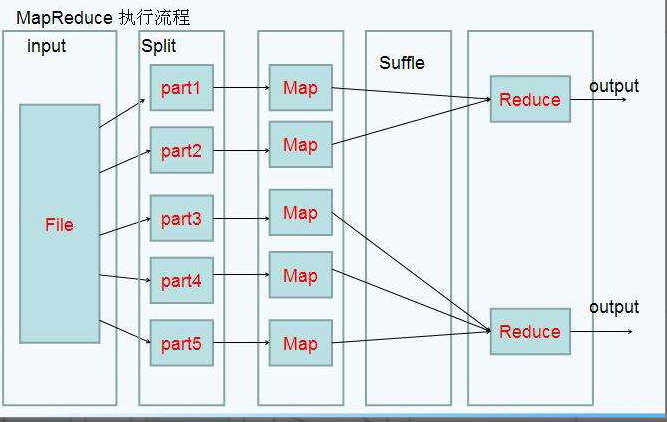

还有一个比较形象的语言解释MapReduce:

我们要数图书馆中的所有书。你数1号书架，我数2号书架。这就是“Map”。我们人越多，数书就更快。

现在我们到一起，把所有人的统计数加在一起。这就是“Reduce”。

### 1.1 MapReduce 设计构思

MapReduce是一个分布式运算程序的编程框架，核心功能是将用户编写的业务逻辑代码和自带默认组件整合成一个完整的分布式运算程序，并发运行在Hadoop集群上。

既然是做计算的框架，那么表现形式就是有个输入（input），MapReduce操作这个输入（input），通过本身定义好的计算模型，得到一个输出（output）。

对许多开发者来说，自己完完全全实现一个并行计算程序难度太大，而MapReduce就是一种简化并行计算的编程模型，降低了开发并行应用的入门门槛。

Hadoop MapReduce构思体现在如下的三个方面：

1. 如何对付大数据处理：分而治之

对相互间不具有计算依赖关系的大数据，实现并行最自然的办法就是采取分而治之的策略。并行计算的第一个重要问题是如何划分计算任务或者计算数据以便对划分的子任务或数据块同时进行计算。不可分拆的计算任务或相互间有依赖关系的数据无法进行并行计算！

1. 构建抽象模型：Map和Reduce

MapReduce借鉴了函数式语言中的思想，用Map和Reduce两个函数提供了高层的并行编程抽象模型。

Map: 对一组数据元素进行某种重复式的处理；

Reduce: 对Map的中间结果进行某种进一步的结果整理。

MapReduce中定义了如下的Map和Reduce两个抽象的编程接口，由用户去编程实现:

map: (k1; v1) → [(k2; v2)]

reduce: (k2; [v2]) → [(k3; v3)]

Map和Reduce为程序员提供了一个清晰的操作接口抽象描述。通过以上两个编程接口，大家可以看出MapReduce处理的数据类型是<key,value>键值对。

1. MapReduce框架结构

一个完整的mapreduce程序在分布式运行时有三类实例进程：

- MR AppMaster：负责整个程序的过程调度及状态协调；
- MapTask：负责map阶段的整个数据处理流程；
- ReduceTask：负责reduce阶段的整个数据处理流程。

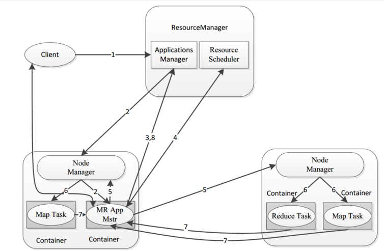

## 2. MapReduce 编程规范

> MapReduce 的开发一共有八个步骤, 其中 Map 阶段分为 2 个步骤，Shuffle 阶段 4 个步骤，Reduce 阶段分为 2 个步骤

1. Map 阶段 2 个步骤：

- 1.1 设置 InputFormat 类, 将数据切分为 Key-Value**(K1和V1)** 对, 输入到第二步
- 1.2 自定义 Map 逻辑, 将第一步的结果转换成另外的 Key-Value（**K2和V2**） 对, 输出结果

1. Shuffle 阶段 4 个步骤：

- 2.1 对输出的 Key-Value 对进行**分区**
- 2.2 对不同分区的数据按照相同的 Key **排序**
- 2.3 (可选) 对分组过的数据初步**规约**, 降低数据的网络拷贝
- 2.4 对数据进行**分组**, 相同 Key 的 Value 放入一个集合中

1. Reduce 阶段 2 个步骤：

- 3.1 对多个 Map 任务的结果进行排序以及合并, 编写 Reduce 函数实现自己的逻辑, 对输入的 Key-Value 进行处理, 转为新的 Key-Value（**K3和V3**）输出
- 3.2 设置 OutputFormat 处理并保存 Reduce 输出的 Key-Value 数据

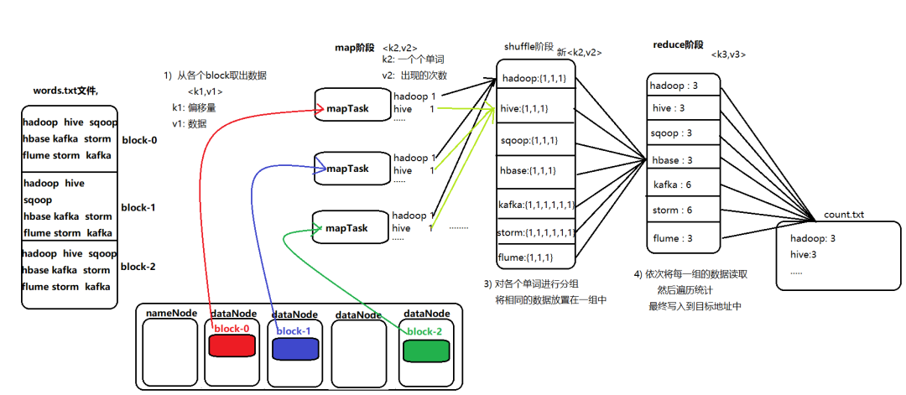


## 3. Mapper以及Reducer抽象类介绍

为了开发我们的MapReduce程序，一共可以分为以上八个步骤，其中每个步骤都是一个class类，我们通过job对象将我们的程序组装成一个任务提交即可。为了简化我们的MapReduce程序的开发，每一个步骤的class类，都有一个既定的父类，让我们直接继承即可，因此可以大大简化我们的MapReduce程序的开发难度，也可以让我们快速的实现功能开发。

MapReduce编程当中，其中最重要的两个步骤就是我们的Mapper类和Reducer类

1. Mapper抽象类的基本介绍

在hadoop2.x当中Mapper类是一个抽象类，我们只需要覆写一个java类，继承自Mapper类即可，然后重写里面的一些方法，就可以实现我们特定的功能，接下来我们来介绍一下Mapper类当中比较重要的四个方法

1. **setup方法**：我们Mapper类当中的初始化方法，我们一些对象的初始化工作都可以放到这个方法里面来实现
2. **map方法**：读取的每一行数据，都会来调用一次map方法，这个方法也是我们最重要的方法，可以通过这个方法来实现我们每一条数据的处理
3. **cleanup方法**：在我们整个maptask执行完成之后，会马上调用cleanup方法，这个方法主要是用于做我们的一些清理工作，例如连接的断开，资源的关闭等等
4. **run方法**：如果我们需要更精细的控制我们的整个MapTask的执行，那么我们可以覆写这个方法，实现对我们所有的MapTask更精确的操作控制

1. Reducer抽象类基本介绍

同样的道理，在我们的hadoop2.x当中，reducer类也是一个抽象类，抽象类允许我们可以继承这个抽象类之后，重新覆写抽象类当中的方法，实现我们的逻辑的自定义控制。接下来我们也来介绍一下Reducer抽象类当中的四个抽象方法

1. **setup方法**：在我们的ReduceTask初始化之后马上调用，我们的一些对象的初始化工作，都可以在这个类当中实现
2. **reduce方法**：所有从MapTask发送过来的数据，都会调用reduce方法，这个方法也是我们reduce当中最重要的方法，可以通过这个方法实现我们的数据的处理
3. **cleanup方法**：在我们整个ReduceTask执行完成之后，会马上调用cleanup方法，这个方法主要就是在我们reduce阶段处理做我们一些清理工作，例如连接的断开，资源的关闭等等
4. **run方法**：如果我们需要更精细的控制我们的整个ReduceTask的执行，那么我们可以覆写这个方法，实现对我们所有的ReduceTask更精确的操作控制

## 4. WordCount示例编写

需求：在一堆给定的文本文件中统计输出每一个单词出现的总次数

node01服务器执行以下命令，准备数，数据格式准备如下：

```
cd /export/servers
vim wordcount.txt

#添加以下内容:
hello hello
world world
hadoop hadoop
hello world
hello flume
hadoop hive
hive kafka
flume storm
hive oozie
```

将数据文件上传到hdfs上面去

```
hdfs dfs -mkdir /wordcount/
hdfs dfs -put wordcount.txt /wordcount/
```

- 定义一个mapper类

```
import org.apache.hadoop.io.LongWritable;
import org.apache.hadoop.io.Text;
import org.apache.hadoop.mapreduce.Mapper;

import java.io.IOException;

// mapper程序:  需要继承 mapper类, 需要传入 四个类型:
/*  在hadoop中, 对java的类型都进行包装, 以提高传输的效率  writable
    keyin :  k1   Long     ---- LongWritable
    valin :  v1   String   ------ Text
    keyout : k2   String   ------- Text
    valout : v2   Long     -------LongWritable

 */

public class MapTask extends Mapper<LongWritable,Text,Text,LongWritable> {

    /**
     *
     * @param key  : k1
     * @param value   v1
     * @param context  上下文对象   承上启下功能
     * @throws IOException
     * @throws InterruptedException
     */
    @Override
    protected void map(LongWritable key, Text value, Context context) throws IOException, InterruptedException {
        //1. 获取 v1 中数据
        String val = value.toString();

        //2. 切割数据
        String[] words = val.split(" ");

        Text text = new Text();
        LongWritable longWritable = new LongWritable(1);
        //3. 遍历循环, 发给 reduce
        for (String word : words) {
            text.set(word);
            context.write(text,longWritable);
        }
    }
}
```

- 定义一个reducer类

```
import org.apache.hadoop.io.LongWritable;
import org.apache.hadoop.io.Text;
import org.apache.hadoop.mapreduce.Reducer;

import java.io.IOException;

/**
 * KEYIN  :  k2    -----Text
 * VALUEIN :  v2   ------LongWritable
 * KEYOUT  : k3    ------  Text
 * VALUEOUT : v3   ------ LongWritable
 */
public class ReducerTask extends Reducer<Text, LongWritable, Text, LongWritable> {


    @Override
    protected void reduce(Text key, Iterable<LongWritable> values, Context context) throws IOException, InterruptedException {

        //1. 遍历 values 获取每一个值
        long  v3 = 0;
        for (LongWritable longWritable : values) {

            v3 += longWritable.get();  //1
        }

        //2. 输出
        context.write(key,new LongWritable(v3));

    }
}
```

- 定义一个主类，用来描述job并提交job

```
import com.sun.org.apache.bcel.internal.generic.NEW;
import org.apache.hadoop.conf.Configuration;
import org.apache.hadoop.conf.Configured;
import org.apache.hadoop.fs.Path;
import org.apache.hadoop.io.LongWritable;
import org.apache.hadoop.io.Text;
import org.apache.hadoop.io.nativeio.NativeIO;
import org.apache.hadoop.mapreduce.Job;
import org.apache.hadoop.mapreduce.lib.input.TextInputFormat;
import org.apache.hadoop.mapreduce.lib.output.TextOutputFormat;
import org.apache.hadoop.util.Tool;
import org.apache.hadoop.util.ToolRunner;

// 任务的执行入口: 将八步组合在一起
public class JobMain extends Configured implements Tool {
    // 在run方法中编写组装八步
    @Override
    public int run(String[] args) throws Exception {

        Job job = Job.getInstance(super.getConf(), "JobMain");
        //如果提交到集群操作. 需要添加一步 : 指定入口类
        job.setJarByClass(JobMain.class);


        //1. 封装第一步:  读取数据
        job.setInputFormatClass(TextInputFormat.class);
        TextInputFormat.addInputPath(job,new Path("hdfs://node01:8020/wordcount.txt"));

        //2. 封装第二步:  自定义 map程序
        job.setMapperClass(MapTask.class);
        job.setMapOutputKeyClass(Text.class);
        job.setMapOutputValueClass(LongWritable.class);

        //3. 第三步 第四步 第五步 第六步 省略

        //4. 第七步:  自定义reduce程序
        job.setReducerClass(ReducerTask.class);
        job.setOutputKeyClass(Text.class);
        job.setOutputValueClass(LongWritable.class);

        //5) 第八步  : 输出路径是一个目录, 而且这个目录必须不存在的
        job.setOutputFormatClass(TextOutputFormat.class);
        TextOutputFormat.setOutputPath(job,new Path("hdfs://node01:8020/output"));

        //6) 提交任务:
        boolean flag = job.waitForCompletion(true); // 成功  true  不成功 false

        return flag ? 0 : 1;
    }

    public static void main(String[] args) throws Exception {
        Configuration configuration = new Configuration();
        JobMain jobMain = new JobMain();
        int i = ToolRunner.run(configuration, jobMain, args); //返回值 退出码

        System.exit(i); // 退出程序  0 表示正常  其他值表示有异常 1
    }
}
```

提醒：代码开发完成之后，就可以打成jar包放到服务器上面去运行了，实际工作当中，都是将代码打成jar包，开发main方法作为程序的入口，然后放到集群上面去运行

## 5. MapReduce程序运行模式

- 本地运行模式

1. mapreduce程序是被提交给LocalJobRunner在本地以单进程的形式运行
2. 而处理的数据及输出结果可以在本地文件系统，也可以在hdfs上
3. 怎样实现本地运行？写一个程序，不要带集群的配置文件本质是程序的conf中是否有`mapreduce.framework.name=local`以及`yarn.resourcemanager.hostname=local`参数
4. 本地模式非常便于进行业务逻辑的debug，只要在idea中打断点即可

【本地模式运行代码设置】

```
configuration.set("mapreduce.framework.name","local");
configuration.set("yarn.resourcemanager.hostname","local");
-----------以上两个是不需要修改的,如果要在本地目录测试, 可有修改hdfs的路径-----------------
TextInputFormat.addInputPath(job,new Path("file:///D:\\wordcount\\input"));
TextOutputFormat.setOutputPath(job,new Path("file:///D:\\wordcount\\output"));
```

- 集群运行模式

1. 将mapreduce程序提交给yarn集群，分发到很多的节点上并发执行

2. 处理的数据和输出结果应该位于hdfs文件系统

3. 提交集群的实现步骤：

   将程序打成JAR包，然后在集群的任意一个节点上用hadoop命令启动 yarn jar hadoop_hdfs_operate-1.0-SNAPSHOT.jar cn.itcast.hdfs.demo1.JobMain

## 6. MapReduce的运行机制详解

### 6.1 MapTask 工作机制

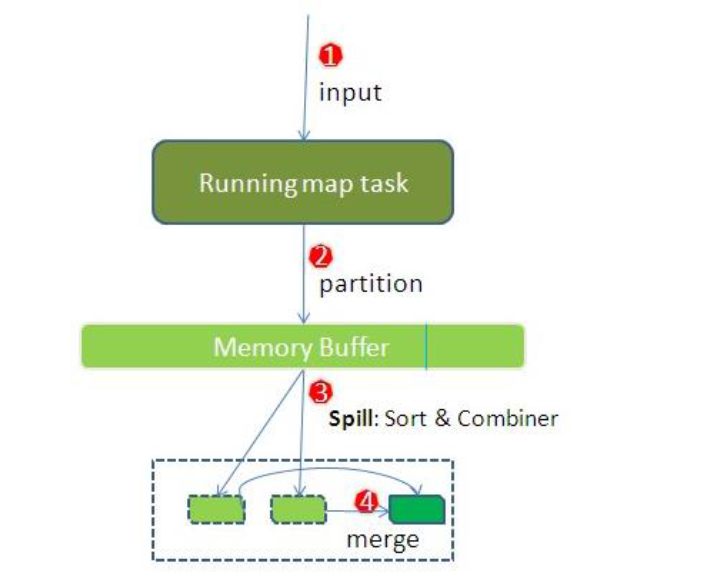

整个Map阶段流程大体如上图所示。

简单概述：inputFile通过split被逻辑切分为多个split文件，通过Record按行读取内容给map（用户自己实现的）进行处理，数据被map处理结束之后交给OutputCollector收集器，对其结果key进行分区（默认使用hash分区），然后写入buffer，每个map task都有一个内存缓冲区，存储着map的输出结果，当缓冲区快满的时候需要将缓冲区的数据以一个临时文件的方式存放到磁盘，当整个map task结束后再对磁盘中这个map task产生的所有临时文件做合并，生成最终的正式输出文件，然后等待reduce task来拉数据

**详细步骤**

1. 读取数据组件 **InputFormat** (默认 TextInputFormat) 会通过 `getSplits` 方法对输入目录中文件进行逻辑切片规划得到 `block`, 有多少个 `block`就对应启动多少个 `MapTask`
2. 将输入文件切分为 `block` 之后, 由 `RecordReader` 对象 (默认是LineRecordReader) 进行**读取**, 以 `\n` 作为分隔符, 读取一行数据, 返回 `<key，value>`. Key 表示每行首字符偏移值, Value 表示这一行文本内容
3. 读取 `block` 返回 `<key,value>`, **进入用户自己继承的 Mapper 类中**，执行用户重写的 map 函数, RecordReader 读取一行这里调用一次
4. Mapper 逻辑结束之后, 将 Mapper 的每条结果通过 `context.write` 进行collect数据收集. 在 collect 中, 会先对其进行分区处理，默认使用 **HashPartitioner**

> MapReduce 提供 Partitioner 接口, 它的作用就是根据 Key 或 Value 及 Reducer 的数量来决定当前的这对输出数据最终应该交由哪个 Reduce task 处理, 默认对 Key Hash 后再以 Reducer 数量取模. 默认的取模方式只是为了平均 Reducer 的处理能力, 如果用户自己对 Partitioner 有需求, 可以订制并设置到 Job 上

1. 接下来, 会将数据写入内存, 内存中这片区域叫做环形缓冲区, 缓冲区的作用是批量收集 Mapper 结果, 减少磁盘 IO 的影响. 我们的 **Key/Value 对以及 Partition 的结果都会被写入缓冲区**. 当然, 写入之前，Key 与 Value 值都会被序列化成字节数组

> 环形缓冲区其实是一个数组, 数组中存放着 Key, Value 的序列化数据和 Key, Value 的元数据信息, 包括 Partition, Key 的起始位置, Value 的起始位置以及 Value 的长度. 环形结构是一个抽象概念。
> 缓冲区是有大小限制, 默认是 100MB. 当 Mapper 的输出结果很多时, 就可能会撑爆内存, 所以需要在一定条件下将缓冲区中的数据临时写入磁盘, 然后重新利用这块缓冲区. 这个从内存往磁盘写数据的过程被称为 Spill, 中文可译为溢写. 这个溢写是由单独线程来完成, 不影响往缓冲区写 Mapper 结果的线程. 溢写线程启动时不应该阻止 Mapper 的结果输出, 所以整个缓冲区有个溢写的比例 spill.percent. 这个比例默认是 0.8, 也就是当缓冲区的数据已经达到阈值 buffer size * spill percent = 100MB * 0.8 = 80MB, 溢写线程启动, 锁定这 80MB 的内存, 执行溢写过程. Mapper 的输出结果还可以往剩下的 20MB 内存中写, 互不影响

1. 当溢写线程启动后, 需要**对这 80MB 空间内的 Key 做排序 (Sort)**. 排序是 MapReduce 模型默认的行为, 这里的排序也是对序列化的字节做的排序

> 如果 Job 设置过 Combiner, 那么现在就是使用 Combiner 的时候了. 将有相同 Key 的 Key/Value 对的 Value 合并在起来, 减少溢写到磁盘的数据量. Combiner 会优化 MapReduce 的中间结果, 所以它在整个模型中会多次使用 \ 那哪些场景才能使用 Combiner 呢? 从这里分析, Combiner 的输出是 Reducer 的输入, Combiner 绝不能改变最终的计算结果. Combiner 只应该用于那种 Reduce 的输入 Key/Value 与输出 Key/Value 类型完全一致, 且不影响最终结果的场景. 比如累加, 最大值等. Combiner 的使用一定得慎重, 如果用好, 它对 Job 执行效率有帮助, 反之会影响 Reducer 的最终结果

1. **合并溢写文件**, 每次溢写会在磁盘上生成一个临时文件 (写之前判断是否有 Combiner), 如果 Mapper 的输出结果真的很大, 有多次这样的溢写发生, 磁盘上相应的就会有多个临时文件存在. 当整个数据处理结束之后开始对磁盘中的临时文件进行 Merge 合并, 因为最终的文件只有一个, 写入磁盘, 并且为这个文件提供了一个索引文件, 以记录每个reduce对应数据的偏移量

【mapTask的一些基础设置配置】

| 配置                               | 默认值                           | 解释                       |
| :--------------------------------- | :------------------------------- | :------------------------- |
| `mapreduce.task.io.sort.mb`        | 100                              | 设置环型缓冲区的内存值大小 |
| `mapreduce.map.sort.spill.percent` | 0.8                              | 设置溢写的比例             |
| `mapreduce.cluster.local.dir`      | `${hadoop.tmp.dir}/mapred/local` | 溢写数据目录               |
| `mapreduce.task.io.sort.factor`    | 10                               | 设置一次合并多少个溢写文件 |

### 6.2 ReduceTask 工作机制

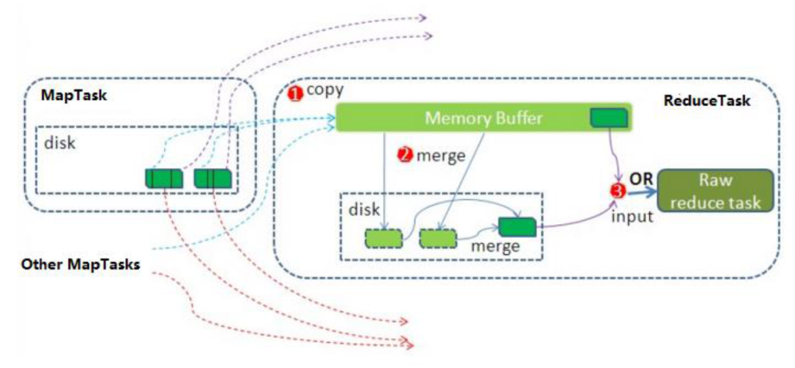

Reduce 大致分为 copy、sort、reduce 三个阶段，重点在前两个阶段。copy 阶段包含一个 eventFetcher 来获取已完成的 map 列表，由 Fetcher 线程去 copy 数据，在此过程中会启动两个 merge 线程，分别为 inMemoryMerger 和 onDiskMerger，分别将内存中的数据 merge 到磁盘和将磁盘中的数据进行 merge。待数据 copy 完成之后，copy 阶段就完成了，开始进行 sort 阶段，sort 阶段主要是执行 finalMerge 操作，纯粹的 sort 阶段，完成之后就是 reduce 阶段，调用用户定义的 reduce 函数进行处理

**详细步骤**

1. **Copy阶段**，简单地拉取数据。Reduce进程启动一些数据copy线程(Fetcher)，通过HTTP方式请求maptask获取属于自己的文件。
2. **Merge阶段**。这里的merge如map端的merge动作，只是数组中存放的是不同map端copy来的数值。Copy过来的数据会先放入内存缓冲区中，这里的缓冲区大小要比map端的更为灵活。merge有三种形式：内存到内存；内存到磁盘；磁盘到磁盘。默认情况下第一种形式不启用。当内存中的数据量到达一定阈值，就启动内存到磁盘的merge。与map 端类似，这也是溢写的过程，这个过程中如果你设置有Combiner，也是会启用的，然后在磁盘中生成了众多的溢写文件。第二种merge方式一直在运行，直到没有map端的数据时才结束，然后启动第三种磁盘到磁盘的merge方式生成最终的文件。
3. **合并排序**。把分散的数据合并成一个大的数据后，还会再对合并后的数据排序。
4. **对排序后的键值对调用reduce方法**，键相等的键值对调用一次reduce方法，每次调用会产生零个或者多个键值对，最后把这些输出的键值对写入到HDFS文件中。

### 6.3 Shuffle 过程

map 阶段处理的数据如何传递给 reduce 阶段，是 MapReduce 框架中最关键的一个流程，这个流程就叫 shuffle

shuffle: 洗牌、发牌 ——（核心机制：数据分区，排序，分组，规约，合并等过程）

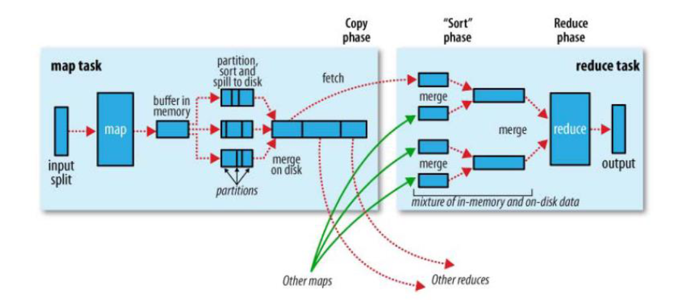

shuffle 是 Mapreduce 的核心，它分布在 Mapreduce 的 map 阶段和 reduce 阶段。一般把从 Map 产生输出开始到 Reduce 取得数据作为输入之前的过程称作 shuffle。

1. **`Collect阶段`**：将 MapTask 的结果输出到默认大小为 100M 的环形缓冲区，保存的是 key/value，Partition 分区信息等。
2. **`Spill阶段`**：当内存中的数据量达到一定的阀值的时候，就会将数据写入本地磁盘，在将数据写入磁盘之前需要对数据进行一次排序的操作，如果配置了 combiner，还会将有相同分区号和 key 的数据进行排序。
3. **`Merge阶段`**：把所有溢出的临时文件进行一次合并操作，以确保一个 MapTask 最终只产生一个中间数据文件。
4. **`Copy阶段`**：ReduceTask 启动 Fetcher 线程到已经完成 MapTask 的节点上复制一份属于自己的数据，这些数据默认会保存在内存的缓冲区中，当内存的缓冲区达到一定的阀值的时候，就会将数据写到磁盘之上。
5. **`Merge阶段`**：在 ReduceTask 远程复制数据的同时，会在后台开启两个线程对内存到本地的数据文件进行合并操作。
6. **`Sort阶段`**：在对数据进行合并的同时，会进行排序操作，由于 MapTask 阶段已经对数据进行了局部的排序，ReduceTask 只需保证 Copy 的数据的最终整体有效性即可。

Shuffle 中的缓冲区大小会影响到 mapreduce 程序的执行效率，原则上说，缓冲区越大，磁盘io的次数越少，执行速度就越快

缓冲区的大小可以通过参数调整,  参数：`mapreduce.task.io.sort.mb` 默认100M

## 7. Reduce 端实现 JOIN

### 7.1 需求

> 假如数据量巨大，两表的数据是以文件的形式存储在 HDFS 中, 需要用 MapReduce 程序来实现以下 SQL 查询运算

```
select  a.id,a.date,b.name,b.category_id,b.price from t_order a left join t_product b on a.pid = b.id
```

- 商品表

| id    | pname  | category_id | price |
| :---- | :----- | :---------- | :---- |
| P0001 | 小米5  | 1000        | 2000  |
| P0002 | 锤子T1 | 1000        | 3000  |

- 订单数据表

| id   | date     | pid   | amount |
| :--- | :------- | :---- | :----- |
| 1001 | 20150710 | P0001 | 2      |
| 1002 | 20150710 | P0002 | 3      |

### 7.2 实现步骤

通过将关联的条件作为map输出的key，将两表满足join条件的数据并携带数据所来源的文件信息，发往同一个reduce task，在reduce中进行数据的串联

1. 定义orderBean

```
import org.apache.hadoop.io.Writable;

import java.io.DataInput;
import java.io.DataOutput;
import java.io.IOException;

public class OrderJoinBean implements Writable {

    private String id="";  // 订单id
    private String date="";  //订单时间
    private String pid="";  // 商品的id
    private String amount="";  // 订单的数量
    private String name="";   //商品的名称
    private String categoryId=""; // 商品的分类id
    private String price="";  //商品的价格


    public String getId() {
        return id;
    }

    public void setId(String id) {
        this.id = id;
    }

    public String getDate() {
        return date;
    }

    public void setDate(String date) {
        this.date = date;
    }

    public String getPid() {
        return pid;
    }

    public void setPid(String pid) {
        this.pid = pid;
    }

    public String getAmount() {
        return amount;
    }

    public void setAmount(String amount) {
        this.amount = amount;
    }

    public String getName() {
        return name;
    }

    public void setName(String name) {
        this.name = name;
    }

    public String getCategoryId() {
        return categoryId;
    }

    public void setCategoryId(String categoryId) {
        this.categoryId = categoryId;
    }

    public String getPrice() {
        return price;
    }

    public void setPrice(String price) {
        this.price = price;
    }

    @Override
    public String toString() {
        return id + "\t" + date + "\t" + pid + "\t" + amount + "\t" + name + "\t" + categoryId + "\t" + price;
    }

    @Override
    public void write(DataOutput out) throws IOException {
        out.writeUTF(id);
        out.writeUTF(date);
        out.writeUTF(pid);
        out.writeUTF(amount);
        out.writeUTF(name);
        out.writeUTF(categoryId);
        out.writeUTF(price);
    }

    @Override
    public void readFields(DataInput in) throws IOException {
        id = in.readUTF();
        date = in.readUTF();
        pid = in.readUTF();
        amount = in.readUTF();
        name = in.readUTF();
        categoryId = in.readUTF();
        price = in.readUTF();
    }
}
```

1. 定义 Mapper

```
import org.apache.hadoop.io.LongWritable;
import org.apache.hadoop.io.Text;
import org.apache.hadoop.mapreduce.InputSplit;
import org.apache.hadoop.mapreduce.Mapper;
import org.apache.hadoop.mapreduce.lib.input.FileSplit;

import java.io.IOException;

public class MapperJoinTask extends Mapper<LongWritable,Text,Text,OrderJoinBean> {

    @Override
    protected void map(LongWritable key, Text value, Context context) throws IOException, InterruptedException {
        // 通过文件片的方式获取文件的名称
        FileSplit fileSplit = (FileSplit) context.getInputSplit();

        String fileName = fileSplit.getPath().getName();

        //1. 获取每一行的数据
        String line = value.toString();

        //2. 切割处理
        String[] split = line.split(",");
        OrderJoinBean orderJoinBean = new OrderJoinBean();
        if(fileName.equals("orders.txt")){
            // 订单的数据
            orderJoinBean.setId(split[0]);
            orderJoinBean.setDate(split[1]);
            orderJoinBean.setPid(split[2]);
            orderJoinBean.setAmount(split[3]);
        }else{
            // 商品的数据
            orderJoinBean.setPid(split[0]);
            orderJoinBean.setName(split[1]);
            orderJoinBean.setCategoryId(split[2]);
            orderJoinBean.setPrice(split[3]);
        }


        //3. 发送给reduceTask
        context.write(new Text(orderJoinBean.getPid()),orderJoinBean);

    }
}
```

1. 定义 Reducer

```
import org.apache.hadoop.io.Text;
import org.apache.hadoop.mapreduce.Reducer;

import java.io.IOException;

public class ReducerJoinTask extends Reducer<Text,OrderJoinBean,Text,OrderJoinBean> {

    @Override
    protected void reduce(Text key, Iterable<OrderJoinBean> values, Context context) throws IOException, InterruptedException {

        //1. 遍历 :  相同的key会发给同一个reduce, 相同key的value的值形成一个集合
        OrderJoinBean orderJoinBean  = new OrderJoinBean();
        for (OrderJoinBean value : values) {
            String id = value.getId();
            if(id.equals("")){
                // 商品的数据
                orderJoinBean.setPid(value.getPid());
                orderJoinBean.setName(value.getName());
                orderJoinBean.setCategoryId(value.getCategoryId());
                orderJoinBean.setPrice(value.getPrice());

            }else {
                // 订单数据
                orderJoinBean.setId(value.getId());
                orderJoinBean.setDate(value.getDate());
                orderJoinBean.setPid(value.getPid());
                orderJoinBean.setAmount(value.getAmount());

            }
        }

        //2. 输出即可

        context.write(key,orderJoinBean);

    }
}
```

1. 定义主类

```
import org.apache.hadoop.conf.Configuration;
import org.apache.hadoop.conf.Configured;
import org.apache.hadoop.fs.Path;
import org.apache.hadoop.io.Text;
import org.apache.hadoop.mapreduce.Job;
import org.apache.hadoop.mapreduce.lib.input.TextInputFormat;
import org.apache.hadoop.mapreduce.lib.output.TextOutputFormat;
import org.apache.hadoop.util.Tool;
import org.apache.hadoop.util.ToolRunner;

public class JobReduceJoinMain extends Configured implements Tool {
    @Override
    public int run(String[] args) throws Exception {

        //1. 获取job对象
        Job job = Job.getInstance(super.getConf(), "jobReduceJoinMain");

        //2. 拼装八大步骤
        job.setInputFormatClass(TextInputFormat.class);
        TextInputFormat.addInputPath(job,new Path("file:///D:\\reduce端join\\input"));

        job.setMapperClass(MapperJoinTask.class);
        job.setMapOutputKeyClass(Text.class);
        job.setMapOutputValueClass(OrderJoinBean.class);


        job.setReducerClass(ReducerJoinTask.class);
        job.setOutputKeyClass(Text.class);
        job.setOutputValueClass(OrderJoinBean.class);


        job.setOutputFormatClass(TextOutputFormat.class);
        TextOutputFormat.setOutputPath(job,new Path("D:\\reduce端join\\out_put"));

        boolean b = job.waitForCompletion(true);


        return b?0:1;
    }

    public static void main(String[] args) throws Exception {
        Configuration conf = new Configuration();
        JobReduceJoinMain jobReduceJoinMain = new JobReduceJoinMain();
        int i = ToolRunner.run(conf, jobReduceJoinMain, args);

        System.exit(i);

    }
}
```

缺点：这种方式中，join的操作是在reduce阶段完成，reduce端的处理压力太大，map节点的运算负载则很低，资源利用率不高，且在reduce阶段极易产生数据倾斜

## 8. Map端实现 JOIN

### 8.1 概述

适用于关联表中有小表的情形.

使用分布式缓存,可以将小表分发到所有的map节点，这样，map节点就可以在本地对自己所读到的大表数据进行join并输出最终结果，可以大大提高join操作的并发度，加快处理速度

### 8.2 实现步骤

先在mapper类中预先定义好小表，进行join

引入实际场景中的解决方案：一次加载数据库

1. 定义Mapper

```
import org.apache.hadoop.filecache.DistributedCache;
import org.apache.hadoop.fs.FSDataInputStream;
import org.apache.hadoop.fs.FileSystem;
import org.apache.hadoop.fs.Path;
import org.apache.hadoop.io.LongWritable;
import org.apache.hadoop.io.Text;
import org.apache.hadoop.mapreduce.Mapper;

import java.io.BufferedReader;
import java.io.IOException;
import java.io.InputStreamReader;
import java.net.URI;
import java.util.HashMap;
import java.util.Map;

public class MapperTask extends Mapper<LongWritable, Text, Text, Text> {
    private Map<String,String> map = new HashMap<>();

    // 初始化的方法, 只会被初始化一次
    @Override
    protected void setup(Context context) throws IOException, InterruptedException {

        URI[] cacheFiles = DistributedCache.getCacheFiles(context.getConfiguration());
        URI fileURI = cacheFiles[0];

        FileSystem fs = FileSystem.get(fileURI, context.getConfiguration());

        FSDataInputStream inputStream = fs.open(new Path(fileURI));

        BufferedReader bufferedReader = new BufferedReader(new InputStreamReader(inputStream));
        String readLine  ="";
        while ((readLine = bufferedReader.readLine() ) != null  ) {
            // readlLine:  product一行数据
            String[] split = readLine.split(",");

            String pid = split[0];

            map.put(pid,split[1]+"\t"+split[2]+"\t"+split[3]);

        }
    }

    @Override
    protected void map(LongWritable key, Text value, Context context) throws IOException, InterruptedException {

        //1. 读取一行数据: orders数据
        String line = value.toString();

        //2. 切割
        String[] split = line.split(",");

        String pid = split[2];

        //3. 到map中获取商品信息:
        String product = map.get(pid);

        //4. 发送给reduce: 输出
        context.write(new Text(pid),new Text(split[0]+"\t"+split[1]+"\t"+product +"\t"+split[3]));

    }
}
```

1. 定义主类

```
import com.itheima.join.reduce.JobReduceJoinMain;
import org.apache.hadoop.conf.Configuration;
import org.apache.hadoop.conf.Configured;
import org.apache.hadoop.filecache.DistributedCache;
import org.apache.hadoop.fs.Path;
import org.apache.hadoop.io.Text;
import org.apache.hadoop.mapreduce.Job;
import org.apache.hadoop.mapreduce.lib.input.TextInputFormat;
import org.apache.hadoop.mapreduce.lib.output.TextOutputFormat;
import org.apache.hadoop.util.Tool;
import org.apache.hadoop.util.ToolRunner;

import java.net.URI;

public class JobMapperJoinMain extends Configured implements Tool{
    @Override
    public int run(String[] args) throws Exception {
        //设置缓存的位置, 必须在run的方法的最前, 如果放置在job任务创建后, 将无效
        // 缓存文件的路径, 必须存储在hdfs上, 否则也是无效的
        DistributedCache.addCacheFile(new URI("hdfs://node01:8020/cache/pdts.txt"),super.getConf());

        //1. 获取job 任务
        Job job = Job.getInstance(super.getConf(), "jobMapperJoinMain");

        job.setInputFormatClass(TextInputFormat.class);
        TextInputFormat.addInputPath(job,new Path("E:\\传智工作\\上课\\北京大数据30期\\大数据第六天\\资料\\map端join\\map_join_iput"));

        job.setMapperClass(MapperTask.class);
        job.setMapOutputKeyClass(Text.class);
        job.setMapOutputValueClass(Text.class);

        job.setOutputFormatClass(TextOutputFormat.class);
        TextOutputFormat.setOutputPath(job,new Path("E:\\传智工作\\上课\\北京大数据30期\\大数据第六天\\资料\\map端join\\out_put_map"));

        boolean b = job.waitForCompletion(true);

        return b?0:1;
    }

    public static void main(String[] args) throws Exception {
        Configuration conf = new Configuration();
        JobMapperJoinMain jobMapperJoinMain = new JobMapperJoinMain();
        int i = ToolRunner.run(conf, jobMapperJoinMain, args);

        System.exit(i);

    }
}
```

## 9. 社交粉丝数据分析

### 9.1 需求分析

以下是qq的好友列表数据，冒号前是一个用户，冒号后是该用户的所有好友（数据中的好友关系是单向的）

```
A:B,C,D,F,E,O
B:A,C,E,K
C:A,B,D,E,I 
D:A,E,F,L
E:B,C,D,M,L
F:A,B,C,D,E,O,M
G:A,C,D,E,F
H:A,C,D,E,O
I:A,O
J:B,O
K:A,C,D
L:D,E,F
M:E,F,G
O:A,H,I,J
```

求出哪些人两两之间有共同好友，及他俩的共同好友都有谁？

【解题思路】

```
第一步  
map
读一行   A:B,C,D,F,E,O
输出    <B,A><C,A><D,A><F,A><E,A><O,A>
在读一行   B:A,C,E,K
输出   <A,B><C,B><E,B><K,B>

REDUCE
拿到的数据比如<C,A><C,B><C,E><C,F><C,G>......
输出：  
<A-B,C>
<A-E,C>
<A-F,C>
<A-G,C>
<B-E,C>
<B-F,C>.....

第二步
map
读入一行<A-B,C>
直接输出<A-B,C>

reduce
读入数据  <A-B,C><A-B,F><A-B,G>.......
输出：A-B  C,F,G,.....
```

### 9.2 实现步骤

第一个MapReduce代码实现

【Mapper类】

```
public class Step1Mapper extends Mapper<LongWritable,Text,Text,Text> {
    @Override
    protected void map(LongWritable key, Text value, Context context) throws IOException, InterruptedException {
         //1:以冒号拆分行文本数据: 冒号左边就是V2
        String[] split = value.toString().split(":");
        String userStr = split[0];

        //2:将冒号右边的字符串以逗号拆分,每个成员就是K2
        String[] split1 = split[1].split(",");
        for (String s : split1) {
            //3:将K2和v2写入上下文中
            context.write(new Text(s), new Text(userStr));
        }
    }
}
```

【Reducer类】

```
public class Step1Reducer extends Reducer<Text,Text,Text,Text> {
    @Override
    protected void reduce(Text key, Iterable<Text> values, Context context) throws IOException, InterruptedException {
        //1:遍历集合,并将每一个元素拼接,得到K3
        StringBuffer buffer = new StringBuffer();

        for (Text value : values) {
            buffer.append(value.toString()).append("-");
        }
        //2:K2就是V3
        //3:将K3和V3写入上下文中
        context.write(new Text(buffer.toString()), key);
    }
}
```

**JobMain:**

```
public class JobMain extends Configured implements Tool {
    @Override
    public int run(String[] args) throws Exception {
        //1:获取Job对象
        Job job = Job.getInstance(super.getConf(), "common_friends_step1_job");

        //2:设置job任务
            //第一步:设置输入类和输入路径
            job.setInputFormatClass(TextInputFormat.class);
            TextInputFormat.addInputPath(job, new Path("file:///D:\\input\\common_friends_step1_input"));

            //第二步:设置Mapper类和数据类型
            job.setMapperClass(Step1Mapper.class);
            job.setMapOutputKeyClass(Text.class);
            job.setMapOutputValueClass(Text.class);

            //第三,四,五,六

            //第七步:设置Reducer类和数据类型
            job.setReducerClass(Step1Reducer.class);
            job.setOutputKeyClass(Text.class);
            job.setOutputValueClass(Text.class);

            //第八步:设置输出类和输出的路径
            job.setOutputFormatClass(TextOutputFormat.class);
            TextOutputFormat.setOutputPath(job, new Path("file:///D:\\out\\common_friends_step1_out"));

        //3:等待job任务结束
        boolean bl = job.waitForCompletion(true);


        return bl ? 0: 1;
    }

    public static void main(String[] args) throws Exception {
        Configuration configuration = new Configuration();

        //启动job任务
        int run = ToolRunner.run(configuration, new JobMain(), args);

        System.exit(run);
    }
}
```

第二个MapReduce代码实现

【Mapper类】

```
public class Step2Mapper extends Mapper<LongWritable,Text,Text,Text> {
    /*
     K1           V1

     0            A-F-C-J-E- B
    ----------------------------------

     K2             V2
     A-C            B
     A-E            B
     A-F            B
     C-E            B

     */
    @Override
    protected void map(LongWritable key, Text value, Context context) throws IOException, InterruptedException {
        //1:拆分行文本数据,结果的第二部分可以得到V2
        String[] split = value.toString().split("\t");
        String   friendStr =split[1];

        //2:继续以'-'为分隔符拆分行文本数据第一部分,得到数组
        String[] userArray = split[0].split("-");

        //3:对数组做一个排序
        Arrays.sort(userArray);

        //4:对数组中的元素进行两两组合,得到K2
        /*
          A-E-C ----->  A  C  E

          A  C  E
            A  C  E

         */
        for (int i = 0; i <userArray.length -1 ; i++) {
            for (int j = i+1; j  < userArray.length ; j++) {
                //5:将K2和V2写入上下文中
                context.write(new Text(userArray[i] +"-"+userArray[j]), new Text(friendStr));
            }

        }

    }
}
```

【Reducer类】

```
public class Step2Reducer extends Reducer<Text,Text,Text,Text> {
    @Override
    protected void reduce(Text key, Iterable<Text> values, Context context) throws IOException, InterruptedException {
        //1:原来的K2就是K3
        //2:将集合进行遍历,将集合中的元素拼接,得到V3
        StringBuffer buffer = new StringBuffer();
        for (Text value : values) {
            buffer.append(value.toString()).append("-");
            
        }
        //3:将K3和V3写入上下文中
        context.write(key, new Text(buffer.toString()));
    }
}
```

【JobMain】

```
public class JobMain extends Configured implements Tool {
    @Override
    public int run(String[] args) throws Exception {
        //1:获取Job对象
        Job job = Job.getInstance(super.getConf(), "common_friends_step2_job");

        //2:设置job任务
            //第一步:设置输入类和输入路径
            job.setInputFormatClass(TextInputFormat.class);
            TextInputFormat.addInputPath(job, new Path("file:///D:\\out\\common_friends_step1_out"));

            //第二步:设置Mapper类和数据类型
            job.setMapperClass(Step2Mapper.class);
            job.setMapOutputKeyClass(Text.class);
            job.setMapOutputValueClass(Text.class);

            //第三,四,五,六

            //第七步:设置Reducer类和数据类型
            job.setReducerClass(Step2Reducer.class);
            job.setOutputKeyClass(Text.class);
            job.setOutputValueClass(Text.class);

            //第八步:设置输出类和输出的路径
            job.setOutputFormatClass(TextOutputFormat.class);
            TextOutputFormat.setOutputPath(job, new Path("file:///D:\\out\\common_friends_step2_out"));

        //3:等待job任务结束
        boolean bl = job.waitForCompletion(true);
        return bl ? 0: 1;
    }

    public static void main(String[] args) throws Exception {
        Configuration configuration = new Configuration();
        //启动job任务
        int run = ToolRunner.run(configuration, new JobMain(), args);
        System.exit(run);
    }
}
```

## 10. 倒排索引建立

### 10.1 需求分析

需求：有大量的文本（文档、网页），需要建立搜索索引

思路分析：

首选将文档的内容全部读取出来，加上文档的名字作为key，文档的value为1，组织成这样的一种形式的数据

map端数据输出:

```
hello-a.txt  1

hello-a.txt 1

hello-a.txt 1
```

reduce端数据输出:

```
hello-a.txt 3
```

### 10.2 代码实现

```
public class IndexCreate extends Configured implements Tool {
    public static void main(String[] args) throws Exception {
        ToolRunner.run(new Configuration(),new IndexCreate(),args);
    }
    @Override
    public int run(String[] args) throws Exception {
        Job job = Job.getInstance(super.getConf(), IndexCreate.class.getSimpleName());
        job.setInputFormatClass(TextInputFormat.class);
        TextInputFormat.addInputPath(job,new Path("file:///D:\\倒排索引\\input"));
        job.setMapperClass(IndexCreateMapper.class);
        job.setMapOutputKeyClass(Text.class);
        job.setMapOutputValueClass(IntWritable.class);
        job.setReducerClass(IndexCreateReducer.class);
        job.setOutputKeyClass(Text.class);
        job.setOutputValueClass(IntWritable.class);
        job.setOutputFormatClass(TextOutputFormat.class);
        TextOutputFormat.setOutputPath(job,new Path("file:///D:\\倒排索引\\outindex"));
        boolean bool = job.waitForCompletion(true);
        return bool?0:1;
    }
    public static class IndexCreateMapper extends Mapper<LongWritable,Text,Text,IntWritable>{
        Text text = new Text();
        IntWritable v = new IntWritable(1);
        @Override
        protected void map(LongWritable key, Text value, Context context) throws IOException, InterruptedException {
            //获取文件切片
            FileSplit fileSplit  = (FileSplit) context.getInputSplit();
            //通过文件切片获取文件名
            String name = fileSplit.getPath().getName();
            String line = value.toString();
            String[] split = line.split(" ");
            //输出 单词--文件名作为key  value是1
            for (String word : split) {
               text.set(word+"--"+name);
                context.write(text,v);
            }
        }
    }
    public static class IndexCreateReducer extends Reducer<Text,IntWritable,Text,IntWritable>{
        IntWritable value = new IntWritable();
        @Override
        protected void reduce(Text key, Iterable<IntWritable> values, Context context) throws IOException, InterruptedException {
            int count = 0;
            for (IntWritable value : values) {
                count += value.get();
            }
            value.set(count);
            context.write(key,value);
        }
    }
}
```

> 本文档首发在公众号【**五分钟学大数据**】

# 三、Yarn

## 1. yarn的架构和原理

### 1.1 yarn的基本介绍和产生背景

YARN是Hadoop2引入的通用的资源管理和任务调度的平台，可以在YARN上运行MapReduce、Tez、Spark等多种计算框架，只要计算框架实现了YARN所定义的接口，都可以运行在这套通用的Hadoop资源管理和任务调度平台上。

Hadoop 1.0是由HDFS和MapReduce V1组成的，YARN出现之前是MapReduce V1来负责资源管理和任务调度，MapReduce V1由JobTracker和TaskTracker两部分组成。

**MapReduce V1有如下缺点**：

1. 扩展性差：

   在MapReduce V1中，JobTracker同时负责资源管理和任务调度，而JobTracker只有一个节点，所以JobTracker成为了制约系统性能的一个瓶颈，制约了Hadoop平台的扩展性。

2. 可靠性低：

   MapReduce V1中JobTracker存在单点故障问题，所以可靠性低。

3. 资源利用率低：

   MapReduce V1采用了基于槽位的资源分配模型，槽位是一种粗粒度的资源划分单位。

- 一是通常情况下为一个job分配的槽位不会被全部利用。
- 二是一个MapReduce任务的Map阶段和Reduce阶段会划分了固定的槽位，并且不可以共用，很多时候一种类型的槽位资源很紧张而另外一种类型的槽位很空闲，导致资源利用率低。

1. 不支持多种计算框架

   MapReduce V1这种资源管理和任务调度方式只适合MapReduce这种计算框架，而MapReduce这种离线计算框架很多时候不能满足应用需求。

**yarn的优点**：

1. 支持多种计算框架

   YARN是通用的资源管理和任务调度平台，只要实现了YARN的接口的计算框架都可以运行在YARN上。

2. 资源利用率高

   多种计算框架可以共用一套集群资源，让资源充分利用起来，提高了利用率。

3. 运维成本低

   避免一个框架一个集群的模式，YARN降低了集群的运维成本。

4. 数据可共享

   共享集群模式可以让多种框架共享数据和硬件资源，减少数据移动带来的成本。

### 1.2 hadoop 1.0 和 hadoop 2.0 的区别

1. 组成部分

Hadoop1.0由HDFS和MapReduce组成，Hadoop2.0由HDFS和YARN组成。

1. HDFS可扩展性

Hadoop1.0中的HDFS只有一个NameNode，制约着集群文件个数的增长，Hadoop2.0增加了HDFS联盟的架构，可以将NameNode所管理的NameSpace水平划分，增加了HDFS的可扩展性。

1. HDFS的可靠性

Hadoop1.0中的HDFS只有一个NameNode，存在着单点故障的问题，Hadoop2.0提供了HA的架构，可以实现NameNode的热备份和热故障转移，提高了HDFS的可靠性。

1. 可支持的计算框架

Hadoop1.0中只支持MapReduce一种计算框架，Hadoop2.0因为引入的YARN这个通用的资源管理与任务调度平台，可以支持很多计算框架了。

1. 资源管理和任务调度

Hadoop1.0中资源管理和任务调度依赖于MapReduce中的JobTracker，JobTracker工作很繁重，很多时候会制约集群的性能。

Hadoop2.0中将资源管理任务分给了YARN的ResourceManage，将任务调度分给了YARN的ApplicationMaster。

### 1.3 yarn 集群的架构和工作原理

YARN的基本设计思想是将MapReduce V1中的JobTracker拆分为两个独立的服务：ResourceManager和ApplicationMaster。ResourceManager负责整个系统的资源管理和分配，ApplicationMaster负责单个应用程序的的管理。

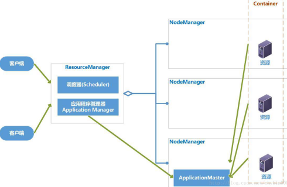

1. **ResourceManager**

RM是一个全局的资源管理器，负责整个系统的资源管理和分配，它主要由两个部分组成：调度器（Scheduler）和应用程序管理器（Application Manager）。

调度器根据容量、队列等限制条件，将系统中的资源分配给正在运行的应用程序，在保证容量、公平性和服务等级的前提下，优化集群资源利用率，让所有的资源都被充分利用 。

应用程序管理器负责管理整个系统中的所有的应用程序，包括应用程序的提交、与调度器协商资源以启动ApplicationMaster、监控ApplicationMaster运行状态并在失败时重启它。

1. **ApplicationMaster**

用户提交的一个应用程序会对应于一个ApplicationMaster，它的主要功能有：

- 与RM调度器协商以获得资源，资源以Container表示。
- 将得到的任务进一步分配给内部的任务。
- 与NM通信以启动/停止任务。
- 监控所有的内部任务状态，并在任务运行失败的时候重新为任务申请资源以重启任务。

1. **nodeManager**

NodeManager是每个节点上的资源和任务管理器，一方面，它会定期地向RM汇报本节点上的资源使用情况和各个Container的运行状态；另一方面，他接收并处理来自AM的Container启动和停止请求。

1. **container**

Container是YARN中的资源抽象，封装了各种资源。一个应用程序会分配一个Container，这个应用程序只能使用这个Container中描述的资源。

不同于MapReduceV1中槽位slot的资源封装，Container是一个动态资源的划分单位，更能充分利用资源。

### 1.4 yarn 的任务提交流程

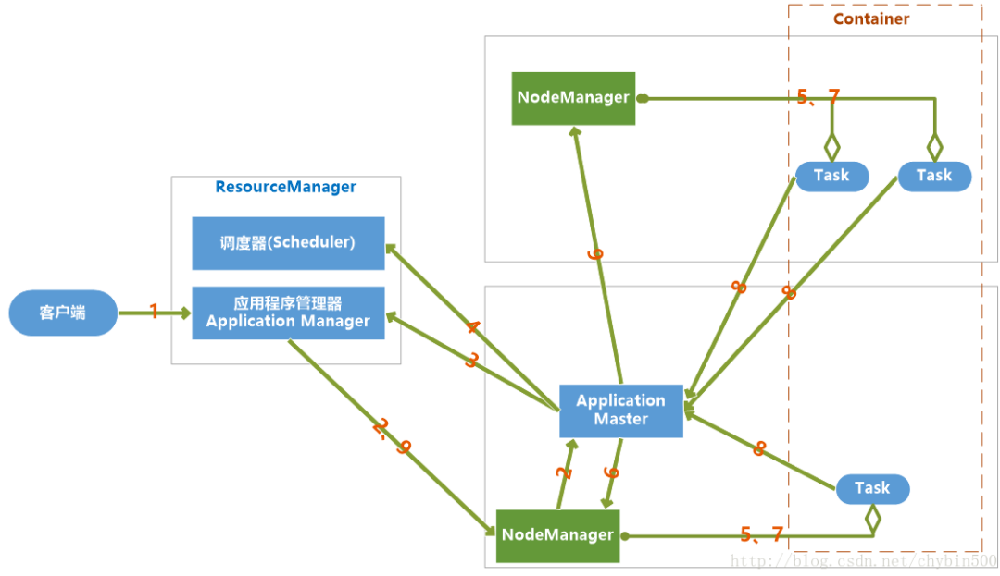

当jobclient向YARN提交一个应用程序后，YARN将分两个阶段运行这个应用程序：一是启动ApplicationMaster;第二个阶段是由ApplicationMaster创建应用程序，为它申请资源，监控运行直到结束。

具体步骤如下:

1. 用户向YARN提交一个应用程序，并指定ApplicationMaster程序、启动ApplicationMaster的命令、用户程序。
2. RM为这个应用程序分配第一个Container，并与之对应的NM通讯，要求它在这个Container中启动应用程序ApplicationMaster。
3. ApplicationMaster向RM注册，然后拆分为内部各个子任务，为各个内部任务申请资源，并监控这些任务的运行，直到结束。
4. AM采用轮询的方式向RM申请和领取资源。
5. RM为AM分配资源，以Container形式返回
6. AM申请到资源后，便与之对应的NM通讯，要求NM启动任务。
7. NodeManager为任务设置好运行环境，将任务启动命令写到一个脚本中，并通过运行这个脚本启动任务
8. 各个任务向AM汇报自己的状态和进度，以便当任务失败时可以重启任务。
9. 应用程序完成后，ApplicationMaster向ResourceManager注销并关闭自己

## 2. RM和NM的功能介绍

### 2.1 resourceManager基本介绍

ResourceManager负责集群中所有资源的统一管理和分配，它接收来自各个NodeManager的资源汇报信息，并把这些信息按照一定的策略分配给各个ApplicationMaster。

#### 2.1.1 RM的职能

1. 与客户端交互，处理客户端的请求。
2. 启动和管理AM，并在它运行失败时候重新启动它。
3. 管理NM，接收来自于NM的资源汇报信息，并向NM下达管理指令。
4. 资源管理和调度，接收来自于AM的资源请求，并为它分配资源。

#### 2.1.2 RM 的内部结构


**用户交互模块**:

1. clientRMService : 为普通用户服务，处理请求，如：提交应用程序、终止程序、获取程序状态
2. adminService : 给管理员提供的服务。普通用户交互模块是ClientRMService，管理员交互模块是AdminService，之所以要将两个模块分开，用不同的通信通道发送给ResourceManager，是因为要避免普通用户的请求过多导致管理员请求被阻塞
3. WebApp :  更友好的展示集群资源和程序运行状态

**NM管理模块**:

1. NMLivelinessMonitor : 监控NM是否活着，如果指定时间内未收到心跳，就从集群中移除。RM会通过心跳告诉AM某个NM上的Container失效，如果Am判断需要重新执行，则AM重新向RM申请资源。
2. NodesListManager : 维护inlude（正常）和exlude（异常）的NM节点列表。默认情况下，两个列表都为空，可以由管理员添加节点。exlude列表里的NM不允许与RM进行通信。
3. ResourceTrackerService : 处理来自NM的请求，包括注册和心跳。注册是NM启动时的操作，包括节点ID和可用资源上线等。心跳包括各个Container运行状态，运行Application列表、节点健康状态

**AM管理模块**:

1. AMLivelinessMonitor : 监控AM是否还活着，如果指定时间内没有接受到心跳，则将正在运行的Container置为失败状态，而AM会被重新分配到另一个节点上
2. ApplicationMasterLauncher: 要求某一个NM启动ApplicationMaster，它处理创建AM的请求和kill AM的请求
3. ApplicationMasterService : 处理来自AM的请求，包括注册、心跳、清理。注册是在AM启动时发送给ApplicationMasterService的；心跳是周期性的，包括请求资源的类型、待释放的Container列表；清理是程序结束后发送给RM，以回收资源清理内存空间；

**Application管理模块**:

1. ApplicationACLLsManager : 管理应用程序的访问权限，分为查看权限和修改权限。
2. RMAppManager : 管理应用程序的启动和关闭
3. ContainerAllocationExpirer : RM分配Container给AM后，不允许AM长时间不对Container使用，因为会降低集群的利用率，如果超时（时间可以设置）还没有在NM上启动Container，RM就强制回收Container。

**状态机管理模块**:

1. RMApp : RMApp维护一个应用程序的的整个运行周期，一个应用程序可能有多个实例，RMApp维护的是所有实例的
2. RMAppAttempt : RMAppAttempt维护一个应用程序实例的一次尝试的整个生命周期
3. RMContainer : RMContainer维护一个Container的整个运行周期（可能和任务的周期不一致）
4. RMNode : RMNode维护一个NodeManager的生命周期，包括启动到运行结束的整个过程。

**安全模块**:

- RM自带了全面的权限管理机制。主要由ClientToAMSecretManager、ContainerTokenSecretManager、ApplicationTokenSecretManager等模块组成。

**资源分配模块**：

- ResourceScheduler：ResourceScheduler是资源调度器，他按照一定的约束条件将资源分配给各个应用程序。RM自带了一个批处理资源调度器（FIFO）和两个多用户调度器Fair Scheduler 和Capacity Scheduler

#### 2.1.3 启动ApplicationMaster

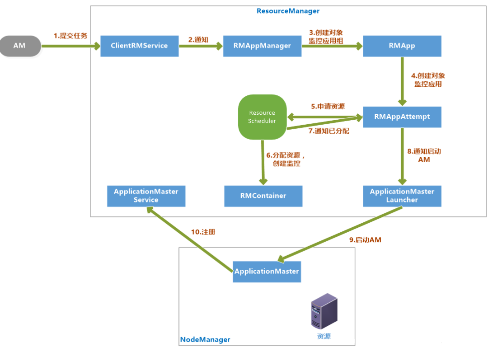

1. 客户端提交一个任务给RM，ClientRMService负责处理客户端请求
2. ClentRMService通知RMAppManager。
3. RMAppManager为应用程序创建一个RMApp对象来维护任务的状态。
4. RMApp启动任务，创建RMAppAttempt对象。
5. RMAppAttempt进行一些初始化工作，然后通知ResourceScheduler申请资源。
6. ResourceScheduler为任务分配资源后，创建一个RMContainer维护Container状态
7. 并通知RMAppAttempt，已经分配资源。
8. RMAppAttempt通知ApplicationMasterLauncher在资源上启动AM。
9. 在NodeManager的已分配资源上启动AM
10. AM启动后向ApplicationMasterService注册。

#### 2.1.4 申请和分配container

AM向RM请求资源和RM为AM分配资源是两个阶段的循环过程：

- 阶段一：AM请求资源请求并领取资源的过程，这个过程是AM发送请求、RM记录请求。
- 阶段二：NM向RM汇报各个Container运行状态，如果RM发现它上面有空闲的资源就分配给等待的AM。

具体过程如下：

**阶段一**：

1. AM通过RPC函数向RM发送资源需求信息，包括新的资源需求描述、待释放的Container列表、请求加入黑名单的节点列表、请求移除黑名单的节点列表等
2. RM的ApplicationMasterService负责处理AM的请求。一旦收到请求，就通知RMAppAttempt，更新应用程序执行进度，在AMLivenessMonitor中记录更新时间。
3. ApplicationMasterService调用ResourceScheduler，将AM的资源需求汇报给ResourceScheduler。
4. ResouceScheduler首先读取待释放的Container列表，通知RMContainer更改状态，杀死要释放的Container，然后将新的资源需求记录，如果资源足够就记录已经分配好资源。

**阶段二**：

1. NM通过RPC向RM汇报各自的各个Container的运行情况
2. RM的ResourceTrackerService负责处理来自NM的汇报，收到汇报后，就通知RMNode更改Container状态，并通知ResourceScheduler。
3. ResourceScheduler收到通知后，如果有可分配的空闲资源，就将资源分配给等待资源的AM，等待AM下次心跳将资源领取走。

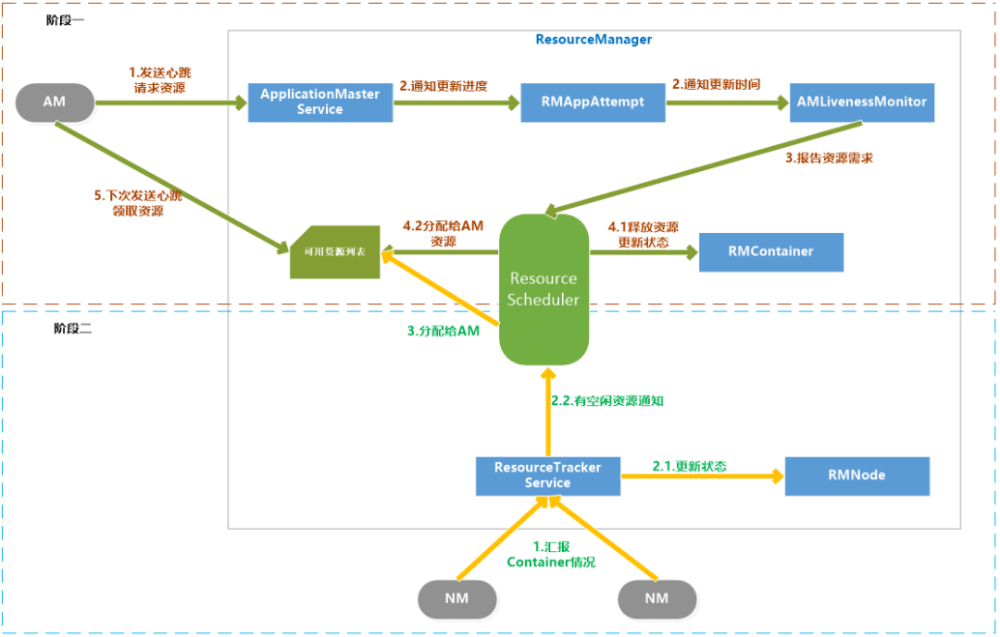

#### 2.1.5 杀死 application

**杀死Application流程**：

Kill Job通常是客户端发起的，RM的ClientRMService负责处理请求，接收到请求后，先检查权限，确保用户有权限Kill Job，然后通知维护这个Application的RMApp对象，根据Application当前状态调用相应的函数来处理。

这个时候分为两种情况：Application没有在运行、Application正在运行。

1. Application没有在运行

向已经运行过的NodeManger节点对应的状态维护对象RMNode发送通知，进行清理；向RMAppManager发送通知，将Application设置为已完成状态。

1. Application正在运行

如果正在运行，也首先像情况一处理一遍，回收运行过的NodeManager资源，将Application设置为已完成。另外RMApp还要通知维护任务状态的RMAppAttempt对象，将已经申请和占用的资源回收，但是真正的回收是由资源调度器ResourceScheduler异步完成的。

异步完成的步骤是先由ApplicationMasterLauncher杀死AM，并回收它占用的资源，再由各个已经启动的RMContainer杀死Container并回收资源。

#### 2.1.6 Container超时

YARN里有两种Container：运行AM的Container和运行普通任务的Container。

1. RM为要启动的AM分配Container后，会监控Container的状态，如果指定时间内AM还没有在Container上启动的话，Container就会被回收，AM Container超时会导致Application执行失败。
2. 普通Container超时会进行资源回收，但是YARN不会自动在其他资源上重试，而是通知AM，由AM决定是否重试。

#### 2.1.7 安全管理

Hadoop的安全管理是为了更好地让多用户在共享Hadoop集群环境下安全高效地使用集群资源。系统安全机制由认证和授权两大部分构成，Hadoop2.0中的认证机制采用Kerberos和Token两种方案，而授权则是通过引入访问控制表（Access Control List，ACL）实现的。

1. 术语

Kerberos是一种基于第三方服务的认证协议，非常安全。特点是用户只需要输入一次身份验证信息就可以凭借此验证获得的票据访问多个服务。

Token是一种基于共享密钥的双方身份认证机制。

Principal是指集群中被认证或授权的主体，主要包括用户、Hadoop服务、Container、Application、Localizer、Shuffle Data等。

1. Hadoop认证机制

Hadoop同时采用了Kerberos和Token两种技术，服务和服务之间的认证采用了Kerberos，用户和NameNode及用户和ResourceManager首次通讯也采用Kerberos认证，用户和服务之间一旦建立连接后，用户就可以从服务端获取一个Token，之后就可以使用Token认证通讯了。因为Token认证要比Kerberos要高效。

Hadoop里Kerberos认证默认是关闭的，可以通过参数hadoop.security.authentication设置为kerberos，这个配置模式是simple。

1. Hadoop授权机制

Hadoop授权是通过访问控制列表（ACL）实现的，Hadoop的访问控制机制与UNIX的POSIX风格的访问控制机制是一致的，将权限授予对象分为：用户、同组用户、其他用户。默认情况下，Hadoop公用UNIX/Linux下的用户和用户组。

- 队列访问控制列表
- 应用程序访问控制列表
- 服务访问控制列表

### 2.2 nodeManager功能介绍

NM是单个节点上的代理，功能包括与ResourceManager保持通讯、管理Container的生命周期、监控Container的资源使用、追踪节点健康状态、管理日志。

#### 2.2.1 基本内部构造

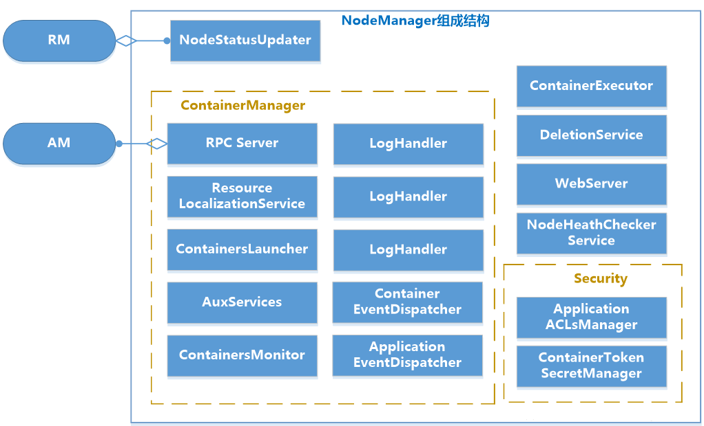

| **模块**                                         | 说明                                                         |
| :----------------------------------------------- | :----------------------------------------------------------- |
| NodeStatusUpdater                                | NodeStatusUpdater是NM和RM通讯的唯一通道。NM启动时，该组件负责向RM注册、汇报节点总的可用资源。该组件周期性地汇报各个Container的状态，接收RM返回的待清理的Container列表等 |
| ContainerManager                                 | ContainerManager是NM最核心的模块。                           |
| RPC Server                                       | 是AM和NM通讯的唯一通道，接收AM请求，启动或者停止Container    |
| ResourceLocalizationService                      | 负责Container所需资源的本地化，下载文件资源，尽量分摊到各个磁盘。 |
| ContainersLauncher                               | 维护一个线程池并行操作Container。                            |
| AuxServices                                      | NM附属服务。                                                 |
| ContainersMonitor                                | ContainersMonitor负责监控Container的资源使用量。             |
| LogHandler                                       | 用户可以通过LogHandler控制Container日志保存方式。            |
| ContainerEventDispatcher                         | Container事件调度器，负责将ContainerEvent类型的事件调度给对应的Container的状态机 |
| ApplicationEventDispatcher                       | Application事件调度器，负责将ApplicationEvent类型的事件调度给对应 |
| ContainerExecutor                                | ContainerExecutor可与底层操作系统交互，安全存放Container需要的文件和目录，启动和清除Container对应的进程。 |
| NodeHealthCheckerServiceNodeHealthCheckerService | 通过周期性运行一个脚本和写磁盘检测节点的健康状况，并通知RM。NodeHealthScriptRunner：运行脚本检测LocalDirsHandlerService：写磁盘文件检测 |
| DeletionService                                  | NM将文件删除功能化，DeletionService异步删除文件，避免同步删除文件带来的性能开销。 |
| Security                                         | 安全模块分为两部分：ApplicationACLManager确保访问NM的用户是合法的。ContainerTokenSecreManager确保用户请求的资源被RM授权过 |
| WebServer                                        | Web UI向用户展示                                             |

#### 2.2.2 状态机管理

NodeManager维护着三类状态机，分别是Application、Container、LocalizedResource。

1. Application状态机

   RM上有一个整个集群上Application信息列表，而一个NM上也有一个处在它自己节点的Application的信息列表，NodeManager上的Application状态机维护着NodeManager上Application的状态。

这有利于对一个NM节点上的同一个Application所有的Container进行统一管理。

1. Container状态机

   Container状态机维护NodeManager上所有Container的生命周期。

2. LocalizedResource状态机

   LocalizedResource状态是NodeManager上用于维护一个资源生命周期的数据结构。资源包括文件、JAR包等。

#### 2.2.3 container生命周期的管理

NodeManager中的ContainerManager负责接收AM发来的请求以启动Container，Container的启动过程分三个阶段：资源本地化、启动并运行Container、资源清理。

1. 资源本地化

资源本地化主要是进行分布是缓存工作，分为应用程序初始化和Container本地化。

1. 运行Container

Container运行是由ContainerLauncher服务完成启动后，调用ContainerExecutor来进行的。主要流程为：将待运行的Container所需要的环境变量和运行命令写到Shell脚本launch_container.sh中，并将启动该脚本的命令写入default_container_executor.sh中，然后通过运行该脚本启动container。

1. 资源清理

container清理是资源本地化的逆过程，是指当container运行完成后，NodeManager来回收资源。

## 3. yarn的applicationMaster介绍

ApplicationMaster实际上是特定计算框架的一个实例，每种计算框架都有自己独特的ApplicationMaster，负责与ResourceManager协商资源，并和NodeManager协同来执行和监控Container。MapReduce只是可以运行在YARN上一种计算框架。

### 3.1 applicationMaster的职能

Application启动后，将负责以下任务：

1. 初始化向ResourceManager报告自己的活跃信息的进程  (注册)
2. 计算应用程序的的资源需求。
3. 将需求转换为YARN调度器可以理解的ResourceRequest。
4. 与调度器协商申请资源
5. 与NodeManager协同合作使用分配的Container。
6. 跟踪正在运行的Container状态，监控它的运行。
7. 对Container或者节点失败的情况进行处理，在必要的情况下重新申请资源。

### 3.2 报告活跃

1. 注册

ApplicationMaster执行的第一个操作就是向ResourceManager注册，注册时AM告诉RM它的IPC的地址和网页的URL。

IPC地址是面向客户端的服务地址；网页URL是AM的一个Web服务的地址，客户端可以通过Http获取应用程序的状态和信息。

注册后，RM返回AM可以使用的信息，包括：YARN接受的资源的大小范围、应用程序的ACL信息。

1. 心跳

   注册成功后，AM需要周期性地发送心跳到RM确认他还活着。参数yarn.am.liveness-monitor.expiry配置AM心跳最大周期，如果RM发现超过这个时间还没有收到AM的心跳，那么就判断AM已经死掉。

### 3.3 资源需求

AM所需要的资源分为静态资源和动态资源。

1. 静态资源

在任务提交时就能确定，并且在AM运行时不再变化的资源是静态资源，比如MapReduce程序中的Map的数量。

1. 动态资源

AM在运行时确定要请求数量的资源是动态资源。

### 3.4 调度任务

当AM的资源请求数量达到一定数量或者到了心跳时，AM才会发送心跳到RM，请求资源，心跳是以ResourceRequest形式发送的，包括的信息有：resourceAsks、ContainerID、containersToBeReleased。

RM响应的信息包括：新分配的Container列表、已经完成了的Container状态、集群可用的资源上限。

### 3.5 启动container

1. AM从RM那里得到了Container后就可以启动Container了。
2. AM首先构造ContainerLaunchContext对象，包括分配资源的大小、安全令牌、启动Container执行的命令、进程环境、必要的文件等
3. AM与NM通讯，发送StartContainerRequest请求，逐一或者批量启动Container。
4. NM通过StartContainerResponse回应请求，包括：成功启动的Container列表、失败的Container信信息等。
5. 整个过程中，AM没有跟RM进行通信。
6. AM也可以发送StopContainerRequest请求来停止Container。

### 3.6 完成的container

当Container执行结束时，由RM通知AM Container的状态，AM解释Container状态并决定如何继续操作。所以YARN平台只是负责为计算框架提供Container信息。

### 3.7 AM的失败和恢复

当AM失效后，YARN只负责重新启动一个AM，任务恢复到失效前的状态是由AM自己完成的。AM为了能实现恢复任务的目标，可以采用以下方案：将任务的状态持久化到外部存储中。比如：MapReduce框架的ApplicationMaster会将已完成的任务持久化，失效后的恢复时可以将已完成的任务恢复，重新运行未完成的任务。

### 3.8 applicationMaster启动过程


## 4. yarn的资源调度

1. 资源调度器的职能

资源调度器是YARN最核心的组件之一，是一个插拔式的服务组件，负责整个集群资源的管理和分配。YARN提供了三种可用的资源调度器：FIFO、Capacity Scheduler、Fair Scheduler。

1. 资源调度器的分类

不同的任务类型对资源有着不同的负责质量要求，有的任务对时间要求不是很高(如Hive)，有的任务要求及时返还结果(如HBase)，有的任务是CPU密集型的，有的是I/O密集型的，所以简单的一种调度器并不能完全符合所有的任务类型。

有两种调度器的设计思路：

一是在一个物理Hadoop集群上虚拟多个Hadoop集群，这些集群各自有自己全套的Hadoop服务，典型的代表是HOD(Hadoop On Demand)调度器，Hadoop2.0中已经过时。

另一种是扩展YARN调度器。典型的是Capacity Scheduler、Fair Scheduler。

1. 基本架构

**插拔式组件**

YARN里的资源调度器是可插拔的，ResourceManager在初始化时根据配置创建一个调度器，可以通过参数yarn.resourcemanager.scheduler.class参数来设置调度器的主类是哪个，默认是CapacityScheduler，配置值为：org.apache.hadoop.yarn.server.resourcemanager.scheduler.capacity.CapacityScheduler。

所有的资源调度器都要实现接口org.apache.hadoop.yarn.server.resourcemanager.scheduler.ResourceScheduler。

**事件处理器**

YARN的资源管理器实际上是一个事件处理器，它处理6个SchedulerEventType类型的事件。

**事件说明**:

- Node_Removed 集群中移除一个计算节点，资源调度器需要收到该事件后从可分配的资源总量中移除相应的资源量。
- Node_Added 集群增加一个节点
- Application_added RM收到一个新的Application。
- Application_Remove 表示一个Application运行结束
- Container_expired 当一个Container分配给AM后，如果在一段时间内AM没有启动Container，就触发这个事件。调度器会对该Container进行回收。
- Node_Update RM收到NM的心跳后，就会触发Node_Update事件。

### 4.1 资源调度三种模型介绍

究竟使用哪种调度模型，取决于这个配置项，apache版本的hadoop默认使用的是capacity  scheduler调度方式。CDH版本的默认使用的是fair scheduler调度方式 : yarn-site.xml

```
yarn.resourcemanager.scheduler.class
```

1. 双层资源调度模型

YARN使用了双层资源调度模型。

第一层：ResourceManager中的调度器将资源分配给各个ApplicationMaster。这一层调度由YARN的资源调度器来实现。

第二层：ApplicationMaster再进一步将资源分配给它内部的各个任务。这一层的调度由用户程序这个计算框架来实现。

YARN的资源分配过程是异步的，YARN的调度器分配给AM资源后，先将资源存入一个缓冲区内，当AM下次心跳时来领取资源。

资源分配过程如下7个步骤：

- 步骤1：NodeManager通过周期性的心跳汇报节点信息 : 告诉resourceManager当前剩余的资源信息
- 步骤2：RM为NM返回一个应答，包括要释放的Container列表。
- 步骤3：RM收到NM汇报的信息后，会出发资源调度器的Node_Update事件。
- 步骤4：资源调度器收到Node_Update事件后，会按照一定的策略将该节点上资源分配给各个应用程序，并将分配结果存入一个内存数据结构中。
- 步骤5：应用程序的ApplicationMaster周期性地向RM发送心跳，以领取最新分配的Container。
- 步骤6：RM收到AM的心跳后，将分配给它的Container以心跳应答的方式返回给ApplicationMaster
- 步骤7：AM收到新分配的Container后，会将这些Container进一步分配给他的内部子任务。

1. 资源保证机制

YARN采用增量资源分配机制来保证资源的分配。

增量资源分配机制是指当YARN暂时不能满足应用程序的资源要求时，将现有的一个节点上的资源预留，等到这个节点上累计释放的资源满足了要求，再分配给ApplicationMaster。

这种增量资源分配机制虽然会造成资源的浪费，但是能保证AM肯定会得到资源，不会被饿死。

1. 资源分配算法

YARN的资源调度器采用了主资源公平调度算法（DRF）来支持多维度资源调度。

1. 资源抢占模型

资源调度器中，每个队列可以设置一个最小资源量和最大资源量。为了提高集群使用效率，资源调度器会将负载较轻的队列资源分配给负载较重的队列使用，当负载较轻的队列突然接到了新的任务时，调度器才会将本属于该队列的资源分配给它，但是此时资源有可能正被其他队列使用，因此调度器必须等待其他队列释放资源，如果一段时间后发现资源还未得到释放，则进行资源抢占。

关于资源抢占的实现，涉及到一下两个问题：

- 如何决定是否抢占某个队列的资源
- 如何使得资源抢占代价最小

资源抢占是通过杀死正在使用的Container实现的，由于Container已经处于运行状态，直接杀死Container会造成已经完成的计算白白浪费，为了尽可能地避免资源浪费，YARN优先选择优先级低的Container做为资源抢占的对象，并且不会立刻杀死Container，而是将释放资源的任务留给ApplicationMaster中的应用程序，以期望他能采取一定的措施来执行释放这些Container，比如保存一些状态后退出，如果一段时间后，ApplicationMaster仍未主动杀死Container，则RM再强制杀死这些Container。

#### 4.1.1 层级队列管理机制FIFO调度策略

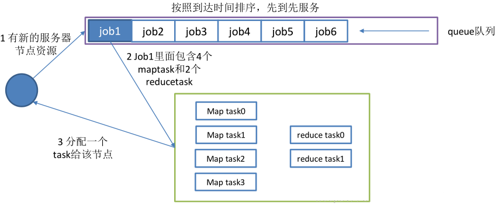

Hadoop1.0中使用了平级队列的组织方式，而后来采用了层级队列的组织方式。

层级队列的特点：

- 子队列

队列可以嵌套，每个队列都可以包含子队列；用户只能将应用程序提交到叶子队列中。

- 最小容量

每个子队列均有一个最小容量比属性，表示可以使用的父队列容量的百分比。

调度器总是优先选择当前资源使用率最低的队列，并为之分配资源。

指定了最小容量，但是不会保证会保持最小容量，同样会被分配给其他队列。

- 最大容量

队列指定了最大容量，任何时候队列使用的资源都不会超过最大容量。

默认情况下队列的最大容量是无限大。

- 用户权限管理

管理员可以配置每个叶子节点队列对应的操作系统的用户和用户组。

- 系统资源管理

管理员设置了每个队列的容量，每个用户可以用资源的量，调度器根据这些配置来进行资源调度

队列命名规则:

为了防止队列名称的冲突和便于识别队列，YARN采用了自顶向下的路径命名规则，父队列和子队列名称采用.拼接。

#### 4.1.2 Capacity Scheduler

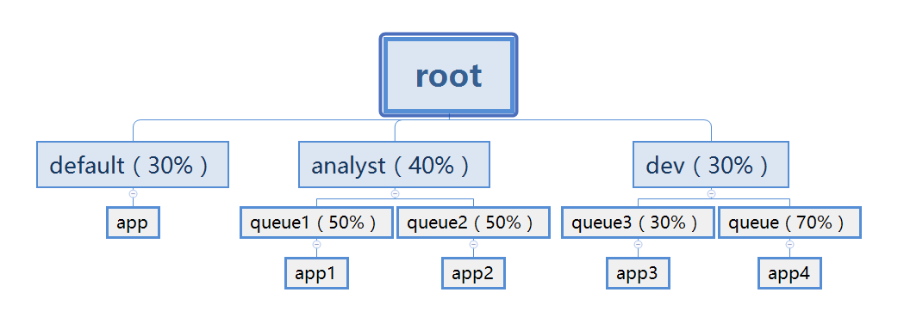


Capacity Scheduler是Yahoo!开发的多用户调度器。主要有以下几个特点：

- 容量保证

管理员可以为队列设置最低保证和资源使用上限，同一个队列里的应用程序可以共享使用队列资源。

- 灵活性:

一个队列里的资源有剩余，可以暂时共享给其他队列，一旦该队列有的新的任务，其他队列会归还资源，这样尽量地提高了集群的利用率。

- 多重租赁

支持多用户共享集群和多应用程序同时运行

- 安全保证

每个队列有严格的ACL列表，限制了用户的权限

- 动态更新配置文件

管理员对参数的配置是动态的。

配置方案:

Capacity Scheduler的所有配置都在capactiy-scheduler.xml里，管理员修改后，要通过命令来刷写队列：yarn mradmin –refreshQueues

Capacity Scheduler不允许管理员动态地减少队列数目，且更新的配置参数值应该是合法值。

以下以队列tongyong为例来说明参数配置：

【资源分配相关参数】

```
 <property>
    <name>yarn.scheduler.capacity.root.tongyong.capacity</name>
    <value>10</value>
    <description>队列资源容量百分比</description>
  </property>

  <property>
    <name>yarn.scheduler.capacity.root.tongyong.user-limit-factor</name>
    <value>3</value>
    <description>
     每个用户最多可以使用的资源量百分比
    </description>
  </property>

  <property>
    <name>yarn.scheduler.capacity.root.tongyong.maximum-capacity</name>
    <value>30</value>
    <description>
      队列资源的使用的最高上限，由于存在资源共享，所以队列使用的资源可能会超过capacity设置的量，但是不会超过maximum-capacity设置的量
    </description>
  </property>

  <property>                                                                         
    <name>yarn.scheduler.capacity.root.tongyong.minimum-user-limit-percent</name>   
    <value>30</value>
    <description>用户资源限制的百分比，当值为30时，如果有两个用户，每个用户不能超过50%，当有3个用户时，每个用户不能超过33%，当超过三个用户时，每个用户不能超过30%
    </description>                                                                   
 </property>
```

【限制应用程序数目相关参数】

```
<property>
        <name>yarn.scheduler.capacity.root.tongyong.maximum-applications</name>
        <value>200</value>
         <description>
           队列中同时处于等待和运行状态的应用程序的数量，如果多于这个数量的应用程序将被拒绝。
        </description>
 </property>
 <property>
        <name>yarn.scheduler.capacity.root.tongyong.maximum-am-resource-percent</name>
        <value>0.1</value>
        <description>
          集群中用于运行应用程序ApplicationMaster的资源比例上限，该参数通常用于限制处于活动状态的应用程序的数目。
       </description>
 </property>
```

【队列的访问和权限控制参数】

```
<property>
    <name>yarn.scheduler.capacity.root.tongyong.state</name>
    <value>RUNNING</value>
    <description>
      队列状态，可以为STOPPED或者为RUNNING。如果改为STOPPED，用户将不能向集群中提交作业，但是正在运行的将正常结束。
    </description>
</property>
<property>
    <name>yarn.scheduler.capacity.root.tongyong.acl_submit_applications</name>
    <value>root,tongyong,user1,user2</value>
    <description>
      限定哪些用户可以向队列里提交应用程序，该属性有继承性，子队列默认和父队列的配置是一样的。
    </description>
</property>
<property>
    <name>yarn.scheduler.capacity.root.tongyong.acl_administer_queue</name>
    <value>root,tongyong</value>
    <description>
      限定哪些用户可以管理当前队列里的应用程序。
    </description>
</property>
```

#### 4.1.3 Fair Scheduler

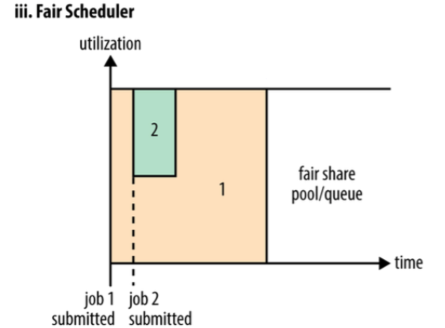


基本特点:

1. 资源公平共享

默认是Fair策略分配资源，Fair 策略是一种基于最大最小公平算法实现的，所有应用程序平分资源。

1. 支持资源抢占

某个队列中有剩余资源时，调度器会将这些资源共享给其他队列，当该队列有了新的应用程序提交过来后，调度器会回收资源，调度器采用先等待再强制回收的策略。

1. 负载均衡

Fair Scheduler提供了一个基于任务数目的负载均衡机制，尽可能将系统中的任务均匀分布到各个节点上。

1. 调度策略配置灵活

可以每个队列选用不同的调度策略：FIFO、Fair、DRF

1. 提高小应用程序的响应时间

小作业也可以分配大资源，可以快速地运行完成

## 5. yarn的多租户配置实现资源隔离

资源隔离目前有2种，静态隔离和动态隔离。

**静态隔离**:

所谓静态隔离是以服务隔离，是通过cgroups（LINUX control groups) 功能来支持的。比如HADOOP服务包含HDFS, HBASE, YARN等等，那么我们固定的设置比例，HDFS:20%, HBASE:40%, YARN：40%， 系统会帮我们根据整个集群的CPU，内存，IO数量来分割资源，先提一下，IO是无法分割的，所以只能说当遇到IO问题时根据比例由谁先拿到资源，CPU和内存是预先分配好的。

上面这种按照比例固定分割就是静态分割了，仔细想想，这种做法弊端太多，假设我按照一定的比例预先分割好了，但是如果我晚上主要跑mapreduce, 白天主要是HBASE工作，这种情况怎么办？静态分割无法很好的支持，缺陷太大，这种模型可能不太合适。

**动态隔离**:

动态隔离主要是针对 YARN, 所谓动态只是相对静态来说，其实也不是动态。先说YARN， 在HADOOP整个环境，主要服务有哪些？mapreduce（这里再提一下，mapreduce是应用，YARN是框架，搞清楚这个概念），HBASE, HIVE，SPARK，HDFS，Flink， 实际上主要的大概这些，很多人估计会表示不赞同，oozie, ES, storm , kylin等等这些和YARN离的太远了，不依赖YARN的资源服务，而且这些服务都是单独部署就OK，关联性不大。所以主要和YARN有关也就是HIVE, SPARK，Mapreduce，Flink。这几个服务也正式目前用的最多的（HBASE用的也很多，但是和YARN没啥关系）。

根据上面的描述，大家应该能理解为什么所谓的动态隔离主要是针对YARN。好了，既然YARN占的比重这么多，那么如果能很好的对YARN进行资源隔离，那也是不错的。如果我有3个部分都需要使用HADOOP，那么我希望能根据不同部门设置资源的优先级别，实际上也是根据比例来设置，建立3个queue name, 开发部们30%，数据分析部分50%，运营部门20%。

设置了比例之后，再提交JOB的时候设置mapreduce.queue.name，那么JOB就会进入指定的队列里面。非常可惜的是，如果你指定了一个不存在的队列，JOB仍然可以执行，这个是目前无解的，默认提交JOB到YARN的时候，规则是root.users.username ， 队列不存在，会自动以这种格式生成队列名称。队列设置好之后，再通过ACL来控制谁能提交或者KIll job。

> 从上面2种资源隔离来看，没有哪一种做的很好，如果非要选一种，建议选取后者，隔离YARN资源， 第一种固定分割服务的方式实在支持不了现在的业务

需求：现在一个集群当中，可能有多个用户都需要使用，例如开发人员需要提交任务，测试人员需要提交任务，以及其他部门工作同事也需要提交任务到集群上面去，对于我们多个用户同时提交任务，我们可以通过配置yarn的多用户资源隔离来进行实现

1. node01编辑yarn-site.xml

```
<!--  指定我们的任务调度使用fairScheduler的调度方式  -->
<property>
 <name>yarn.resourcemanager.scheduler.class</name>
 <value>org.apache.hadoop.yarn.server.resourcemanager.scheduler.fair.FairScheduler</value>
</property>

<!--  指定我们的任务调度的配置文件路径  -->
<property>
 <name>yarn.scheduler.fair.allocation.file</name>
 <value>/etc/hadoop/fair-scheduler.xml</value>
</property>

<!-- 是否启用资源抢占，如果启用，那么当该队列资源使用
yarn.scheduler.fair.preemption.cluster-utilization-threshold 这么多比例的时候，就从其他空闲队列抢占资源
  -->
<property>
 <name>yarn.scheduler.fair.preemption</name>
 <value>true</value>
</property>
<property>
 <name>yarn.scheduler.fair.preemption.cluster-utilization-threshold</name>
 <value>0.8f</value>
</property>


<!-- 默认提交到default队列  -->
<property>
 <name>yarn.scheduler.fair.user-as-default-queue</name>
 <value>true</value>
 <description>default is True</description>
</property>

<!-- 如果提交一个任务没有到任何的队列，是否允许创建一个新的队列，设置false不允许  -->
<property>
 <name>yarn.scheduler.fair.allow-undeclared-pools</name>
 <value>false</value>
 <description>default is True</description>
</property>
```

1. node01添加fair-scheduler.xml配置文件

```
<?xml version="1.0"?>
<allocations>
<!-- users max running apps  -->
<userMaxAppsDefault>30</userMaxAppsDefault>
<!-- 定义我们的队列  -->
<queue name="root">
 <minResources>512mb,4vcores</minResources>
 <maxResources>102400mb,100vcores</maxResources>
 <maxRunningApps>100</maxRunningApps>
 <weight>1.0</weight>
 <schedulingMode>fair</schedulingMode>
 <aclSubmitApps> </aclSubmitApps>
 <aclAdministerApps> </aclAdministerApps>

 <queue name="default">
  <minResources>512mb,4vcores</minResources>
  <maxResources>30720mb,30vcores</maxResources>
  <maxRunningApps>100</maxRunningApps>
  <schedulingMode>fair</schedulingMode>
  <weight>1.0</weight>
  <!--  所有的任务如果不指定任务队列，都提交到default队列里面来 -->
  <aclSubmitApps>*</aclSubmitApps>
 </queue>

<!-- 

weight
资源池权重

aclSubmitApps
允许提交任务的用户名和组；
格式为： 用户名 用户组

当有多个用户时候，格式为：用户名1,用户名2 用户名1所属组,用户名2所属组

aclAdministerApps
允许管理任务的用户名和组；

格式同上。
 -->
 <queue name="hadoop">
  <minResources>512mb,4vcores</minResources>
  <maxResources>20480mb,20vcores</maxResources>
  <maxRunningApps>100</maxRunningApps>
  <schedulingMode>fair</schedulingMode>
  <weight>2.0</weight>
  <aclSubmitApps>hadoop hadoop</aclSubmitApps>
  <aclAdministerApps>hadoop hadoop</aclAdministerApps>
 </queue>

 <queue name="develop">
  <minResources>512mb,4vcores</minResources>
  <maxResources>20480mb,20vcores</maxResources>
  <maxRunningApps>100</maxRunningApps>
  <schedulingMode>fair</schedulingMode>
  <weight>1</weight>
  <aclSubmitApps>develop develop</aclSubmitApps>
  <aclAdministerApps>develop develop</aclAdministerApps>
 </queue>

 <queue name="test1">
  <minResources>512mb,4vcores</minResources>
  <maxResources>20480mb,20vcores</maxResources>
  <maxRunningApps>100</maxRunningApps>
  <schedulingMode>fair</schedulingMode>
  <weight>1.5</weight>
  <aclSubmitApps>test1,hadoop,develop test1</aclSubmitApps>
  <aclAdministerApps>test1 group_businessC,supergroup</aclAdministerApps>
 </queue>
</queue>
</allocations>
```

1. 将修改后的配置文件拷贝到其他机器上

```
cd /export/servers/hadoop-2.6.0-cdh5.14.0/etc/hadoop
[root@node01 hadoop]# scp yarn-site.xml  fair-scheduler.xml node02:$PWD
[root@node01 hadoop]# scp yarn-site.xml  fair-scheduler.xml node03:$PWD
```

1. 重启yarn集群

```
[root@node01 hadoop]# cd /export/servers/hadoop-2.6.0-cdh5.14.0/
[root@node01 hadoop-2.6.0-cdh5.14.0]# sbin/stop-yarn.sh
[root@node01 hadoop-2.6.0-cdh5.14.0]# sbin/start-yarn.sh
```

1. 创建普通用户hadoop

```
useradd hadoop
passwd hadoop
```

1. 修改文件夹权限

node01执行以下命令，修改hdfs上面tmp文件夹的权限，不然普通用户执行任务的时候会抛出权限不足的异常

```
groupadd supergroup
usermod -a -G supergroup hadoop
su - root -s /bin/bash -c "hdfs dfsadmin -refreshUserToGroupsMappings"
```

1. 使用hadoop用户提交mr任务

node01执行以下命令，切换到普通用户hadoop，然后使用hadoop来提交mr的任务

```
[root@node01 hadoop-2.6.0-cdh5.14.0]# su hadoop
[hadoop@node01 hadoop-2.6.0-cdh5.14.0]$ yarn jar /export/servers/hadoop-2.6.0-cdh5.14.0/share/hadoop/mapreduce/hadoop-mapreduce-examples-2.6.0-cdh5.14.0.jar pi 10 20
```

> 本文档首发在公众号【**五分钟学大数据**】

# 四、Hadoop 3.x 版本的新特性

## 1. Apache Hadoop 3.0.0

Apache Hadoop 3.0.0在以前的主要发行版本（hadoop-2.x）上进行了许多重大改进。

#### 1. 最低要求的Java版本从Java 7增加到Java 8

现在，已针对Java 8的运行时版本编译了所有Hadoop JAR。仍在使用Java 7或更低版本的用户必须升级到Java 8。

#### 2. 支持HDFS中的纠删码

纠删码是一种持久存储数据的方法，可节省大量空间。与标准HDFS副本机制的3倍开销相比，像Reed-Solomon(10,4) 这样的标准编码的空间开销是1.4倍。

由于纠删码在重建期间会带来额外的开销，并且大多数情况下会执行远程读取，因此传统上已将其用于存储较冷，访问频率较低的数据。

在部署此功能时应考虑纠删码机制的网络和CPU开销。

关于HDFS中纠删码更详细的介绍，可查看我之前写的这篇文章：[ 深入剖析 HDFS 3.x 新特性-纠删码](https://mp.weixin.qq.com/s?__biz=Mzg2MzU2MDYzOA==&mid=2247484561&idx=1&sn=4da87b1e99bb2387e41a7158ceb596e3&scene=21#wechat_redirect)

#### 3. Shell脚本重写

Hadoop Shell脚本已被重写，以修复许多长期存在的错误并包括一些新功能。Hadoop的开发人员尽管一直在寻求兼容性，但是某些更改可能会破坏现有的安装。

#### 4. MapReduce 任务本地优化

MapReduce 增加了对 map output 收集器的本地执行的支持，对于 shuffle 密集型工作，这可以使性能提高30％或更多。

#### 5. 支持两个以上的 NameNode

在之前的版本中，HDFS的高可用最多支持两个NameNode。在HDFS 3.x 版本中，通过将编辑复制到法定数量的三个JournalNode，该体系结构能够容忍系统中任何一个节点的故障。

但是，某些部署需要更高的容错度。这个新特性启用了这一点，该功能允许用户运行多个备用NameNode。例如，通过配置三个NameNode和五个JournalNode，群集可以忍受两个节点的故障，而不仅仅是一个节点的故障。

#### 6. 多个服务的默认端口已更改

以前，多个Hadoop服务的默认端口在Linux临时端口范围内（32768-61000）。这意味着在启动时，服务有时会由于与另一个应用程序的冲突而无法绑定到端口。

这些冲突的端口已移出临时范围，具体的端口更改如下：

NameNode 的端口: 50070 --> 9870, 8020 --> 9820, 50470 --> 9871;
Secondary NameNode 的端口: 50091 --> 9869, 50090 --> 9868;
DataNode 的端口: 50020 --> 9867, 50010 --> 9866, 50475 --> 9865, 50075 --> 9864;
Hadoop KMS 的端口: 16000 --> 9600（HBase的HMaster端口号与Hadoop KMS端口号冲突。两者都使用16000，因此 Hadoop KMS 更改为9600）。

#### 7. 支持Microsoft Azure数据湖和阿里云对象存储系统文件系统连接器

Hadoop现在支持与Microsoft Azure数据湖和Aliyun对象存储系统集成，作为与Hadoop兼容的替代文件系统。

#### 8. 数据内节点平衡器

单个DataNode可管理多个磁盘。在正常的写操作过程中，磁盘将被均匀填充。但是，添加或替换磁盘可能会导致DataNode内部出现严重偏差。原有的HDFS平衡器无法处理这种情况。新版本的HDFS中有平衡功能处理，该功能通过`hdfs diskbalancer` CLI调用。

#### 9. 基于HDFS路由器的联合

基于HDFS路由器的联合添加了一个RPC路由层，该层提供了多个HDFS名称空间的联合视图。这简化了现有HDFS客户端对联合群集的访问。

#### 10. YARN资源类型

YARN资源模型已被通用化，以支持用户定义的CPU和内存以外的可计数资源类型。例如，集群管理员可以定义资源，例如GPU，软件许可证或本地连接的存储。然后可以根据这些资源的可用性来调度YARN任务。

## 2. HDFS 3.x 数据存储新特性-纠删码

HDFS是一个高吞吐、高容错的分布式文件系统，但是HDFS在保证高容错的同时也带来了高昂的存储成本，比如有5T的数据存储在HDFS上，按照HDFS的默认3副本机制，将会占用15T的存储空间。那么有没有一种能达到和副本机制相同的容错能力但是能大幅度降低存储成本的机制呢，有，就是在HDFS 3.x 版本引入的**纠删码**机制。

### 1. EC介绍

> Erasure Coding  简称 EC，中文名：纠删码

EC（纠删码）是一种编码技术，在 HDFS 之前，这种编码技术在廉价磁盘冗余阵列（RAID）中应用最广泛，RAID 通过条带化技术实现 EC，**条带化技术就是一种自动将 I/O 的负载均衡到多个物理磁盘上的技术**，原理就是将一块连续的数据分成很多小部分并把他们分别存储到不同磁盘上去，这就能使多个进程同时访问数据的多个不同部分而不会造成磁盘冲突（当多个进程同时访问一个磁盘时，可能会出现磁盘冲突），而且在需要对这种数据进行顺序访问的时候可以获得最大程度上的 I/O 并行能力，从而获得非常好的性能。

在HDFS中，把连续的数据分成很多的小部分称为**条带化单元**，对于原始数据单元的每个条带单元，都会计算并存储一定数量的奇偶检验单元，计算的过程称为编码，可以通过基于剩余数据和奇偶校验单元的解码计算来恢复任何条带化单元上的错误。

### 2. HDFS数据冗余存储策略

**HDFS的存储策略是副本机制**，这种存储方式使得数据存储的安全性得到提高，但同时也带来了额外的开销，HDFS默认的3副本方案在存储空间和其他资源（如网络带宽）上有200%的额外开销，但是对于I/O活动相对较低的数据，在正常期间很少访问其他块副本，但是仍然消耗与第一个副本相同的资源量。

因此，HDFS 3.x 版本一个重大改进就是**使用纠删码（EC）代替副本机制**，**纠删码技术提供了与副本机制相同的容错能力，而存储空间却少得多**。在典型的纠删码（EC）设置中，存储开销不超过50%。

### 3. EC算法实现原理

EC的实现算法有很多种，较为常见的一种算法是**Reed-Solomon（RS）**，它有两个参数，记为`RS(k,m)`，k 表示数据块，m 表示校验块，**有多少个校验块就最多可容忍多少个块（包括数据块和校验块）丢失**，具体原理通过如下例子解释：

我们使用`RS(3,2)`，表示使用 3 个原始数据块，2 个校验块。

例：由`RS(3,2)` 可求出它的生成矩阵 GT，和 7、8、9 三个原始数据块 Data，通过**矩阵乘法**，计算出来两个校验数据块 50、122。这时原始数据加上校验数据，一共五个数据块：7、8、9、50、122，可以任意丢两个，然后通过算法进行恢复，矩阵乘法如下图所示：

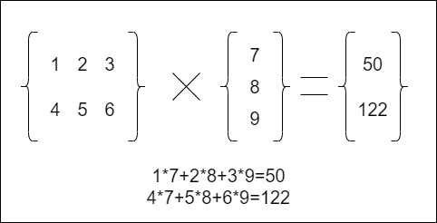

> GT 是生成矩阵，RS(k,m) 的生成矩阵就是 m 行 k 列的矩阵；
>
> Data 代表原始数据，7,8,9代表原始数据块；
>
> Parity 代表校验数据，50,122代表校验数据块。

所以3个原始数据块，如果使用2个校验块，EC编码总共占用5个数据块的磁盘空间，与2副本机制占用6个数据块的磁盘空间**容错能力相当**。

### 4. EC的应用场景

将EC技术集成进HDFS可以提高存储效率，同时仍提供与传统的基于副本的HDFS部署类似的数据持久性。例如，一个具有6个块的3副本文件将消耗 6 * 3 = 18 个磁盘空间。但是，使用EC(6个数据，3个校验)部署时，它将仅消耗9个磁盘空间块。

但是EC在编码过程及数据重建期间会大量的使用CPU资源，并且数据大部分是执行远程读取，所以还会有大量的网络开销。

所以，**对于CPU资源紧张且存储成本较低的情况下，可以采用副本机制存储数据，对于CPU资源有剩余且存储成本较高的情况下，可以采用EC机制存储数据**。

### 5. EC在HDFS的架构

HDFS 是直接使用 `Online EC`（以EC格式写入数据），避免了转换阶段并节省了存储空间。`Online EC` 还通过并行利用多个磁盘主轴来增强顺序`I/O`性能。在具有高端网络的群集中，这尤其理想。其次，它自然地将一个小文件分发到多个DataNode，而无需将多个文件捆绑到一个编码组中。这极大地简化了文件操作，例如删除，磁盘配额以及namespaces之间的迁移。

在一般HDFS集群中，小文件可占总存储消耗的3/4以上，为了更好的支持小文件，HDFS目前支持条形布局（Striping Layout）的EC方案，而HDFS连续布局（Contiguous Layout）方案正在开发中。

1. **条形布局**：

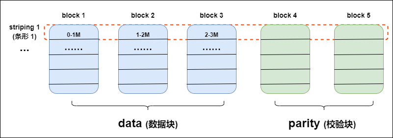

优点：

- 客户端缓存数据较少；
- 无论文件大小都适用。

缺点：

- 会影响一些位置敏感任务的性能，因为原先在一个节点上的块被分散到了多个不同的节点上；
- 和多副本存储策略转换比较麻烦。

1. **连续布局**：

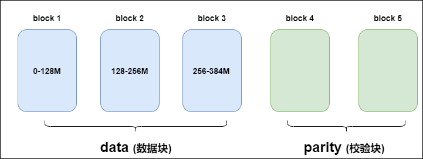

优点：

- 容易实现；
- 方便和多副本存储策略进行转换。

缺点：

- 需要客户端缓存足够的数据块；
- 不适合存储小文件。

------

传统模式下 HDFS 中文件的基本构成单位是`block`，而EC模式下文件的基本构成单位是`block group`。以RS(3,2)为例，每个`block group`包含3个数据块，2个校验块。

**HDFS对于引入EC模式所做的主要扩展如下**：

- NameNode：HDFS文件在逻辑上由block group组成，每个block group包含一定数量的内部块，**为了减少这些内部块对NameNode内存消耗**，HDFS引入了新的分层块命名协议。可以从其任何内部块的ID推断出block group的ID。这允许在块组而不是块的级别进行管理。

- Client：客户端读取和写入路径得到了增强，可以并行处理block group中的多个内部块。

- DataNode：DataNode运行额外ErasureCodingWorker（ECWorker）任务，用于对失败的纠删编码块进行后台恢复。**NameNode检测到失败的EC块， 会选择一个DataNode进行恢复工作。此过程类似于失败时如何重新恢复副本的块**。重建执行三个关键的任务节点：

- 1. 从源节点读取数据：使用专用线程池从源节点并行读取输入数据。基于EC策略，对所有源目标的发起读取请求，并仅读取最少数量的输入块进行重建。
  2. 解码数据并生成输出数据：从输入数据解码新数据和奇偶校验块。所有丢失的数据和奇偶校验块一起解码。
  3. 将生成的数据块传输到目标节点：解码完成后，恢复的块将传输到目标DataNodes。

- 纠删码策略：为了适应异构的工作负载，HDFS群集中的文件和目录允许具有不同的复制和纠删码策略。纠删码策略封装了如何对文件进行编码/解码。每个策略由以下信息定义：

- 1. EC模式：这包括EC组（例如6 + 3）中的数据和奇偶校验块的数量，以及编解码器算法（例如Reed-Solomon，XOR）。
  2. 条带化单元的大小。这确定了条带读取和写入的粒度，包括缓冲区大小和编码工作。

我们可以**通过XML文件定义自己的EC策略**，该文件必须包含以下三个部分：

1. layoutversion：这表示EC策略XML文件格式的版本。
2. schemas：这包括所有用户定义的EC模式。
3. policies：这包括所有用户定义的EC策略，每个策略均由schema id和条带化单元的大小（cellsize）组成。

`Hadoop conf`目录中有一个配置EC策略的XML示例文件，配置时可以参考该文件，文件名称为`user_ec_policies.xml.template`。

### 6. 集群的硬件配置

纠删码对群集在CPU和网络方面有一定的要求：

1. 编码和解码工作会消耗HDFS客户端和DataNode上的额外CPU。
2. 纠删码文件也分布在整个机架上，以实现机架容错。这意味着在读写条带化文件时，大多数操作都是在机架上进行的。因此，**网络二等分带宽非常重要**。
3. 对于机架容错，拥有至少与配置的EC条带宽度一样多的机架也很重要。对于EC策略`RS(6,3)`，这意味着最少要有9个机架，理想情况下是10或11个机架，以处理计划内和计划外的中断。对于机架少于条带宽度的群集，HDFS无法保持机架容错，但仍会尝试在多个节点之间分布条带化文件以保留节点级容错。

### 7. 最后

在HDFS默认情况下，所有的EC策略是被禁止的，我们可以根据群集的大小和所需的容错属性，通过`hdfs ec [-enablePolicy -policy]`命令启用EC策略。

例如，对于具有9个机架的群集，像`RS-10-4-1024k`这样的策略将不会保留机架级的容错能力，而`RS-6-3-1024k`或`RS-3-2-1024k`可能更合适。

> `RS-10-4-1024k` 表示有10个数据块，4个校验块。

在副本机制下，我们可以设置副本因子，指定副本的数量，但是**在EC策略下，指定副本因子是没有意义的，因为它始终为1**，无法通过相关命令进行更改。

------

> 本文档首发在公众号【**五分钟学大数据**】

# 五、Hadoop大厂面试真题

hadoop中常问的就三块，第一：分布式存储(HDFS)；第二：分布式计算框架(MapReduce)；第三：资源调度框架(YARN)。

> 本文首发于公众号【五分钟学大数据】，关注公众号，获取最新大数据技术文章

#### 1. 请说下HDFS读写流程

> 这个问题虽然见过无数次，面试官问过无数次，还是有不少面试者不能完整的说出来，所以请务必记住。并且很多问题都是从HDFS读写流程中引申出来的。

**HDFS写流程**：

1. Client客户端发送上传请求，**通过RPC与NameNode建立通信**，NameNode检查该用户是否有上传权限，以及上传的文件是否在HDFS对应的目录下重名，如果这两者有任意一个不满足，则直接报错，如果两者都满足，则返回给客户端一个可以上传的信息；
2. Client根据文件的大小进行切分，默认128M一块，切分完成之后给NameNode发送请求第一个block块上传到哪些服务器上；
3. NameNode收到请求之后，根据网络拓扑和机架感知以及副本机制进行文件分配，返回可用的DataNode的地址；

> 注：Hadoop在设计时考虑到数据的安全与高效, **数据文件默认在HDFS上存放三份, 存储策略为本地一份，同机架内其它某一节点上一份, 不同机架的某一节点上一份**。

1. 客户端收到地址之后与服务器地址列表中的一个节点如A进行通信，本质上就是RPC调用，建立pipeline，A收到请求后会继续调用B，B在调用C，将整个pipeline建立完成，逐级返回Client；
2. Client开始向A上发送第一个block（**先从磁盘读取数据然后放到本地内存缓存**），**以packet（数据包，64kb）为单位，A收到一个packet就会发送给B，然后B发送给C，A每传完一个packet就会放入一个应答队列等待应答**；
3. 数据被分割成一个个的packet数据包在pipeline上依次传输，**在pipeline反向传输中，逐个发送ack（命令正确应答）**，最终由pipeline中第一个DataNode节点A将pipelineack发送给Client；
4. 当一个block传输完成之后, Client再次请求NameNode上传第二个block，NameNode重新选择三台DataNode给Client。

**HDFS读流程**：

1. Client向NameNode发送RPC请求。请求文件block的位置；
2. NameNode收到请求之后会检查用户权限以及是否有这个文件，如果都符合，则会视情况返回部分或全部的block列表，对于每个block，NameNode都会返回含有该block副本的DataNode地址；这些返回的DataNode地址，会按照集群拓扑结构得出DataNode与客户端的距离，然后进行排序，**排序两个规则**：网络拓扑结构中距离 Client 近的排靠前；心跳机制中超时汇报的DataNode状态为STALE，这样的排靠后；
3. Client选取排序靠前的DataNode来读取block，如果客户端本身就是DataNode,那么将从本地直接获取数据(**短路读取特性**)；
4. 底层上本质是建立Socket Stream（FSDataInputStream），重复的调用父类DataInputStream的read方法，直到这个块上的数据读取完毕；
5. 当读完列表的block后，若文件读取还没有结束，客户端会继续向NameNode 获取下一批的block列表；
6. **读取完一个block都会进行checksum验证**，如果读取DataNode时出现错误，客户端会通知NameNode，然后再从下一个拥有该block副本的DataNode 继续读；
7. **read方法是并行的读取block信息，不是一块一块的读取**；NameNode只是返回Client请求包含块的DataNode地址，**并不是返回请求块的数据**；
8. 最终读取来所有的block会合并成一个完整的最终文件；

#### 2. HDFS在读取文件的时候，如果其中一个块突然损坏了怎么办

客户端读取完DataNode上的块之后会进行checksum验证，也就是把客户端读取到本地的块与HDFS上的原始块进行校验，如果发现校验结果不一致，客户端会通知NameNode，然后再**从下一个拥有该block副本的DataNode继续读**。

#### 3. HDFS在上传文件的时候，如果其中一个DataNode突然挂掉了怎么办

客户端上传文件时与DataNode建立pipeline管道，管道的正方向是客户端向DataNode发送的数据包，管道反向是DataNode向客户端发送ack确认，也就是正确接收到数据包之后发送一个已确认接收到的应答。

当DataNode突然挂掉了，客户端接收不到这个DataNode发送的ack确认，客户端会通知NameNode，NameNode检查该块的副本与规定的不符，NameNode会通知DataNode去复制副本，并将挂掉的DataNode作下线处理，不再让它参与文件上传与下载。

#### 4. NameNode在启动的时候会做哪些操作

NameNode数据存储在内存和本地磁盘，本地磁盘数据存储在**fsimage镜像文件和edits编辑日志文件**。

首次启动NameNode：

1. **格式化文件系统，为了生成fsimage镜像文件**；

2. 启动NameNode：

3. - 读取fsimage文件，将文件内容加载进内存
   - 等待DataNade注册与发送block report

4. 启动DataNode：

5. - 向NameNode注册
   - 发送block report
   - 检查fsimage中记录的块的数量和block report中的块的总数是否相同

6. 对文件系统进行操作（创建目录，上传文件，删除文件等）：

7. - 此时内存中已经有文件系统改变的信息，但是磁盘中没有文件系统改变的信息，此时会将这些改变信息写入edits文件中，edits文件中存储的是文件系统元数据改变的信息。

第二次启动NameNode：

1. 读取fsimage和edits文件；
2. 将fsimage和edits文件合并成新的fsimage文件；
3. 创建新的edits文件，内容开始为空；
4. 启动DataNode。

#### 5. Secondary NameNode了解吗，它的工作机制是怎样的

Secondary NameNode是合并NameNode的edit logs到fsimage文件中；

它的具体工作机制：

1. Secondary NameNode询问NameNode是否需要checkpoint。直接带回NameNode是否检查结果；
2. Secondary NameNode请求执行checkpoint；
3. NameNode滚动正在写的edits日志；
4. 将滚动前的编辑日志和镜像文件拷贝到Secondary NameNode；
5. Secondary NameNode加载编辑日志和镜像文件到内存，并合并；
6. 生成新的镜像文件fsimage.chkpoint；
7. 拷贝fsimage.chkpoint到NameNode；
8. NameNode将fsimage.chkpoint重新命名成fsimage；

所以如果NameNode中的元数据丢失，是可以从Secondary NameNode恢复一部分元数据信息的，但不是全部，因为NameNode正在写的edits日志还没有拷贝到Secondary NameNode，这部分恢复不了。

#### 6. Secondary NameNode不能恢复NameNode的全部数据，那如何保证NameNode数据存储安全

这个问题就要说NameNode的高可用了，即 **NameNode HA**。

一个NameNode有单点故障的问题，那就配置双NameNode，配置有两个关键点，一是必须要保证这两个NameNode的元数据信息必须要同步的，二是一个NameNode挂掉之后另一个要立马补上。

1. **元数据信息同步在 HA 方案中采用的是“共享存储”**。每次写文件时，需要将日志同步写入共享存储，这个步骤成功才能认定写文件成功。然后备份节点定期从共享存储同步日志，以便进行主备切换。
2. 监控NameNode状态采用zookeeper，两个NameNode节点的状态存放在zookeeper中，另外两个NameNode节点分别有一个进程监控程序，实施读取zookeeper中有NameNode的状态，来判断当前的NameNode是不是已经down机。如果Standby的NameNode节点的ZKFC发现主节点已经挂掉，那么就会强制给原本的Active NameNode节点发送强制关闭请求，之后将备用的NameNode设置为Active。

> **如果面试官再问HA中的 共享存储 是怎么实现的知道吗？**
> 可以进行解释下：NameNode 共享存储方案有很多，比如Linux HA, VMware FT, QJM等，目前社区已经把由Clouderea公司实现的基于QJM（Quorum Journal Manager）的方案合并到HDFS的trunk之中并且作为**默认的共享存储**实现。
> 基于QJM的共享存储系统**主要用于保存EditLog，并不保存FSImage文件**。FSImage文件还是在NameNode的本地磁盘上。
> QJM共享存储的基本思想来自于Paxos算法，采用多个称为JournalNode的节点组成的JournalNode集群来存储EditLog。每个JournalNode保存同样的EditLog副本。每次NameNode写EditLog的时候，除了向本地磁盘写入 EditLog 之外，也会并行地向JournalNode集群之中的每一个JournalNode发送写请求，只要大多数的JournalNode节点返回成功就认为向JournalNode集群写入EditLog成功。如果有2N+1台JournalNode，那么根据大多数的原则，最多可以容忍有N台JournalNode节点挂掉。

#### 7. 在NameNode HA中，会出现脑裂问题吗？怎么解决脑裂

> 假设 NameNode1 当前为 Active 状态，NameNode2 当前为 Standby 状态。如果某一时刻 NameNode1 对应的 ZKFailoverController 进程发生了“假死”现象，那么 Zookeeper 服务端会认为 NameNode1 挂掉了，根据前面的主备切换逻辑，NameNode2 会替代 NameNode1 进入 Active 状态。但是此时 NameNode1 可能仍然处于 Active 状态正常运行，这样 NameNode1 和 NameNode2 都处于 Active 状态，都可以对外提供服务。这种情况称为脑裂。

脑裂对于NameNode这类对数据一致性要求非常高的系统来说是灾难性的，数据会发生错乱且无法恢复。zookeeper社区对这种问题的解决方法叫做 fencing，中文翻译为隔离，也就是想办法把旧的 Active NameNode 隔离起来，使它不能正常对外提供服务。

在进行 fencing 的时候，会执行以下的操作：

1. 首先尝试调用这个旧 Active NameNode 的 HAServiceProtocol RPC 接口的 transitionToStandby 方法，看能不能把它转换为 Standby 状态。

2. 如果 transitionToStandby 方法调用失败，那么就执行 Hadoop 配置文件之中预定义的隔离措施，Hadoop 目前主要提供两种隔离措施，通常会选择 sshfence：

3. - sshfence：通过 SSH 登录到目标机器上，执行命令 fuser 将对应的进程杀死；
   - shellfence：执行一个用户自定义的 shell 脚本来将对应的进程隔离。

#### 8. 小文件过多会有什么危害，如何避免

Hadoop上大量HDFS元数据信息存储在NameNode内存中,因此过多的小文件必定会压垮NameNode的内存。

每个元数据对象约占150byte，所以如果有1千万个小文件，每个文件占用一个block，则NameNode大约需要2G空间。如果存储1亿个文件，则NameNode需要20G空间。

显而易见的解决这个问题的方法就是合并小文件,可以选择在客户端上传时执行一定的策略先合并,或者是使用Hadoop的`CombineFileInputFormat\<K,V\>`实现小文件的合并。

#### 9. 请说下HDFS的组织架构

1. **Client**：客户端

2. - 切分文件。文件上传HDFS的时候，Client将文件切分成一个一个的Block，然后进行存储
   - 与NameNode交互，获取文件的位置信息
   - 与DataNode交互，读取或者写入数据
   - Client提供一些命令来管理HDFS，比如启动关闭HDFS、访问HDFS目录及内容等

3. **NameNode**：名称节点，也称主节点，存储数据的元数据信息，不存储具体的数据

4. - 管理HDFS的名称空间
   - 管理数据块（Block）映射信息
   - 配置副本策略
   - 处理客户端读写请求

5. **DataNode**：数据节点，也称从节点。NameNode下达命令，DataNode执行实际的操作

6. - 存储实际的数据块
   - 执行数据块的读/写操作

7. **Secondary NameNode**：并非NameNode的热备。当NameNode挂掉的时候，它并不能马上替换NameNode并提供服务

8. - 辅助NameNode，分担其工作量
   - 定期合并Fsimage和Edits，并推送给NameNode
   - 在紧急情况下，可辅助恢复NameNode

#### 10. 请说下MR中Map Task的工作机制

**简单概述**：

inputFile通过split被切割为多个split文件，通过Record按行读取内容给map（自己写的处理逻辑的方法） ，数据被map处理完之后交给OutputCollect收集器，对其结果key进行分区（默认使用的hashPartitioner），然后写入buffer，**每个map task 都有一个内存缓冲区**（环形缓冲区），存放着map的输出结果，当缓冲区快满的时候需要将缓冲区的数据以一个临时文件的方式溢写到磁盘，当整个map task 结束后再对磁盘中这个maptask产生的所有临时文件做合并，生成最终的正式输出文件，然后等待reduce task的拉取。

**详细步骤**：

1. 读取数据组件 InputFormat (默认 TextInputFormat) 会通过 getSplits 方法对输入目录中的文件进行逻辑切片规划得到 block，有多少个 block就对应启动多少个 MapTask。
2. 将输入文件切分为 block 之后，由 RecordReader 对象 (默认是LineRecordReader) 进行读取，以 \n 作为分隔符, 读取一行数据, 返回 <key，value>， Key 表示每行首字符偏移值，Value 表示这一行文本内容。
3. 读取 block 返回 <key,value>, 进入用户自己继承的 Mapper 类中，执行用户重写的 map 函数，RecordReader 读取一行这里调用一次。
4. Mapper 逻辑结束之后，将 Mapper 的每条结果通过 context.write 进行collect数据收集。在 collect 中，会先对其进行分区处理，默认使用 HashPartitioner。
5. **接下来，会将数据写入内存，内存中这片区域叫做环形缓冲区(默认100M)，缓冲区的作用是 批量收集 Mapper 结果，减少磁盘 IO 的影响。我们的 Key/Value 对以及 Partition 的结果都会被写入缓冲区。当然，写入之前，Key 与 Value 值都会被序列化成字节数组**。
6. 当环形缓冲区的数据达到溢写比列(默认0.8)，也就是80M时，溢写线程启动，**需要对这 80MB 空间内的 Key 做排序 (Sort)**。排序是 MapReduce 模型默认的行为，这里的排序也是对序列化的字节做的排序。
7. 合并溢写文件，每次溢写会在磁盘上生成一个临时文件 (写之前判断是否有 Combiner)，如果 Mapper 的输出结果真的很大，有多次这样的溢写发生，磁盘上相应的就会有多个临时文件存在。当整个数据处理结束之后开始对磁盘中的临时文件进行 Merge 合并，因为最终的文件只有一个写入磁盘，并且为这个文件提供了一个索引文件，以记录每个reduce对应数据的偏移量。

#### 11. 请说下MR中Reduce Task的工作机制

**简单描述**：

Reduce 大致分为 copy、sort、reduce 三个阶段，重点在前两个阶段。

copy 阶段包含一个 eventFetcher 来获取已完成的 map 列表，由 Fetcher 线程去 copy 数据，在此过程中会启动两个 merge 线程，分别为 inMemoryMerger 和 onDiskMerger，分别将内存中的数据 merge 到磁盘和将磁盘中的数据进行 merge。待数据 copy 完成之后，copy 阶段就完成了。

开始进行 sort 阶段，sort 阶段主要是执行 finalMerge 操作，纯粹的 sort 阶段，完成之后就是 reduce 阶段，调用用户定义的 reduce 函数进行处理。

**详细步骤**：

1. **Copy阶段**：简单地拉取数据。Reduce进程启动一些数据copy线程(Fetcher)，通过HTTP方式请求maptask获取属于自己的文件（map task 的分区会标识每个map task属于哪个reduce task ，默认reduce task的标识从0开始）。

2. **Merge阶段**：在远程拷贝数据的同时，ReduceTask启动了两个后台线程对内存和磁盘上的文件进行合并，以防止内存使用过多或磁盘上文件过多。

   merge有三种形式：内存到内存；内存到磁盘；磁盘到磁盘。默认情况下第一种形式不启用。当内存中的数据量到达一定阈值，就直接启动内存到磁盘的merge。与map端类似，这也是溢写的过程，这个过程中如果你设置有Combiner，也是会启用的，然后在磁盘中生成了众多的溢写文件。内存到磁盘的merge方式一直在运行，直到没有map端的数据时才结束，然后启动第三种磁盘到磁盘的merge方式生成最终的文件。

3. **合并排序**：把分散的数据合并成一个大的数据后，还会再对合并后的数据排序。

4. **对排序后的键值对调用reduce方法**：键相等的键值对调用一次reduce方法，每次调用会产生零个或者多个键值对，最后把这些输出的键值对写入到HDFS文件中。

#### 12. 请说下MR中Shuffle阶段

shuffle阶段分为四个步骤：依次为：分区，排序，规约，分组，其中前三个步骤在map阶段完成，最后一个步骤在reduce阶段完成。

shuffle 是 Mapreduce 的核心，它分布在 Mapreduce 的 map 阶段和 reduce 阶段。一般把从 Map 产生输出开始到 Reduce 取得数据作为输入之前的过程称作 shuffle。

1. **Collect阶段**：将 MapTask 的结果输出到默认大小为 100M 的环形缓冲区，保存的是 key/value，Partition 分区信息等。
2. **Spill阶段**：当内存中的数据量达到一定的阀值的时候，就会将数据写入本地磁盘，在将数据写入磁盘之前需要对数据进行一次排序的操作，如果配置了 combiner，还会将有相同分区号和 key 的数据进行排序。
3. **MapTask阶段的Merge**：把所有溢出的临时文件进行一次合并操作，以确保一个 MapTask 最终只产生一个中间数据文件。
4. **Copy阶段**：ReduceTask 启动 Fetcher 线程到已经完成 MapTask 的节点上复制一份属于自己的数据，这些数据默认会保存在内存的缓冲区中，当内存的缓冲区达到一定的阀值的时候，就会将数据写到磁盘之上。
5. **ReduceTask阶段的Merge**：在 ReduceTask 远程复制数据的同时，会在后台开启两个线程对内存到本地的数据文件进行合并操作。
6. **Sort阶段**：在对数据进行合并的同时，会进行排序操作，由于 MapTask 阶段已经对数据进行了局部的排序，ReduceTask 只需保证 Copy 的数据的最终整体有效性即可。

> Shuffle 中的缓冲区大小会影响到 mapreduce 程序的执行效率，原则上说，缓冲区越大，磁盘io的次数越少，执行速度就越快。
> 缓冲区的大小可以通过参数调整,  参数：`mapreduce.task.io.sort.mb` 默认100M

#### 13. Shuffle阶段的数据压缩机制了解吗

在shuffle阶段，可以看到数据通过大量的拷贝，从map阶段输出的数据，都要通过网络拷贝，发送到reduce阶段，这一过程中，涉及到大量的网络IO，如果数据能够进行压缩，那么数据的发送量就会少得多。

hadoop当中支持的压缩算法：
gzip、bzip2、LZO、LZ4、**Snappy**，这几种压缩算法综合压缩和解压缩的速率，谷歌的Snappy是最优的，一般都选择Snappy压缩。谷歌出品，必属精品。

#### 14. 在写MR时，什么情况下可以使用规约

规约（combiner）是不能够影响任务的运行结果的局部汇总，适用于求和类，不适用于求平均值，如果reduce的输入参数类型和输出参数的类型是一样的，则规约的类可以使用reduce类，只需要在驱动类中指明规约的类即可。

#### 15. YARN集群的架构和工作原理知道多少

YARN的基本设计思想是将MapReduce V1中的JobTracker拆分为两个独立的服务：ResourceManager和ApplicationMaster。

ResourceManager负责整个系统的资源管理和分配，ApplicationMaster负责单个应用程序的的管理。

1. **ResourceManager**：RM是一个全局的资源管理器，负责整个系统的资源管理和分配，它主要由两个部分组成：调度器（Scheduler）和应用程序管理器（Application Manager）。

调度器根据容量、队列等限制条件，将系统中的资源分配给正在运行的应用程序，在保证容量、公平性和服务等级的前提下，优化集群资源利用率，让所有的资源都被充分利用应用程序管理器负责管理整个系统中的所有的应用程序，包括应用程序的提交、与调度器协商资源以启动ApplicationMaster、监控ApplicationMaster运行状态并在失败时重启它。

1. **ApplicationMaster**：用户提交的一个应用程序会对应于一个ApplicationMaster，它的主要功能有：

2. - 与RM调度器协商以获得资源，资源以Container表示。
   - 将得到的任务进一步分配给内部的任务。
   - 与NM通信以启动/停止任务。
   - 监控所有的内部任务状态，并在任务运行失败的时候重新为任务申请资源以重启任务。

3. **NodeManager**：NodeManager是每个节点上的资源和任务管理器，一方面，它会定期地向RM汇报本节点上的资源使用情况和各个Container的运行状态；另一方面，他接收并处理来自AM的Container启动和停止请求。

4. **Container**：Container是YARN中的资源抽象，封装了各种资源。**一个应用程序会分配一个Container，这个应用程序只能使用这个Container中描述的资源**。不同于MapReduceV1中槽位slot的资源封装，Container是一个动态资源的划分单位，更能充分利用资源。

#### 16. YARN的任务提交流程是怎样的

当jobclient向YARN提交一个应用程序后，YARN将分两个阶段运行这个应用程序：一是启动ApplicationMaster;第二个阶段是由ApplicationMaster创建应用程序，为它申请资源，监控运行直到结束。具体步骤如下:

1. 用户向YARN提交一个应用程序，并指定ApplicationMaster程序、启动ApplicationMaster的命令、用户程序。
2. RM为这个应用程序分配第一个Container，并与之对应的NM通讯，要求它在这个Container中启动应用程序ApplicationMaster。
3. ApplicationMaster向RM注册，然后拆分为内部各个子任务，为各个内部任务申请资源，并监控这些任务的运行，直到结束。
4. AM采用轮询的方式向RM申请和领取资源。
5. RM为AM分配资源，以Container形式返回。
6. AM申请到资源后，便与之对应的NM通讯，要求NM启动任务。
7. NodeManager为任务设置好运行环境，将任务启动命令写到一个脚本中，并通过运行这个脚本启动任务。
8. 各个任务向AM汇报自己的状态和进度，以便当任务失败时可以重启任务。
9. 应用程序完成后，ApplicationMaster向ResourceManager注销并关闭自己。

#### 17. YARN的资源调度三种模型了解吗

在Yarn中有三种调度器可以选择：FIFO Scheduler ，Capacity Scheduler，Fair Scheduler。

Apache版本的hadoop默认使用的是Capacity  Scheduler调度方式。CDH版本的默认使用的是Fair Scheduler调度方式

**FIFO Scheduler**（先来先服务）：

FIFO Scheduler把应用按提交的顺序排成一个队列，这是一个先进先出队列，在进行资源分配的时候，先给队列中最头上的应用进行分配资源，待最头上的应用需求满足后再给下一个分配，以此类推。

FIFO Scheduler是最简单也是最容易理解的调度器，也不需要任何配置，但它并不适用于共享集群。大的应用可能会占用所有集群资源，这就导致其它应用被阻塞，比如有个大任务在执行，占用了全部的资源，再提交一个小任务，则此小任务会一直被阻塞。

**Capacity Scheduler**（能力调度器）：

对于Capacity调度器，有一个专门的队列用来运行小任务，但是为小任务专门设置一个队列会预先占用一定的集群资源，这就导致大任务的执行时间会落后于使用FIFO调度器时的时间。

**Fair Scheduler**（公平调度器）：

在Fair调度器中，我们不需要预先占用一定的系统资源，Fair调度器会为所有运行的job动态的调整系统资源。

比如：当第一个大job提交时，只有这一个job在运行，此时它获得了所有集群资源；当第二个小任务提交后，Fair调度器会分配一半资源给这个小任务，让这两个任务公平的共享集群资源。

需要注意的是，在Fair调度器中，从第二个任务提交到获得资源会有一定的延迟，因为它需要等待第一个任务释放占用的Container。小任务执行完成之后也会释放自己占用的资源，大任务又获得了全部的系统资源。最终的效果就是Fair调度器即得到了高的资源利用率又能保证小任务及时完成。

