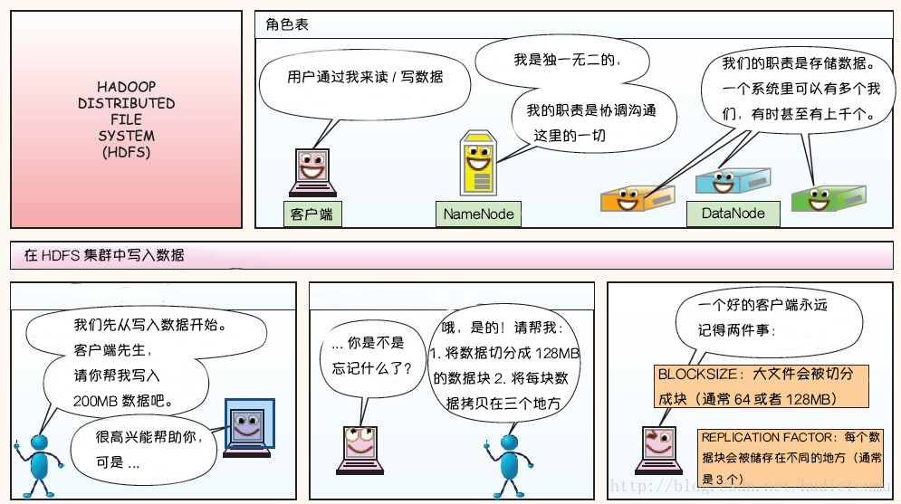
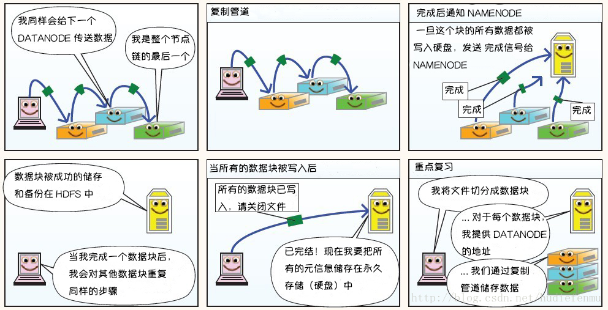
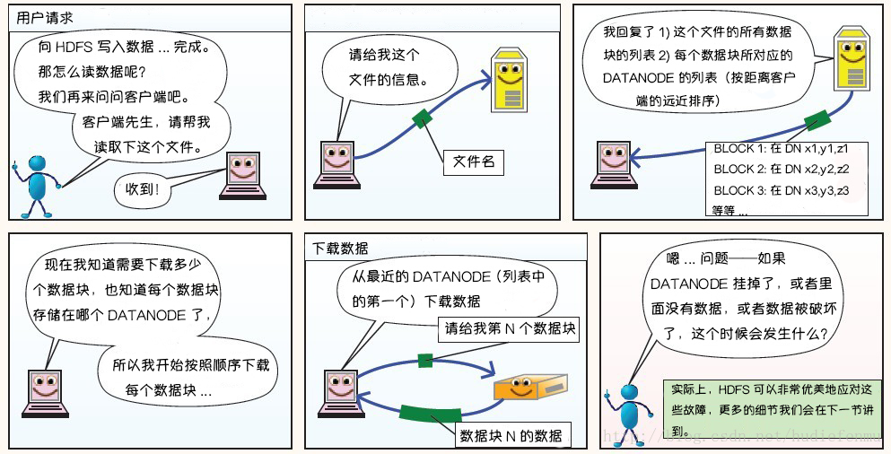
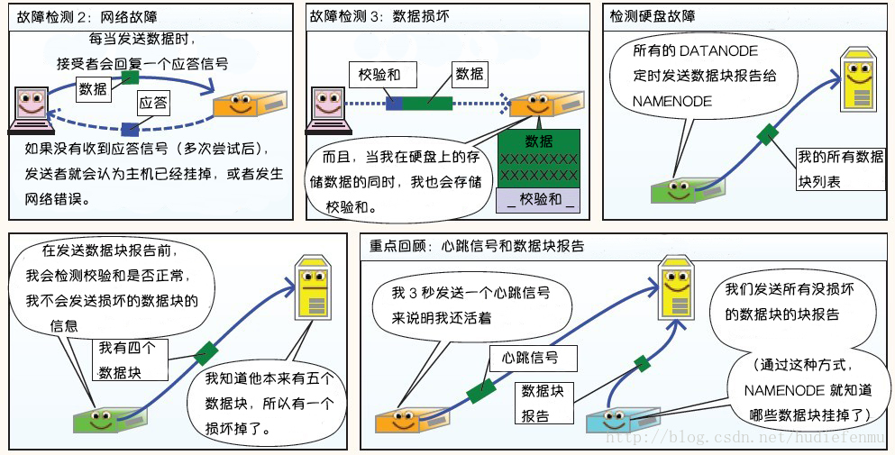
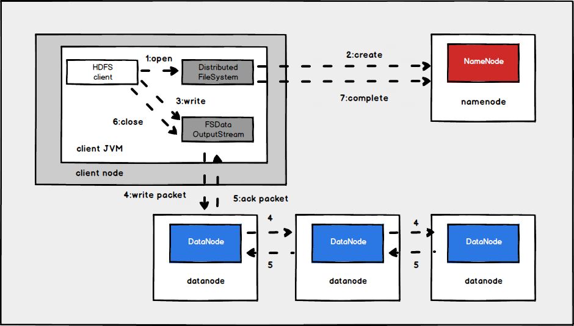
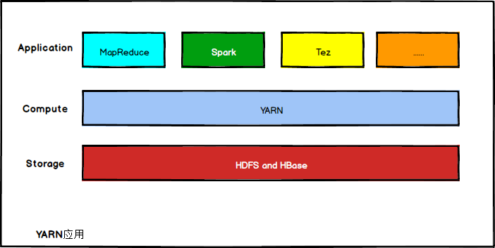

## 1 初始Hadoop

**1.1  相较于其它系统的优势**

- **为什么不能用配有大量硬盘的数据库来进行大规模数据分析？为什么需要Hadoop？**

计算机硬盘的寻址时间的提升远远不如传输速度的提升。寻址是将磁头移动到特定硬盘位置进行读/写操作的过程。他是导致硬盘操作延迟的主要原因，而传输速率取决于硬盘的带宽。

如果数据访问模式中包含大量的硬盘寻址，那么读取大量数据集就必然会花更长的时间。另一方面，如果数据库系统只更新一小部分记录，那么传统的B树就更有优势，但是数据库系统如果有大量数据更新时，B树的效率就明显落后于MapReduce，因为需要使用“排序/合并”来重建数据库。

在许多情况下，可以将MapReduce看作关系型数据库管理系统的补充，MapReduce适合解决需要以批处理方式分析整个数据集的问题。RDBMS适用于索引后数据集的点查询和更新，建立索引的数据库系统能够提供对小规模数据的低延迟数据检索和快速更新。**MapReduce适合一次写入，多次读取数据的应用，关系型数据库则更适合持续更新的数据集。**

|          | 传统关系型数据库 | MapReduce          |
| -------- | ---------------- | ------------------ |
| 数据大小 | GB               | PB                 |
| 数据存取 | 交互式和批处理   | 批处理             |
| 更新     | 多次读/写        | 一次写入，多次读取 |
| 事务     | ACID             | 无                 |
| 结构     | 写时模式         | 读时模式           |
| 完整性   | 高               | 低                 |
| 横向扩展 | 非线性           | 线性               |


## 2 关于MapReduce

**MapReduce是一种可用于数据处理的编程模型。**

**2.4.1 数据流**

MapReduce作业是客户端需要执行的一个工作单元：它包括输入数据、MapReduce程序和配置信息。Hadoop将作业分成若干个任务(task)来执行，其中包括辆类任务：map任务和reduce任务。这些任务运行在集群的节点上，并通过YARN进行调度。如果一个任务失败，它将在另一个不同的节点上自动重新调度运行。

- **为什么最佳分片的大小应该和块大小相同**？

因为他是确保可以存储在单个节点上的最大输入块的大小，如果分片跨越两个数据块，那么对于任何一个HDFS节点，基本都不可能同时存储这两个数据块，因此分片中的部分数据需要通过网络传输到map任务运行的节点。与使用本地数据运行整个map任务相比，这种方法效率更低。

- **map任务将其输出写入本地硬盘，而非HDFS？**

map的输出是中间结果：该中间结果由reduce任务处理后才产生最终输出结果，而且一旦作业完成，map的输出结果就可以删除。如果运行map任务的节点在将map中间结果传送给reduce任务之前是失败，hadoop将在另一个节点上重新运行这个map任务以再次构建map中间结果。

## 3 Hadoop分布式文件系统

**系统构成和写数据过程**

**HDFS写数据原理**






**读数据原理**



**HDFS故障类型和其检测方法**




**读写故障的处理**


**DataNode故障处理**


**副本布局策略**


### 3.2 HDFS的概念

- **HDFS中的块为什么这么大？**

HDFS的块比磁盘的块大，其目的是为了最小化寻址开销。如果块足够大，从磁盘传输数据的时间会明显大于定位这个块开始位置所需的时间。因而，传输一个由多个块组成的大文件的时间却决于磁盘传输速率。MapReduce中的map任务通常一次只处理一个块中的数据，因此如果任务数太少，作业的运行速度就会比较慢。

- **分布式文件系统中块抽象的好处？**

1. 一个文件的大小可以大于网络中任意一个磁盘的容量。文件的所有块并不需要存储在同一个磁盘上，因此他们可以利用集群上的任意一个磁盘进行存储。
2. 使用抽象块而非整个文件作为存储单元，大大简化了存储子系统的设计。将存储子系统的处理对象设置为块，可简化存储管理。同时也消除了对元数据的顾虑。
3. 块非常适合用于数据备份进而提供数据容错能力和提高可用性。

#### 3.2.2 namenode和datanode

HDFS集群有两类节点以管理节点-工作节点模式运行，即一个namenode(管理节点)和多个datanode(工作节点)。

**namenode**

1. 管理文件系统的命名空间，它维护者文件系统树及整棵树内所有的文件和目录。这些信息以两个文件形式永久保存在本地磁盘上：命名空间镜像文件和编辑日志文件。
2. 记录每个文件中各个块所在的数据节点信息(但它并不永久保存块的位置信息，因为这些信息会在系统启动时根据数据节点信息重建)。

**datanode**

文件系统的工作节点。它们根据需要存储并建锁数据块，并定期向namenode发送它们所存储的块的列表。

- **namenode容错机制**

1. 备份哪些组成文件系统元数据持久状态的文件。Hadoop可以通过配置使namenode在多个文件系统上保存元数据的持久状态。这些写操作是实时同步的，且是原子操作。
2. 运行一个辅助namenode，但它不能被用作namenode。这个辅助namenode的重要作用是定期合并编辑日志与命名空间镜像，以防止编辑日志过大。**它会保存合并后的命名空间镜像的副本，并在namenode发生故障时启用。**但是辅助namenode保存的状态总是滞后于主节点，所以在主节点全部失效时，难免会丢失部分数据。

- **HDFS高可用的实现需要在架构上做如下修改：**

1. namenode之间需要通过高可用共享存储实现编辑日志的共享。当备用namenode接管工作之后，它将通读共享编辑日志直至末尾，以实现与活动namenode的状态同步，并继续读取由活动namenode写入的新条目。
2. datanode需要同时向两个namenode发送数据块报告，因为数据块的映射信息存储在namenode的内存中，而非磁盘。
3. 客户端需要使用特定的机制来处理namenode的失效问题，这一机制对用户是透明的。
4. 辅助namenode的角色被备用namenode所包含，备用namenode为活动的namenode命名空间设置周期性检查点。

### 3.6 数据流

#### 3.6.1剖析文件读取

- 读取文件时事件的发生顺序？

客户端通过调用FileSystem对象的open()方法来打开希望读取的文件，对于HDFS来说，这个对象是DistributedFileSystem的一个实例。DistributedFileSystem通过使用远程过程调用(RPC)来调用namenode，以确定文件起始块的位置。对于每一个块，namenode返回存有该块副本的datanode地址。此外，这些打他弄得根据它们与客户端的距离来排序，如果该客户端本身就是一个datanode，那么该客户端将会从保存有相应数据块副本的本地datanode读取数据。


>在读取数据的时候，如果DFSInputStream在与datanode通信时遇到错误，会尝试从这个块的另外一个最邻近datanode读取数据。他也会记住那个datanode，以保证以后不会反复读取该节点上后续的块。
>
>DFSInputStream也会通过校验和确认从datanode发来的数据是否完整。如果发现有损坏的块，DFSInputStream也会试图从其它datanode读取其副本，也会将被损坏的块通知给namenode。


- 网络拓扑与Hadoop，”彼此邻近“什么意思？

Hadoop把网络看作一棵树，两个节点间的距离是它们到**最近共同祖先**的距离总和。该树中的层次是没有预先设定的，但是相对于数据中心、机架和正在运行的节点，通常可以设定等级。具体想法是针对以下每个场景，可用带宽以此递减：

1. 同一节点上的进程
2. 同一机架上的不同节点
3. 同一数据中心中不同机架上的节点
4. 不同数据中心中的节点

>数据中心d1、机架r1中的节点n1，可表示为/d1/r1/n1
>
>distance(/d1/r1/n1,/d1/r1/n1)=0	同一节点上的进程
>
>distance(/d1/r1/n1,/d1/r1/n2)=2	同一机架上的不同节点
>
>distance(/d1/r1/n1,/d1/r2/n3)=4	同一数据中心不同机架上的接待你
>
>distance(/d1/r1/n1,/d2/r3/n4)=6	不同数据中心中的节点

#### 3.6.2剖析文件写入

客户端通过对DistributedFileSystem对象调用create()来新建文件，DistributedFileSystem对namenode创建一个RPC调用，在文件系统的命名空间中新建一个文件，此时该文件中还没有相应的数据块。namenode执行各种不同的检查以确保这个文件不存在以及客户端有新建该文件的权限。如果这些检查均通过，那么namenode就会位创建新文件记录一条记录；否则，文件创建失败并向客户端抛出一个IOException异常。DistributedFileSystem向客户端返回一个FSDataOutPutStream对象，由此客户端可以开始写入数据。就向读取事件一样，FSDataOutStream封装一个DFSoutPutstream对象，该对象负责处理datanode和namenode之间的通信。




在客户端写入数据时，DFSOutputStream将它分成一个个的数据包，并写入内部队列，称为“数据队列”。DataStreamer处理数据队列，它的责任是挑选出适合存储数据副本的一组datanode，并据此来要求namenode分配新的数据块。这一组datanode构成一个管线（假设副本数为3），所有管线有3个节点。DataStreamer将数据包流式传输到管线中第一个datanode，该datanode存储数据包并将它发送到管线中的第2个datanode。同样，第2个datanode存储该数据包并且发送给管线中的第3个datanode。

如果任何datanode在数据写入期间发生故障，则执行以下操作。首先关闭管线，确认把队列中的所有数据包都添加回数据队列的最前端，以确保故障节点下游的datanode不会漏掉任何一个数据包。为存储在另一正常datanode的当前数据块指定一个新的标识，并将该标识传送给namenode，以便故障datanode在恢复后可以删除存储的部分数据块。从管线中删除故障datanode，基于两个正常datanode构建一条新管线。余下的数据块写入管线中正常的datanode。namenode注意到块复本量不足时，会在另一个节点上创建一个新的复本，后续的数据块继续正常接受处理。

- **复本怎么放？**

Hadoop的默认布局策略是在运行客户端的节点上放第一个复本（如果客户端运行在集群之外，就随机选择一个节点，不过系统会避免挑选那么存储太满或太忙的节点）。第二个复本放在与第一个不同且随机另外选择的机架中节点上。第三个复本与第二个复本放在同一机架上，且随机选择另一个节点。其它复本放在集群中随机选择的节点上，不过系统会尽量避免在同一机架上放太多复本。

#### 3.6.3 一致模型

**文件系统的一致模型描述了文件读/写的数据可见性。**

新建一个文件后，它能在文件系统的命名空间中立即可见，但是，写入文件的内容并不保证能立即可见，即使数据流已经刷新并存储。所以文件长度显示为0。**当写入的数据超过一个块后，第一个数据块对新的reader就是可见的，总之，当前正在写入的块对其它reader不可见。**

```java
Path p = new Path("p");
OutputStream out = fs.create(p);
out.write("content".getBytes("UTF-8"));
out.flush();
assertThat(fs.getFileStatus(p).getLen(),is(0L));
```

HDFS提供了一种强行将所有缓刷新到datanode中的手段，即对FSDataOutputStream调用**hflush()**方法。当hflush()方法返回成功后，对所有新的reader而言，HDFS能保证文件中到目前为止写入的数据均到达所有datanode的写入管道并且对所有新的reader均可见。

```java
Path p = new Path("p");
FSDataOutStream out = fs.create(p);
out.write("content".getBytes("UTF-8"));
out.hflush();
assertThat(fs.getFileStatus(p).getLen(),is(((long)"content".length())));
```

>hflush()不保证datanode已经将数据写到磁盘上，仅确保数据在datanode的内存中。为确保数据写到磁盘上，可以用**hsync()**替代。


## 4 关于YARN

**Apache YARN(Yet Another Resource Negotiator)是Hadoop的集群资源管理系统。**

YARN提供请求和使用集群资源的API，但这些API很少直接用于用户代码。




### 4.1 剖析YARN应用运行机制

YARN通过两类长期运行的守护进程提成自己的核心服务：**管理集群上资源使用的资源管理器(resource manager)**、**运行在集群中所有节点上且能够启动和监控容器(container)的节点管理器(node manager)**。容器用于执行特定应用程序的进程，每个容器都有资源限制。一个容器可以是一个Unix进程，也可以是一个linux cgroup，取决于YARN的配置。


为了能在YARN上运行一个应用，首先，客户端联系资源管理器，要求它运行一个application master进程，然后，资源管理器找到一个能够在容器中启动application master的节点管理器。

>YARN本身不会为应用的各部分彼此间通信提供任何手段，大多数重要的YARN应用使用某种形式的远程通信机制来向客户端传递状态更新和返回结果。

#### 4.1.1 资源申请

**YARN应用可以在运行中的任意时刻提出资源申请**。例如可以在最开始提出所有的请求，或者为了满足不断变化的应用需要，采取更为动态的方式在需要更多资源时提出请求。

①Spark采用上述第一种方式，在集群上启动固定数量的执行器

②MapReduce分两步，在最开始时申请map任务容器，reduce任务容器的启用则放在后期。同样，如果任何任务出现失败，将会另外申请容器以重新运行失败的任务。

### 4.2 YARN与MapReduce 1相比

**MapReduce 1中**，有辆类守护进程控制着作业执行过程：一个`jobtracker`以及一个或多个`tasktracker`。`jobtracker`通过调度`tasktracker`上运行的任务来协调所有运行在系统上的作业。`tasktracker`在运行任务的同时将运行进度报告发送给`jobtracker`，`jobtracker`由此记录每项作业任务的整体进度情况。如果其中一个任务失败，`jobtracker`可以在另一个`tasktracker`节点上重新调度该任务。

**MapReduce 1中**，`jobtracker`同时负责**作业调度**和**任务进度监控**。相比之下，YARN中，这些职责是由不同的实体担负的：它们分别是资源管理器和application master(每个MapReduce作业一个)。`jobtracker`也负责存储已完成作业的作业历史，但是也可以运行一个作业历史服务器作为一个独立的守护进程来取代`jobtracker`。在YARN中，与之等价的角色是时间轴服务器(timeline server)，它主要用于存储应用历史。

| MapReduce 1 | YARN                                         |
| ----------- | -------------------------------------------- |
| Jobtracker  | 资源管理器、application master、时间轴服务器 |
| Tasktracker | 节点管理器                                   |
| Slot        | 容器                                         |

- **YARN的优点？**

①可扩展性(Scalability)

与MapReduce 1相比，YARN可以在更大规模的集群上运行。当节点数达到4000，任务数达到40000时，MapReduce 1会遇到可扩展性瓶颈，**瓶颈源自于jobtracker必须同时管理作业和任务**。YARN利用**资源管理器和application master分离的架构有带你克服了局限性**，可以扩展到接近`10000`个节点和`100000`个任务。

②可用性(Availability)

**当服务守护进程失败时，通过为另一个守护进程复制接管工作所需的状态以便其继续提供服务，从而可以获得高可用(HA,High availability)**。然而，`jobtracker`内存中大量快速变化的复杂状态使得改进`jobtracker`服务获得高可用性非常困难。

③利用率(Utilization)

MapReduce 1中，每个`tasktracker`都配置有若干固定长度的slot，这些slot时静态分配的，在配置的时候被划分为`map slot`和`reduce slot`。一个`map slot`仅能用于运行一个map任务，一个`reduce slot`仅能由于运行一个reduce任务。

YARN中，一个节点管理器管理一个资源池，而不是指定的固定数目的slot。YARN上运行的MapReduce不会出现由于集群中仅有`map slot`可用导致reduce任务必须等待的情况。并且，YARN中的资源时精细化管理的，这样一个应用能够按需请求资源，而不是请求一个不可分割的、对于特定的任务而言可能会太大或太小的slot。

④多租户

YARN的最大优点在于向MapReduce以外的其它类型的分布式应用开放了Hadoop。MapReduce仅仅时许多YARN应用中的一个。

用户甚至可以在同一个YARN集群上运行不同版本的MapReduce，这使得升级MapReduce的过程更好管理。

### 4.3 YARN中的调度

#### 4.3.1 调度选项

| 策略       | 描述                                                         | 优点                       | 缺点             |
| ---------- | ------------------------------------------------------------ | -------------------------- | ---------------- |
| FIFO调度器 | 将应用放置在一个队列中，然后按照提交的顺序运行应用。首先为队列中第一个应用的请求分配资源，<br />第一个应用的请求被满足后再依次为队列中下一个应用服务。 | 简单易懂，不需要任何配置。 | 不适合共享集群。 |
| 容量调度器 | 一个独立的专门队列保证小作业一提交就可以启动                 |                            | 大作业执行时间长 |
| 公平调度器 | 不需要预留一定量的资源，调度器会在所有运行的作业之间动态平衡资源。第一个(大)作业启动时，<br />它也是唯一运行的作业，因而获得集群中所有的资源。当第二个(小)作业启动时，它被分配到集群的<br />一半资源，这样每个作业都能公平共享资源。 | 所有应用公平分配资源       |                  |

#### 4.3.5 主导资源公平性

- **如果一个用户的应用对CPU的需求很大，但对内存的需求量很少，而另一个用户需要很少的CPU，但对内存需求量很大，那么如何比较这两个应用？**

YARN中调度器解决这个问题的思路是，观察每个用户的主导资源，并将其作为对集群资源使用的度量，次方法称为**主导资源公平性**(Dominant Resource Fairness,DRF)

## 5 Hadoop的I/O操作

- **检测数据是否损坏的常见措施？**

在数据第一次引入系统时计算校验和并在数据通过一个不可靠的通道进行传输时再次进行计算校验和。如果计算所得的新校验和与原来的校验和不匹配，就可以认为数据已损坏。HDFS用于校验和计算的错误检测码是CRC-32C。

>校验和也是可能损坏的，但由于校验和比数据小得多，所以损坏的可能性非常小。

### 5.1 数据完整性

#### 5.1.1 HDFS的数据完整性

`datanode`负责在收到数据后存储该数据及其校验和之前对数据进行验证。它在收到客户端的数据或复制其它`datanode`的数据时执行这个操作。正在写数据的客户端将数据以及校验和发送到由一系列`datanode`组成的管线，管线中最后一个`datanode`负责验证校验和。如果`datanode`检测到错误，客户端便会收到一个`IOException`异常的一个子类。

客户端从`datanode`读取数据时，也会验证校验和，将它们与`datanode`中存储的校验和进行比较。每个`datanode`均持久保存一个用于验证的校验和日志，所以它知道每个数据块的最后一次验证时间。客户端成功验证一个数据块后，会告诉这个`datanode`，`datanode`由此更新日志。

不只是客户端在读取数据块时会验证校验和，每个`datanode`也会在一个后台线程中运行一个`DataBlockScanner`，从而定期验证存储在这个`datanode`上的所有数据块。

- **数据修复**

由于HDFS存储着每个数据块的复本，因此它可以通过数据复本来修复损坏的数据块，进而得到一个新的，完好无损的复本。

基本思路是：

①客户端在读取数据块时，如果检测到错误，首先向`namenode`报告已损坏的数据块及其正在尝试读操作的这个`datanode`，再抛出`ChecksumException`异常。

②`namenode`将这个数据块复本标记为已损坏，这样它就不再将客户端处理请求直接发送到这个节点。

③之后，它安排这个数据块的一个复本复制到另一个`datanode`，如此一来，数据块的复制因子又回到期望水平。此后，已损坏的数据块复本被删除。

> 在使用`open()`方法读取文件之前，将`false`传递给`FileSystem`对象的`setVerifyChecksum()`方法，可以禁用校验和验证。
>
> 如果在命令解释器中使用带`-get`选项的`-ignoreCrc`命令或者使用等价的`-copyToLocal`命令，也可以达到相同的效果。

- **禁用校验和计算**

使用`RawLocalFileSystem`替代`LocalFileSystem`。

### 5.2 压缩

压缩格式：

| 压缩格式 | 工具  | 算法    | 文件扩展名 | 是否可切分 |
| -------- | ----- | ------- | ---------- | ---------- |
| DEFLATE  | 无    | DEFLATE | .deflate   | 否         |
| gzip     | gzip  | DEFLATE | .gz        | 否         |
| bzip2    | bzip2 | bzip2   | .bz2       | 是         |
| LZO      | lzop  | LZO     | .lzo       | 否         |
| LZ4      | 无    | LZ4     | .lz4       | 否         |
| Snappy   | 无    | Snappy  | .snappy    | 否         |

> `DEFLATE`为标准压缩算法，标准实现是`zlib`。

#### 5.2.2 压缩和输入分片

> 在考虑如何压缩将由`MapReduce`处理的数据时，压缩格式是否支持切分非常重要。

一个存储在HDFS文件系统中压缩前为`1GB`的文件，如果HDFS的块大小为`128MB`，那么文件将被存储在8个块中，把这个文件作为输入数据的MapReduce作业，将创建8个输入分片，其中每个分片作为一个单独的map任务的输入被独立处理。

若文件经过`gzip`压缩的，压缩后文件大小为`1GB`。与以前一样，HDFS将这个文件保存为8个数据块。但是，无法将每个数据块单独作为一个输入分片，因为无法**实现从`gzip`压缩数据流的任意位置读取数据**，读取时无法从数据流的任意当前位置前进到下一块的骑士位置读取下一个数据块，从而实现与整个数据流的同步。在这种情况下，MapReduce会采用正确的做法，它不会尝试切分`gzip`压缩文件，但牺牲了数据的本地性：一个map任务处理8个HDFS块，而其中大多数块并没有存储在执行该map任务的节点上。并且，map任务数越少，作业的粒度就越大，因而运行的时间可能会更长。

- **应该使用哪种压缩格式？**

建议，大致按照效率从高到底排列：

①使用容器文件格式，例如顺序文件、Avro数据文件、ORCFiles或者Parquet文件，这些文件格式同时支持压缩和切分。通常与一个快速压缩工具联合使用，如，`LZO`，`LZ4`或者`Snappy`。

②使用支持切分的压缩格式，如`bzip2`，或者使用通过索引实现切分的压缩格式如`LZO`。

③在应用中将文件切分成块，并使用任意一种压缩格式为每个数据块建立压缩文件。

④ 存储未经压缩的文件。

> 对于大文件，不要使用不支持切分整个文件的压缩格式，因为会失去数据的本地特性，造成MapReduce应用效率低下。

### 5.3 序列化

==序列化指将结构化对象转化为字节流以便在网络上传输或写到磁盘进行永久存储的过程。反序列化指将字节流转回结构化对象的逆过程。==

序列化用于分布式数据处理两大领域：==进程通信和永久存储==

在Hadoop中，系统中多个节点上进程间的通信时通过“远程过程调用”实现的。RPC协议将消息序列化成二进制流后发送到远程节点，远程节点紧接着将二进制流反序列化为原始消息。通常情况下，RPC序列化格式如下：

①紧凑

紧凑格式能充分利用网络带宽

②快速

进程间通信形成分布式系统的骨架，需要尽量减少序列化和反序列化的性能开销

③可扩展

满足新的需求，所以需要在控制客户端和服务器的过程中需要直接引进相应的协议

④支持互操作

对于某些系统来说，系统能支持已不用语言写的客户端与服务器交互

#### 5.3.2 Writable类

| JAVA基本类型 | Writable实现    | 序列化大小(字节) |
| ------------ | --------------- | ---------------- |
| boolean      | BooleanWritable | 1                |
| byte         | ByteWritable    | 1                |
| short        | ShortWritable   | 2                |
| int          | IntWritable     | 4                |
|              | VIntWritable    | 1~5              |
| float        | FloatWritable   | 4                |
| long         | LongWritable    | 8                |
|              | VLongWritable   | 1~9              |
| double       | DoubleWritable  | 8                |

> `Writable`类对所有Java基本类型提供封装，`char`类型除外(可以存储在`IntWritable`中)。所有的封装包好`get()`和`set()`两个方法用于读取或存储封装的值。

> 对整数进行编码时，有两种选择，即**定长格式(`IntWritable`和`LongWritable`)和变长格式(`VIntWritable`和`VLongWritable`)**，需要编码的数值如果相当小`[-127,127]`，变长格式只用一个字节进行编码，否则，使用第一个字节来表示数值的正负和后跟多少字节。

## 6 MapReduce应用开发

- 作业、任务和任务尝试ID

`Hadoop 2`中，MapReduce作业ID由YARN资源管理器创建的YARN应用ID生成。一个应用ID的格式包含两部分：`资源管理器开始时间`和`唯一标识此应用的由资源管理器维护的增量计数器`。例如ID为`application_1410450250506_0001`的应用是资源管理器运行的第一个应用，时间戳`1410450250506`表示资源管理器开始时间。计数器的数字前面由0开始，以便于ID在目录列表中进行排序。

任务属于作业，任务ID是这样形成的，将作业ID的job'前缀替换为task前缀，然后加上一个后缀表示是作业里的哪个任务。例如`task_1410450250506_0001_m_000003`表示ID为`job_1410450250506_0001`的作业的第4个map任务。作业的任务ID在作业初始化时产生，因此任务ID的顺序不必是任务的执行顺序。

## 7 MapReduce的工作机制

### 7.1 MapReduce作业运行机制

在最高层，有以下5个实体：

①客户端，提交MapReduce作业

②YARN资源管理器，负责协调集群上计算机资源的分配

③YARN节点管理器，负责启动和监视集群中机器上的计算容器

④MapReduce的application master，负责协调运行MapReduce作业的任务，他和MapReduce任务在容器中运行，这些容器由资源管理器分配并由节点管理器进行管理。

⑤分布式文件系统，用来与其它实体间共享作业文件

#### 7.1.1 提交作业


- **JobSummiter实现的作业提交过程？**

①向资源管理器申请一个新应用ID，用于MapReduce作业ID。

②检查作业的输出说明，如，没有指定输出目录或输出目录已经存在，作业就不能提交，错误抛回给MapReduce程序。

③计算作业的输入分片。

④将运行作业所需要的资源(包括作业JAR文件，配置文件和计算所得的输入分片)复制到已作业ID命名的目录下的共享文件系统中。

⑤通过调用资源管理器的`submitApplication()`方法提交作业。

#### 7.1.2 作业的初始化

资源管理器收到调用它的`submitApplication()`消息后，将请求传递给YARN调度器`scheduler`。调度器分配一个容器，然后资源管理器在节点管理器的管理下在容器中启动`application master`的进程。

MapReduce作业的`application master`是一个Java应用程序，它的主类是`MRAppMaster`。由于将接受来自任务的进度和完成报告（步骤6），因此`application master`对作业的初始化时通过创建多个对象以保持对作业进度的跟踪来完成的。接下来，它接受来自共享文件系统的、在客户端计算的输入分片（步骤7）。然后对每一个分片创建一个map任务对象以及由`mapreduce.job.reduces`属性确定的多个reduce任务。==任务ID在此时分配。==

`application master`必须决定如何运行构成MapReduce作业的各个任务。如果作业很小，就选择和自己在同一个JVM上运行任务。与在一个节点上顺序循行这些任务相比，当`application master`判断在新的容器中分配和运行任务的开销大于并行运行他们的开销时，就会发生这一情况。==这样的作业称为uberized，或者作为uber任务运行。==

> 哪些是小作业？默认情况下，小作业就是少于10个mapper且只有1个reducer且输入大小小于一个HDFS块的作业

#### 7.1.3 任务的分配

如果作业不合适作为uber任务运行，那么`application master`就会为该作业中的所有map任务和reduce任务向资源管理器请求容器（步骤8）。首先为Map任务发出请求，该请求优先级高于reduce任务的请求，这是因为所有的map任务必须在reduce的排序阶段能够启动前完成。==直到有5%的map任务已经完成时，为reduce任务的请求才会发出。==

reduce任务能够在集群中任意位置运行，但是==map任务的请求有着数据本地化局限==。在理想的情况下，任务是数据本地化的，意味着任务在分片驻留的同一节点上运行。可选的情况是，任务可能是机架本地化的，即和分片在同一机架而非同一节点上运行。有些任务既不是数据本地化，也不是机架本地化，它们会从别的机架，而不是运行所在的机架上获取自己的数据。

#### 7.1.4 任务的执行

一旦资源管理器的调度器为任务分配了一个特定节点上的容器，`application master`就通过与节点管理器通信来启动容器（步骤9a和9b）。该任务由主类为`YarnChild`的一个Java应用程序执行。在它运行之前，首先将任务需要的资源本地化，包括作业的配置、JAR文件和所有来自分布式缓存的文件。

#### 7.1.5 进度和状态的更新

- **状态信息在作业期间不断改变，如何与客户端通信的？**

任务在运行时，对其进度保持跟踪：

①对map任务，任务进度是已处理输入所占的比例

②对reduce任务，系统会估计已处理reduce输入的比例，整个过程分成三部分，与shuffle的三个阶段相对应。

### 7.3 shuffle和排序

#### 7.3.1 map端

==MapReduce确保每个reducer的输入都是按键排序的。系统执行排序、将map输出作为输入传给reducer的过程称为shuffle。==

map函数开始产生输出时，并不是简单地将他写到磁盘，它利用缓冲的方式写到内存并处于效率的考虑进行预排序。每个map任务都有一个唤醒内存缓冲区用于存储输出。在默认情况下，缓冲区的大小为`100MB`，可以通过改变`mapreduce.task.io.sort.mb`属性来调整。一旦缓冲内容达到阙值`mapreduce.map.sort.spill.percent`默认`0.80`，一个后台线程便开始把内容溢出到磁盘。在溢出写到磁盘过程中，map输出继续写到缓冲区，但如果在此区间缓冲区被填满，map会被阻塞直到写磁盘过程完成。溢出写过程按轮询方式将缓冲区中的内容写到`mapreduce.cluster.local.dir`属性在作业特定子目录下的目录中。


在写磁盘之前，线程首先根据数据最终要传的reducer把数据划分成相应的分区(partition)。在每个分区中，后台线程按键进行内存中排序，如果由一个combiner函数，它就在排序后的输出上运行。运行combiner 函数使得map输出结果更紧凑，因此减少写到磁盘的数据和传递给reducer的数据。

每次内存缓冲区达到溢出阈值，就会新建一个溢出文件(spill file)，因此在map任务写完其最后一个输出记录之后，就会有几个溢出文件。在任务完成之前，溢出文件被合并成一个已分区且已排序的输出文件。配置属性`mapreduce.task.io.sort.factor`控制着一次最多能合并多少流，默认值为`10`。

如果至少存在3个溢出文件`mapreduce.map.combine.minspills`时，则combiner会在输出文件写到磁盘之前再次运行。combiner可以在输入上反复运行，但并不影响最终结果。如果只有1或2个溢出文件，那么由于map输出规模减小，因而不值得带哦用combiner带来的开销，因此不会为该map输出再次运行combiner。

> 在将压缩map输出写到磁盘的过程中对它进行压缩往往是个很好的主意，因为这样会写磁盘的熟读更快，节约磁盘空间，并且减少传给reducer的数据量。在默认情况下，输出是不压缩的，可将`mapreduce.map.output.compress`设置为`true`，使用的压缩哭由`mapreduce.map.output.compress.codec`指定。

#### 7.3.2 reduce端


