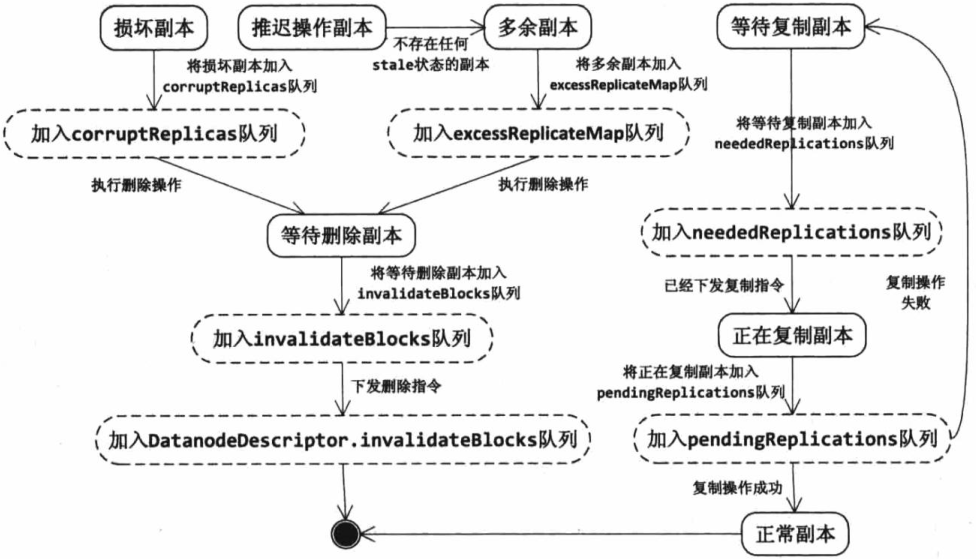
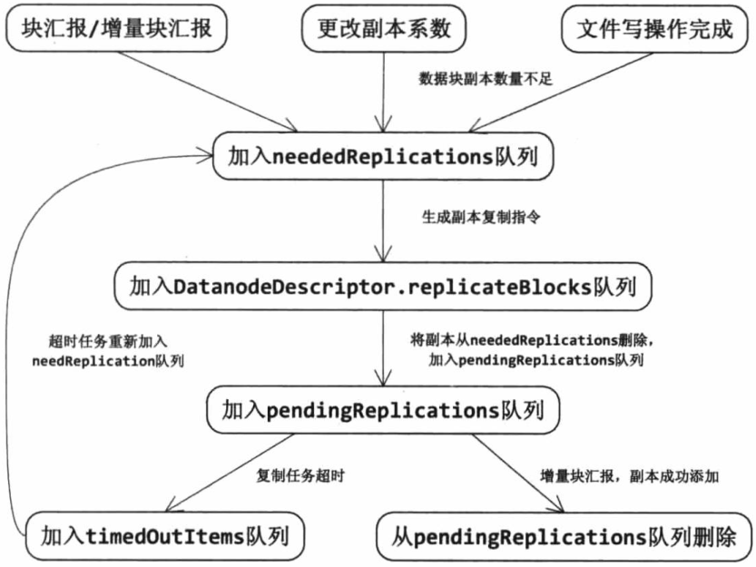
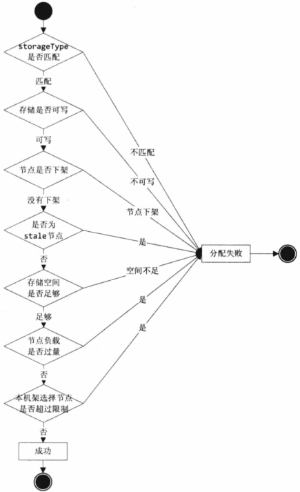
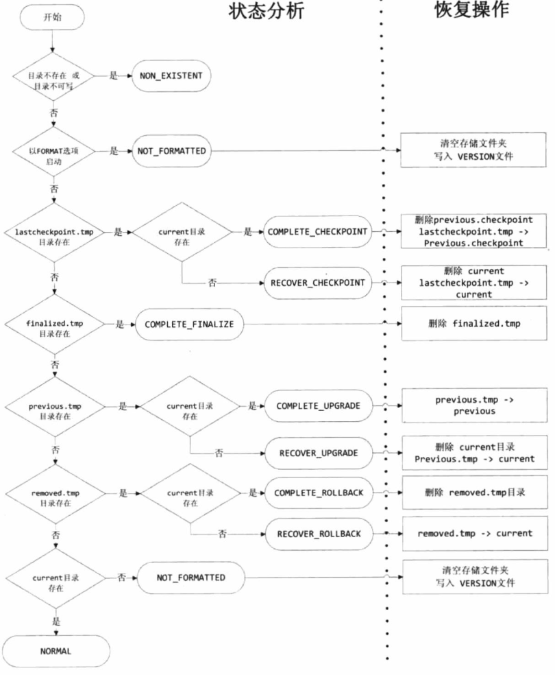
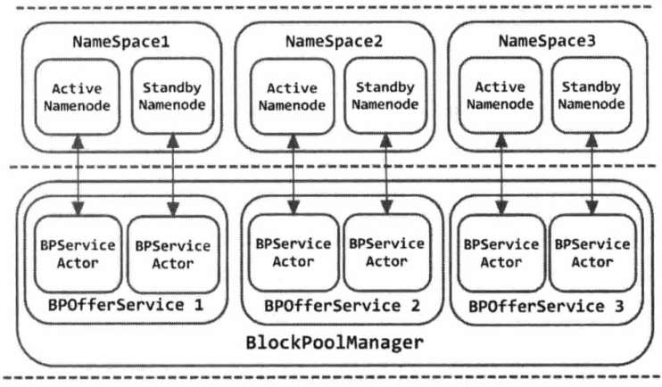
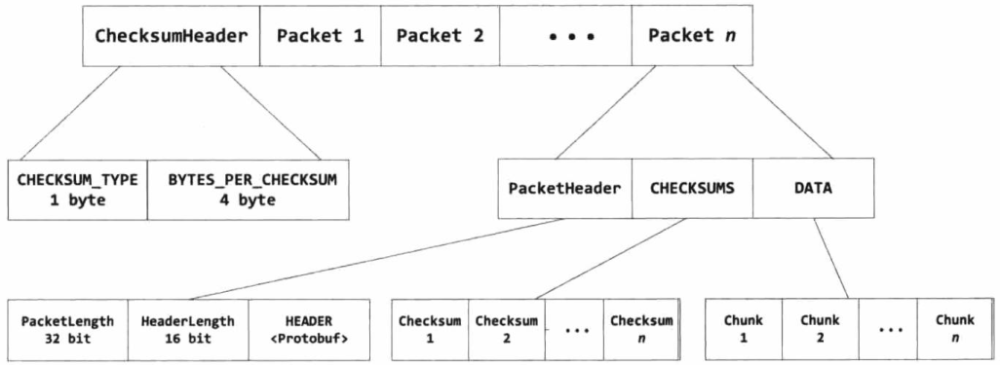
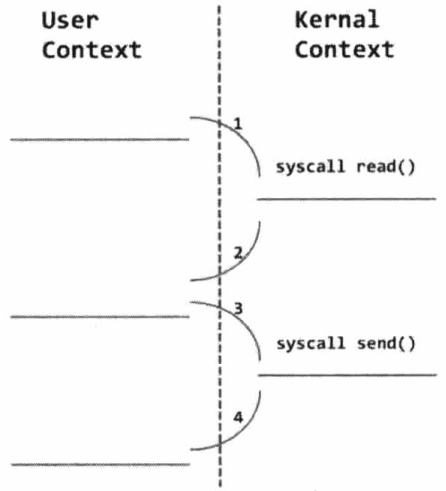
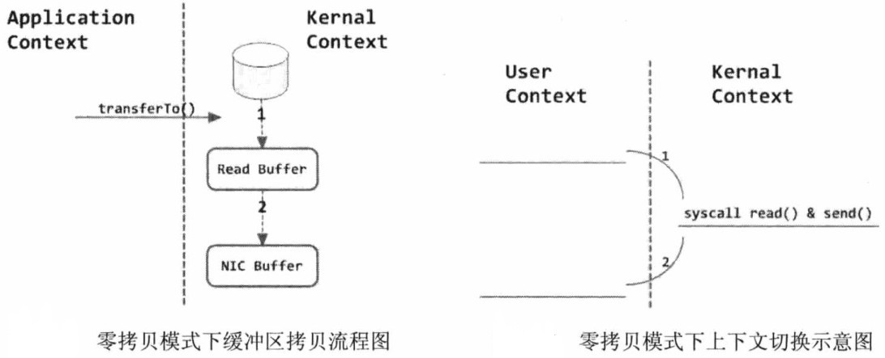
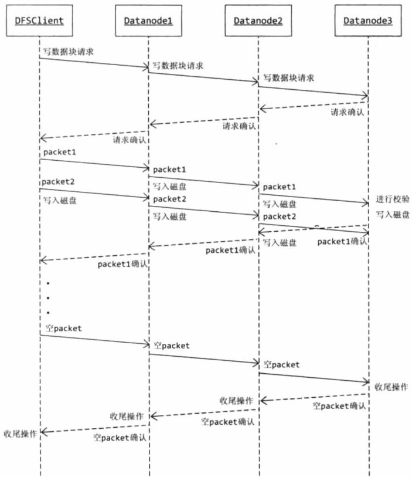
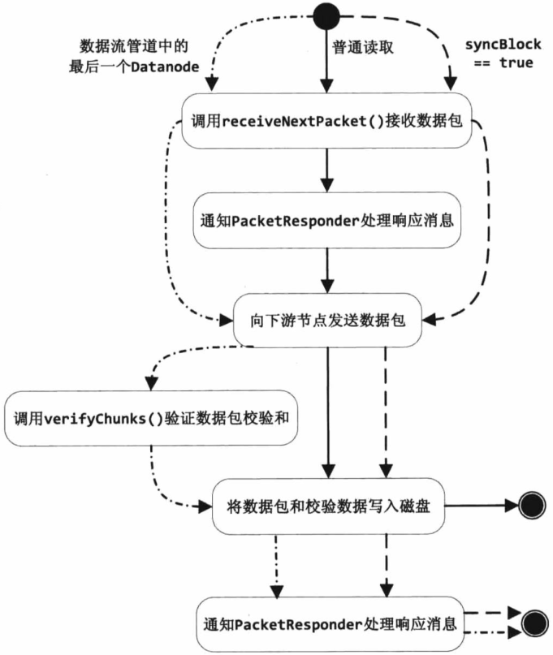

## 第二章 Hadoop RPC

RPC服务器端代码的处理流程与所有网络程序服务器端的处理流程类似，都分为5个步骤：

1. 读取请求
2. 反序列化请求
3. 处理请求
4. 序列化响应
5. 发回响应

对于网络服务器端程序来说，如果对每个请求都构建一个线程响应，那么在负载增加时性能会下降得很快；而如果只用少量线程响应，又会在`IO`阻塞时造成响应流程停止、吞吐率降低。

### Reactor模式

是一种广泛应用在服务器端的设计模式，也是一种基于事件驱动的设计模式。`Reactor`模式的处理流程是：应用程序向一个中间人注册`IO`事件，当中间人监听到这个`IO`事件发生后，会通知并唤醒应用程序处理这个事件。这里的中间人其实是一个不断等待和循环的线程，它接受所有应用程序的注册，并检查应用程序注册的`IO`事件是否就绪，如果就绪了则通知应用程序进行处理。

一个简单的基于`Reactor`模式的网络服务器设计，包括`reactor`、`acceptor`、`handler`等模块。`reactor`负责监听所有的`IO`事件，当检测到一个新的`IO`事件发生时,`reactor`会唤醒这个事件对应的模块处理。`acceptor`则负责响应`Socket`连接请求事件，`acceptor`会接受请求建立连接，之后构建`handler`对象。`handler`对象则负责向`reactor`注册`IO`读事件，然后从网络上读取请求并执行对应的业务逻辑，最后发回响应。


### 客户端和NameNode、DataNode通信过程

1. client和NameNode之间是通过RPC通信
2. DataNode和NameNode之间是通过RPC通信
3. client和DataNode之间是通过简单的Socket通信
4. DataNode与DataNode之间通过RPC通信

**以HDFS读写文件为例：**
  NameNode主要负责管理文件系统的==命名空间、集群配置信息和存储块的复制==等。NameNode会将文件系统的Meta-data存储在内存中，这些信息主要包括了文件信息、每一个文件对应的文件块的信息和每一个文件块在DataNode的信息等。==NameNode本身就是一个RPC的服务端，主要实现的接口有：ClientProtocol、DatanodeProtocol、NamenodeProtocol==。
  DataNode是文件存储的基本单元，它将Block存储在本地文件系统中，保存了Block的Meta-data，同时周期性地将所有存在的Block信息发送给NameNode。

ClientProtocol接口
ClientProtocol协议用于客户端和NameNode之间的交流。客户端通过此协议可以操纵HDFS的目录命名空间、打开与关闭文件流等。该接口协议中定义的与文件内容相关的操作主要有

（1）文件管理，文件的增、删、改，权限控制、文件块管理等；

（2）文件系统管理，查看文件系统状态和设置元数据信息，例如容量、块大小、副本因子数等；

（3）持久会话类，如放弃对指定块的操作、客户端同步等。

DataNodeProtocol接口
该协议用于DataNode和NameNode之间进行通信，例如发送心跳报告和块状态报告。一般来说，NameNode不直接对DataNode进行RPC（后面的文章会介绍）调用，如果一个NameNode需要与DataNode进行通信，唯一的方式，就是通过调用该协议接口定义的方法。

NameNodeProtocol接口
该协议接口定义了备用NameNode（Secondary NameNode）（注意，他不是NameNode的备份） 他是一个用来辅助NameNode的服务器端进程，主要是对映像文件执行特定的操作，另外，还包括获取指定DataNode块上的操作。

## 第三章 Namenode

### 3.1文件系统目录树

#### 3.1.4 FSImage

##### 1 fsimage和edits文件

fsimage和edits文件都是经过`序列化(protocol)`的，在NameNode启动的时候，它会将fsimage文件中的所有内容加载到内存中，之后再执行edits文件中的各项操作。使得内存中的元数据和实际的数据同步，存在内存中的元数据支持客户端的读操作。 

在NameNode启动之后，hdfs中的更新操作会重新写到edits文件中，因为fsimage文件一般情况下都是非常大的，可以达到GB级别甚至更高，如果所有的更新操作都向fsimage中添加的话，势必会导致系统运行的越来越慢。但是如果向edits文件中写的话就不会导致这样的情况出现，每次执行写操作后，且在向客户端发送成功代码之前，edits文件都需要同步更新的。 如果一个文件比较大，会使得写操作需要向多台机器进行操作，只有当所有的写操作都执行完成之后，写操作才可以称之为成功。这样的优势就是在任何的操作下都不会因为机器的故障而导致元数据不同步的情况出现。

fsimage包含hadoop文件系统中的所有的目录和文件IDnode的序列化信息。**对于文件来说，包含的信息有修改时间、访问时间、块大小和组成一个文件块信息等**；**对于目录来说，包含的信息主要有修改时间、访问控制权等信息**。**fsimage并不包含DataNode的信息，而是包含DataNode上块的映射信息，并存在内存中**。当一个新的DataNode加入集群时，DataNode都会向NameNode提供块的信息，并且NameNode也会定期的获取块的信息，以便NameNode拥有最新的块映射信息。又因为fsimage包含hadoop文件系统中的所有目录和文件IDnode的序列化信息，所有一旦fsimage出现丢失或者损坏的情况，那么即使DataNode上有块的数据，但是我们没有文件到块的映射关系，所以我们也是没有办法使用DataNode上的数据。所以定期且及时的备份fsimage和edits文件非常重要.


##### 2 **Namenode维护着HDFS中最重要的关系**

1. HDFS文件系统的目录数以及文件的数据块索引，文件系统目录数在3.1节中已经介绍，文件的数据块索引即每个文件对应的数据块列表，这个信息保存在`INodeFile.blocks`字段中。
2. 数据块和数据节点的对应关系，即指定数据块的副本保存在哪些数据节点上的信息。这个信息是在`Datanode`启动时，由`Datanode`上报给`Namenode`的，也就是说这个信息是`Namenode`动态构建起来的，而不是从`fsimage`文件中加载的。

在3.1节中已经介绍了HDFS文件系统目录树的实现，我们知道`Namenode`会定期将文件系统目录树以及文件与数据块的对应关系保存至fsimage文件中，然后在`Namenode`启动时读取fsimage文件以重建HDFS第一关系。**要注意的是第二关系并不会保存至fsimage文件中，也就是说，fsimage并不记录数据块和数据节点的对应关系。**这部分数据是由`Datanode`主动将当前`Datanode`上保存的数据块信息汇报给`Namenode`，然后`Namenode`更新内存中的数据，以维护数据块和数据节点的对应关系。

### 3.2 数据块管理

#### 3.2.1 Block、Replica、BlocksMap

`BlocksMap`是`Namenode`上与数据块相关的最重要的类，它管理着`Namenode`上数据块的元数据，包括当前数据块属于哪个HDFS文件，以及当前数据块保存在哪些`Datanode`上，当`Datanode`启动时，会对`Datanode`的本地磁盘进行扫描，并将当前`Datanode`上保存的数据块信息汇报给`Namenode`。`Namenode`收到`Datanode`的汇报信息后，会建立数据块与保存这个数据块的数据节点的对应关系，并将这个信息保存在`BlocksMap`中，所以无论是获取某个数据块对应的`HDFS`文件，还是获取数据块保存在哪些数据节点上，都需要通过`BlocksMap`对象。

`BlocksMap`通过一个`GSet`对象维护了`Block->BlockInfo`的映射关系，`GSet`是`Hadoop`自己实现的一个比较特殊的集合类型，其特数的地方在于它是一个集合，但却提供类似映射的功能：

```java
private final int capacity;
private volatile GSet<Block,BlockInfo> blocks;
```

**为什么BlocksMap维护的是Block->BlockInfo的对应关系呢？**

这是因为`BlockInfo`保存数据节点的信息都是在`Datanode`启动时上报的，**也就是动态构建的**。而`Namenode`启动时内存中保存的关于数据块的信息只有`Block`类中维护的这么多，所以`Namenode`维护了`Block->BlockInfo`的对应关系，随着`Datanode`不断地上报数据块信息，`BlockInfo`地信息会不断地更新。

#### 3.2.2 数据块状态管理

###### （5）`postponedMisreplicatedBlocks`队列

当`Namenode`发生错误并进行`Actice`与`Standby`切换时，`Namenode`中保存的多余副本不能直接删除，需要先放入`postponedMisreplicatedBlocks`队列中，直到这个数据块地所有副本所在的`Datanode`都进行了块汇报。

为什么这样设计？

1. `blockA`有两个副本，副本1在`datanode1`上，副本2在`datanode2`上
2. 这时，`namenode1`发出删除指令，删除`datanode1`上的副本1
3. 发出删除指令后，`namenode1`发生错误，切换至`namenoe2`
4. 这时`datanode1`并没有进行块汇报，`namenode2`并不知道`datanode1`上已经删除了副本1，所以`namenode2`向`datanode2`发出删除操作
5. `datanode2`删除副本2，数据块地所有副本都被删除了，数据块也就丢失了


###### 数据块副本状态转换图



###### 数据块副本删除流程图


###### 数据块地复制

`Namenode`会在以下三种情况下将一个数据块副本加入`needReplications`队列中以执行数据块副本复制流程：

1. 客户端完成了一个文件地写操作，`Namenode`会检查这个文件包含地所有数据块是否有足够地副本数量，如果不足则加入`neededReplications`队列中
2. 当`Namenode`执行一个`Datanode`地撤销操作时，会将这个`Datanode`上保存的所有副本进行复制，也就是将这些副本加入`neededReplicsations`队列中。
3. `pendingReplications`队列中保存的数据块复制任务超时，会将这些任务重新加入`neededReplications`队列中。

当待复制数据块加入`neededReplications`队列后，会由`RedundancyMonitor`线程处理，调用`computeDatanodeWork()`方法定期从`needReplications`队列中筛选出数据块，然后为这些数据块选择复制的源`Datanode`和目标`Datanode`，再将数据块加入源`Datanode`对应的`DatanodeDescriptor`的`replicateBlocks`队列，生成复制数据块的指令通过心跳响应将指令带到源`Datanode`。完成名字节点指令的生成后，`computeDatnodeWork()`方法会将待复制数据块从`neededReplicatioins`队列中删除，然后加入`pendingReplications`队列。



##### 3 块汇报

为了提高`HDFS`的启动速度，`Namenode`会将`Datanode`的全量块汇报分为两种：启动时发送的第一次全量块汇报和周期性的全量块汇报。对于启动时发送的第一次全量汇报，为了提高响应速度，`Namenode`不会计算哪些元数据需要删除，不会计算无效副本，将这些处理都推迟到下一次块汇报时处理。


### 3.3 数据节点管理

#### 3.3.3 DatanodeManager

##### 4 Datanode的心跳

`Datanode`的`BPServiceActor`对象会以`dnConf.heartBeatInterval(默认3s)`间隔向`Namenode`发送心跳，`Datanode`向`Namenode`发送的心跳信息包括：`Datanode`的注册信息、`Datanode`的存储信息、缓存信息、当前`Datanode`写文件的连接数、读写数据使用的线程数的等描述当前`Datanode`负载信息。

`Namenode`收到`Datanode`的心跳之后，会调用`BlockManager.hadnleHeartBeat()`方法返回一个心跳响应`HeartbeatResponse`。这个心跳响应中包含一个`DatanodeCommand`的数组，用来携带`Namenode`对`Datanode`的指令，例如数据块副本的复制、删除、缓存等指令。

`NameNode`还会启动一个线程，负责周期性检测所有`Datanode`上报心跳的情况，对于长时间没有上报心跳的`Datanode`，则认为该`Datanode`出现故障不能正常工作，这时会调用`DatanodeManager.removeDatanode()`删除该数据节点。

### 3.4 租约管理

`HDFS`文件是`write-once-read-many`，并且不支持客户端的并行写操作，那么就**需要一种机制保证对HDFS文件的互斥操作**。`HDFS`提供了租约==Lease==机制来实现这个功能，租约是`HDFS`种一个重要的概念，是`Namenode`给予租约持有者`LeaseHolder`在规定时间内有文件权限==写文件==的合同。

在`HDFS`中，客户端写文件时需要先从租约管理器`LeaseManager`申请一个租约，成功申请租约后客户端就成为了租约持有者，也就拥有了对该`HDFS`文件的独占权限，其它客户换在该租约有效时无法打开这个`HDFS`文件进行操作。`Namenode`的租约管理器保存了`HDFS`文件与租约、租约和租约持有者的对应关系，租约管理者还会定期检查它维护的所有租约是否过期。租约管理器会强制收回过期的租约，所有租约持有者需要定期更新租约，维护对该文件的独占锁定。当客户端完成了对文件的写操作，关闭文件时，必须在租约管理器中释放租约。

### 3.5 缓存管理

`Hadoop2.3.0`版本新增了集中式缓存管理`Centralized Cache Management`功能，允许用户将一些文件和目录保存到`HDFS`缓存中，`HDFS`集中式缓存是由分布在`Datanode`上的堆外内存组成的，并且由`Namenode`同一管理。

添加集中式缓存功能的`HDFS`集群具有以下显著优势：

1. 阻止了频繁使用的数据从内存中清除
2. 因为集中式缓存是由`Namenode`统一管理的，所以`HDFS`客户端可以根据数据块的缓存情况调度任务，从而提高了数据块的读性能。
3. 数据块被`Datanode`缓存后，客户端就可以使用一个新的更高效的零拷贝机制读取数据块。因为数据块被缓存时已经执行了校验操作，所以使用零拷贝读取数据块的客户端不会有读取开销。
4. 可以提高集群的内存利用率。当`Datanode`使用操作系统的`buffer`缓存数据块时，对一个块的重复读会导致该块的`N`个副本全部被送入操作系统的`buffer`中，而使用集中式缓存时，用户可以锁定这`N`个副本中的`M`个，从而节约了`N-M`的内存。

#### 3.5.1 缓存概念

`HDFS`集中式缓存有两个主要概念：

1. 缓存指令`Cache Directive`：一条缓存指令定义了一个要被缓存的路径(`PATH`)，这些路径可以是文件夹或文件。需要注意的是，文件的缓存是非递归的，只有在文件夹第一层列出的文件才会被缓存，文件夹也可以指定额外的参数，比如缓存副本因子(`replication`)、有效期等。缓存副本因子设置了路径的缓存副本数，如果多个缓存指令指向同一个文件，那么就用最大缓存副本因子。
2. 缓存池`Cache Pool`：缓存池是一个管理单元，是管理缓存指令的组。缓存池拥有类似`UNIX`的权限，可以限制哪个用户和组可以访问该缓存池。缓存池也可以用于资源管理。可以设置一个最大限制值，限制写入缓存池中指令的字节数。

#### 3.5.3 HDFS集中式缓存架构

用户通过`hdfs cacheadmin`命令或者`HDFS API`向`Namenode`发送缓存指令，`Namenode`的`CacheManager`类会将缓存指令保存到内存的指定数据结构中，同时在`fsimage`和`editlog`文件中记录该缓存指令。之后`Namenode`的`CacheReplicationMonitor`类会周期性扫描命名空间和活跃的缓存指令，以确定需要缓存或删除缓存的数据块，并向`Datanode`分配缓存任务。`Namenode`还负责管理集群中所有`Datanode`的堆外缓存，`Datanode`会周期性向`Namenode`发送缓存报告，而`Namenode`会通过心跳响应向`Datanode`下发缓存指令。`DFSClient`读取数据块时回向`Namenode`发送`ClientProtocol.getBlockLocations`请求获取数据块的位置信息，`Namenode`除了返回数据块的位置信息外，还会返回该数据块的缓存信息，这样`DFSClient`就可以执行本地零拷贝读取缓存数据块。


### 3.6 ClientProtocol实现

#### 3.6.3 创建新的数据块

##### 1 分析状态--`analyzeFileState()`

1. 如果`previousBlock==null`，也就是`addBlock()`方法并未携带文件最后一个数据块的信息。这种情况可能是`Client`调用`ClientProtocol.append()`方法申请追加写文件，而文件的最后一个数据块正好写满，`Client`就会调用`addBlock()`方法申请新的数据块，这时`analyzeFileState()`方法无须执行任何操作，`getAdditionalBlock()`方法正常执行数据块分配操作即可。
2. 如果`previousBlock`信息与`penultimateBlock`信息匹配，`penultimateBlock`是`Namenode`记录的文件倒数第二个数据块的信息。这种情况是`Namenode`已经成功地为`Client`分配了数据块，但是响应信息并未送回`Client`,所以`Client`重发了请求。对于这种情况，由于`Namenode`已经成功地分配了数据块，并且`Client`没有向新分配的数据块写入任何数据，所以`analyzeFileState()`方法会将分配的数据块保存至`onRetryBlock`参数中，`getAdditionalBlock()`方法可以直接将`onRetryBlock`中保存的数据块再次返回给`Client`,而无须构造新的数据块。
3. `previousBlock`信息与`lastBlockInFile`信息不匹配，这是异常的情况，不应该出现，`getAdditionalBlock()`方法会直接抛出异常。`
4. Namenode`正在执行分配数据块操作，例如正在调用`chooseTarget()`方法，这时Client由于请求超时而重新发送了请求。对于重发的请求，`analyzeFileState()`无须进行任何操作，因为之前的请求并未改变命名空间的状态。


##### 2 分配数据节点--`chooseTarget4NewBlock()`

1. 如果`Client`不是一个`DataNode`,则在集群范围内随机选择一个节点作为第一个节点。

2. 如果`Client`是一个`DataNode`,则判断`Client`所在的本地数据节点是否符合存储数据块的要求，如果符合，则第一个节点分配完毕；如果该数据节点不符目标节点要求，则在`Client`同一个机架范围内寻找，如果找到目标节点，则第一个节点分配完毕；
3. 如果在同一个机架内未找到符合要求的目标节点，则在集群内随机分配一个节点，找到则第一个节点分配完毕；否则分配失败。
4. 如果已经成功分配第一个数据节点，则在与第一个分配节点不同机架的远程机架内寻找第二个目标节点。如果符合要求，则第二个节点分配完毕：如果在远程机架内未找到符合要求的目标节点，则在第一个分配节点的机架内寻找，如果找到则第二个节点分配完毕，否则第二个节点分配失败。
5. 如果前两个节点分配成功，则准备分配第三个副本的目标节点。首先判断前两个节点是否在同一个机架内，如果是，则在远程机架内寻找目标节点，找到则第三个节点分配完毕：如果前两个节点在不同的机架内，且当前数据块为新分配的数据块，则在与`Client`相同的机架内寻找。如果当前数据块为已有的数据块，则在第二个节点的机架内分配。如果找到则第三个节点分配完毕，未找到则在集群中随机分配一个节点；否则第三个节点分配失败。
6. 如果需要分配的节点数目大于三个，则在集群范围内随机寻找节点。


在`chooseTarget4NewBlock()`逻辑中，如何判断一个数据节点满足保存数据块副本的要求？这里是通过`BlockPlacementPolicy.isGoodTrarget()`方法判断，如果返回`true`，则当前数据节点可以作为数据块副本的保存节点。



### 3.7 `Namenode`的启动和停止

安全模式是`Namenode`的一种状态，处于安全模式中的`Namenode`不接受任何对于命名空间的修改操作，同时也不触发任何复制和删除数据块的操作。

`Namenode`启动时会首先加载命名空间镜像(`fsimage`)并且合并编辑日志(`editslog`),完成这些操作后`Namenode`的==第一关系（文件系统目录树）也就建立起来了==。之后`Namenode`就需要接受`Datanode`的块汇报(`blockReport`)以获得数据块的存储信息，==也就是建立第二关系==（数据块与存储这个数据块副本的Datanode的对应关系）。这些操作都是`Namenode`在安全模式中进行的，只有当`Namenode`==收集到的阈值比例满足最低副本系数的数据块时才可以离开安全模式==。最低副本系数指的是一个数据块应该拥有的最少的副本数量，它是由配置项`dfs.namenode..replication.min`配置的，`默认值是1`。这里的阈值比例指的是已经收集到的满足最低副本系数的数据块数量与`HDFS`文件系统中所有数据块的比例，文件系统中所有数据块的数量在第一关系建立时就可以获得，阈值比例则是由配置项`dfs.safemode.threshold.pct`配置的，默认是`0.999`。当`Namenode`发现已经满足了阈值比例后，会延迟一段时间退出安全模式，目的是等待那些还没有进行块汇报的数据节点进行块汇报，这个时间是由配置项`dfs.safemode.extension`配置的，默认是`30`秒。之后`Namenode`就可以顺利地退出安全模式了。

| 配置名                         | 类型  | 默认值 | 描述                                                         |
| ------------------------------ | ----- | ------ | ------------------------------------------------------------ |
| `dfs.namenode.replication.min` | int   | 1      | 数据块最低副本系数，也用于写操作时判断是否可以`complete`一个数据块 |
| `dfs.safemode.threshold.pct`   | float | 0.999  | 离开安全模式时，系统需要满足的阈值比例。也就是满足最低副本系数的数据块与系统内所有数据块的比例 |
| `dfs.safeode.extension`        | int   | 30000  | 安全模式等待时间，也就是满足了最低副本系数之后，离开安全模式的时间，用于等待剩余的数据节点上报数据块 |

> 如果`threshold`设置为`0`,则`Namenode`启动时并不会进入安全模式。如果`threshold`设置为`1`，则`Namenode`需要等待所有数据块上报之后才能退出安全模式。如果`threshold`设置大于`1`,则`Namenode`无法自动退出安全模式。同时需要注意的是，任何时候都可以通过手动方式退出安全模式。

#### 3.7.2 HDFS HA

在一个`HA`集群中，会配置两个独立的`Namenode`。在任意时刻，只有一个节点会作为活动的节点，另一个节点则处于备份状态。活动的`Namenode`负责执行所有修改命名空间以及删除备份数据块的操作，而备份的`Namenode`则执行同步操作以保持与活动节点命名空间的致性。

为了使备份节点与活动节点的状态能够同步一致，两个节点都需要与组独立运行的节点`(JournalNodes,JNS)`通信。当`Active Namenode`执行了修改命名空间的操作时，它会定期将执行的操作记录在`editlog`中，并写入`JNS`的多数节点中。而`Standby Namenode`会一直监听`JNS`上`editlog`的变化，如果发现`editlog`有改动，`Standby Namenode`就会读取`editlog`并与当前的命名空间合并。当发生了错误切换时，`Standby`节点会先保证已经从`JNS`上读取了所有的`editlog`并与命名空间合并，然后才会从`Standby`状态切换为`Active`状态。通过这种机制，保证了`Active Namenode`与`Standby Namenode`之间命名空间状态的一致性，也就是第一关系链的一致性。

为了使错误切换能够很快地执行完毕，就需要保证`Standby`节点也保存了实时的数据块存储信息，也就是第二关系链。这样发生错误切换时，`Standby`节点就不需要等待所有的数据节点进行全量块汇报，而可以直接切换为`Active`状态。为了实现这个机制，`Datanode`会同时向这两个`Namenode`发送心跳以及块汇报信息。这样`Active Namenode`和`Standby Namenode`的元数据就完全同步了，一旦发生故障，就可以马上切换，也就是热备。这里需要注意的是，`Standby Namenode`只会更新数据块的存储信息，并不会向`Namenode`发送复制或者删除数据块的指令，这些指令只能由`Active Namenode`发送。


在`HA`架构中有一个非常重要的问题，就是需要保证同一时刻只有一个处于`Active`状态的`Namenode`,否则就会出现两个`Namenode`同时修改命名空间的问题，也就是脑裂`(split-brain)`。脑裂的`HDFS`集群很有可能造成数据块的丢失，以及向`Datanode`下发错误指令等异常情况。为了预防脑裂的情况，`HDFS`提供了三个级别的隔离`(fencing)`机制。

1. 共享存储隔离：同一时间只允许一个`Namenode`向`JournalNodes`写入`editlog`数据。
2. 客户端隔离：同一时间只允许一个`Namenode`响应客户端请求。
3. `Datanode`隔离：同一时间只允许一个`Namenode`向`Datanode`下发名字节点指令，例如删除、复制数据块指令等。

##### Quorum Journal

所有的`HA`实现方案都依赖于一个保存`editlog`的共享存储。这个共享存储必须是高可用的，并且能够被集群中的所有`Namenode`同时访问。

在`Quorum Journal`模式之前，HDFS中使用最多的共享存储方案是`NAS+NFS`。但是这种方案有个缺点，就是为了预防脑裂的情况，它要求有一个互斥脚本在`Namenode`发生故障切换时关闭上一个活动节点，或者阻止上一个活动节点访问共享存储。为了解决这个问题，`cloudera`提供了`Quorum Journal`设计方案，这是一个基于`Paxos`算法实现的HA`方案`:


`Quorum Journal`方案中有两个重要的组件:

1. `JournalNode(JN)`:运行在`N`台独立的物理机器上，它将`editlog`文件保存在`JournalNode`的本地磁盘上，同时`JournalNode`还对外提供RPC接口`QJournalProtocol`以执行远程读写`editlog`文件的功能。
2. `QuorumJournalManager(QJM)`:运行在`Namenode`上（目前HA集群中只有两个`Namenode`,`Active&Standby`),通过调用`RPC`接口`QJournalProtocol`中的方法向`JournalNode`发送写入、互斥、同步`editlog`。

`Quorum Journal`方案依赖于这样一个概念：`HDFS`集群中有`2N+1`个`JN`存储`editlog`文件，这些`editlog`文件是保存在`N`的本地磁盘上的。每个`N`对`QM`暴露`RPC`接口`QJournalProtocol`,允许`Namenode`读写`editlog`文件。当`Namenode`向共享存储写入`editlog`文件时，它会通过`QJM`向集群中的所有N发送写`editlog`文件请求，当有一半以上的（`≥N+1`)`JN`返回写操作成功时即认为该次写成功。这个原理是基于`Paxos`算法的，集群能容忍最多有`N`台机器挂掉，如果多于`N`台挂掉，这个算法就失效了。

1. 使用`Quorum Journal`实现的`HA`方案有如下好处。
2. `JN`进程可以运行在普通的`PC`上，而无须配置专业的共享存储硬件。
3. 不需要实现单独的`fencing`机制，`Quorum Journal`模式中内置了`fencing`功能。
4. `Quorum Journal`不存在单点故障，集群中有`2N+1`个`JournalNode`,可以允许有`N`个`JournalNode`死亡。
5. `JN`不会因为其中一台机器的延迟而影响整体的延迟，而且也不会因为N数量的增多而影响性能（因为`Namenode`向`JournalNode`发送日志是并行的）。


##### 互斥机制

当`HA`集群发生`Namenode`异常切换时，需要在共享存储上`fencing`上一个活动节点以保证该节点不能再向共享存储写入`editlog`。基于`Quorum Journal`模式的`HA`提供了`epoch number`来解决互斥(`fencing`)问题，这个概念在很多分布式文献中都能找到（例如Paxos、ZAB等）。`epoch number`具有如下一些性质。

1. 当一个`Namenode`变为活动状态时，会分配给它一个`epoch number`。
2. 每个`epoch number`都是唯一的，没有任意两个`Namenode`有相同的`epoch number`。
3. `epoch number`定义了`Namenode`写`editlog`文件的顺序。对于任意两个`Namenode`,拥有更大`epoch number`的`Namenode`被认为是活动节点

当一个`Namenode`切换为活动状态时，它的`QJM`会向所有`JN`发送`QJournalProtocol.getJournalState()`请求以获取该`JN`的`lastPromisedEpoch`变量值，`lastPromisedEpoch`变量保存了该N认为的集群中活动的`Namenode`对应的`epoch number`值。当`QM`接收到集群中多于半的`N`回复后，它会将接收到的最大值加`1`并保存到`myEpoch`变量中，之后`QM`会调用`QJournalProtocol.newEpoch(myEpoch)`方法向所有`JN`发起更新`epoch number`请求。每个`JN`都会比较`QM`提交的`myEpoch`变量，以及当前`JN`保存的`lastPromisedEpoch`变量，如果新的`myEpoch`较大，则更新`N`的`lastPromisedEpoch`为新值，并且返回更新成功；如果小，则返回更新失败，如果`QJM`接收到超过一半的`JN`返回成功，则设置它的`epoch number`为`myEpoch`;否则，它中止尝试成为一个活动的`Namenode`,并抛出`IOException`异常。

当活动的`Namenode`成功获取并更新了`epoch number`后，调用任何修改`editlog`的`RPC`请求都必须携带`epoch number`。当`RPC`请求到达`JN`后（除了`newEpoch()`请求），`JN`会将请求者的`epoch number`与自己保存的`lastPromisedEpoch`变量做比较，如果请求者的`epoch number`更大，`JN`就会更新自己的`lastPromisedEpoch`变量，并执行对应的操作：如果请求者的`epoch number`更小，`JN`就会拒绝这次请求。当集群中的大多数`JN`拒绝了请求时，这次操作就失败了。考虑如下情况，当HDFS集群发生Namenode错误切换后，原来`Standby Namenode`会将集群的`epoch number`加`1`之后更新。这样原来的`Active Namenode`的`epoch number`肯定小于这个值，当这个节点执行写`editlog`操作时，由于`JN`节点不接收`epoch number`小于`lastPromisedEpoch`的写请求，所以这次写请求会失败，也就达到了`fencing`的目的。

#### 3.7.3 名字节点的启动

`Namenode`实体在代码实现中主要对应于三个类，即`NameNode`类、`NameNodeRpcServer`类以及`FSNamesystem`类。

1. `NameNodeRpcServer`类用于接收和处理所有的`RPC`请求，
2. `FSNamesystem`类负责实现`Namenode`的所有逻辑，
3. `NameNode`类则负责管理`Namenode`配置、`RPC`接口以及`HTTP`接口等。


`createNameNode()`方法会根据启动`Namenode`时传入的启动选项，调用对应的方法执行操作。

1. `FORMAT`:格式化当前`Namenode`,调用`format()`方法执行格式化操作。
2. `GENCLUSTERID`:产生新的`clusterID`。`clusterID`是集群的持久属性。它在创建集群时生成，并在集群的生命周期中保持不变。当一个新的名称节点被格式化时，如果这是一个新的集群，则会生成并存储一个新的`clusterID`
3. `ROLLBACK`:回滚上一次升级，调用`doRollback()`方法执行回滚操作。
4. `BOOTSTRAPSTANDBY`:拷贝`Active Namenode`的最新命名空间数据到`Standby Namenode`,调用`BootstrapStandby.run()`方法执行操作。
5. `INITIALIZESHAREDEDITS`:初始化`editlog`的共享存储空间，并从`Active Namenode`中拷贝足够的`editlog`数据，使得`Standby`节点能够顺利启动。这里调用了静态`initializeSharedEdits()`执行操作。
6. `BACKUP`:启动`backup`节点，这里直接构造一个`BackupNode`对象并返回。
7. `CHECKPOINT`:启动`checkpoint`节点，也是直接构造`BackupNode`对象并返回。
8. `RECOVER`:恢复损坏的元数据以及文件系统，这里调用了`doRecovery()`方法执行操作。
9. `METADATAVERSION`:确认配置文件夹存在，并且打印`fsimage`文件和文件系统的元数据版本。
10. `UPGRADEONLY`:升级`Namenode`,升级完成后关闭`Namenode`。
11. 默认情况：其他所有选项的执行都是直接通过`NameNode`的构造方法构造`NameNode`对象，并返回的。

`NameNode.initialize()`方法流程，构造`HTTP`服务器，构造`RPC`服务器，初始化`FSNamesystem`对象，最后调用`startCommonServices()`启动`HTTP`服务器、`RPC`服务器。

```java
protected void initialize(Configuration conf) throws IOException {
  if (conf.get(HADOOP_USER_GROUP_METRICS_PERCENTILES_INTERVALS) == null) {
    String intervals = conf.get(DFS_METRICS_PERCENTILES_INTERVALS_KEY);
    if (intervals != null) {
      conf.set(HADOOP_USER_GROUP_METRICS_PERCENTILES_INTERVALS,
        intervals);
    }
  }

  UserGroupInformation.setConfiguration(conf);
  loginAsNameNodeUser(conf);

  NameNode.initMetrics(conf, this.getRole());
  StartupProgressMetrics.register(startupProgress);

    //构造JvmPauseMonitor对象并启动
    //该类设置了一个简单的线程，该线程在循环中运行，在很短的时间间隔内睡眠。
    //如果睡眠时间明显长于其目标时间，这意味着JVM或主机暂停了处理，这可能会导致其他问题。如果检测到这样的暂停，该线程会记录一条信息。
  pauseMonitor = new JvmPauseMonitor();
  pauseMonitor.init(conf);
  pauseMonitor.start();
  metrics.getJvmMetrics().setPauseMonitor(pauseMonitor);

    //启动HTTP服务器
  if (NamenodeRole.NAMENODE == role) {
    startHttpServer(conf);
  }

    //初始化FSNamenode
    //调用 FSNamesystem.loadFromDisk(conf);
  loadNamesystem(conf);
  startAliasMapServerIfNecessary(conf);

    //创建RPC服务
  rpcServer = createRpcServer(conf);

  initReconfigurableBackoffKey();

  if (clientNamenodeAddress == null) {
    // This is expected for MiniDFSCluster. Set it now using 
    // the RPC server's bind address.
    clientNamenodeAddress = 
        NetUtils.getHostPortString(getNameNodeAddress());
    LOG.info("Clients are to use " + clientNamenodeAddress + " to access"
        + " this namenode/service.");
  }
  if (NamenodeRole.NAMENODE == role) {
    httpServer.setNameNodeAddress(getNameNodeAddress());
    httpServer.setFSImage(getFSImage());
  }

    //启动active和standby状态的共同服务
  startCommonServices(conf);
    //启动计时器，定期将NameNode指标写入日志文件
  startMetricsLogger(conf);
}
```

`FSNamesystem.loadFromDisk()`首先调用构造方法构造`FSNamesystem`对象，然后将`fsimage`以及`editlog`文件加载到命名空间中：

```java
static FSNamesystem loadFromDisk(Configuration conf) throws IOException {

  checkConfiguration(conf);
  FSImage fsImage = new FSImage(conf,
      FSNamesystem.getNamespaceDirs(conf),
      FSNamesystem.getNamespaceEditsDirs(conf));
    //创建FSNamesystem对象
  FSNamesystem namesystem = new FSNamesystem(conf, fsImage, false);
  StartupOption startOpt = NameNode.getStartupOption(conf);
  if (startOpt == StartupOption.RECOVER) {
    namesystem.setSafeMode(SafeModeAction.SAFEMODE_ENTER);
  }

  long loadStart = monotonicNow();
  try {
      //加载fsimage、editlog文件到内存
    namesystem.loadFSImage(startOpt);
  } catch (IOException ioe) {
    LOG.warn("Encountered exception loading fsimage", ioe);
    fsImage.close();
    throw ioe;
  }
  long timeTakenToLoadFSImage = monotonicNow() - loadStart;
  LOG.info("Finished loading FSImage in " + timeTakenToLoadFSImage + " msecs");
  NameNodeMetrics nnMetrics = NameNode.getNameNodeMetrics();
  if (nnMetrics != null) {
    nnMetrics.setFsImageLoadTime((int) timeTakenToLoadFSImage);
  }
  namesystem.getFSDirectory().createReservedStatuses(namesystem.getCTime());
  return namesystem;
}
```

## 第四章 Datanode

`Datanode`以存储数据块(`Block`)的形式保存HDFS`文件`，同时`Datanode`还会响应`HDFS`客户端读、写数据块的请求。`Datanode`会周期性地向`Namenode`上报心跳信息、数据块汇报信息(`BlockReport`)、缓存数据块汇报信息(`CacheReport`)以及增量数据块块汇报信息。`Namenode`会根据块汇报的内容，修改`Namenode`的命名空间(`Namespace`),同时向`Datanode`返回名字节点指令。`Datanode`会响应`Namenode`返回的名字节点指令，如创建、删除和复制数据块指令等。


### 4.1 Datanode逻辑结构

#### 4.1.1 HDFS 1.X架构

`HDFS1.x`架构从逻辑上可以分为两层：

1. 命名空间管理层：管理整个文件系统的命名空间(`Namespace`),包括文件系统目录树中的文件信息、目录信息以及文件包含的数据块信息等。对外提供常见的文件系统操作，例如创建文件、修改文件以及删除文件等。
2. 数据块存储管理层：该层分为两个部分。
   1. 数据块管理：管理数据节点(`Datanode`)信息以及数据块信息，对外提供操作数据块的接口，例如创建、删除、修改、获取数据块位置信息等。
   2. 存储(`Storage`)管理：管理`Datanode`上保存数据块的物理存储以及数据块文件，对外提供写数据块文件、读数据块文件以及复制数据块文件等功能。


`Namenode`实现了==命名空间管理层==及==数据块存储管理层中的数据块管理==功能，而`Datanode`则实现了==数据块存储管理层中的存储管理==部分。如图所示，`Datanode`会在`Namenode`上注册，并定期向`Namenode`发送数据块汇报与心跳，`Namenode`则会通过心跳响应发送数据块操作指令给`Datanode`,例如复制、删除以及恢复数据块等指令。可以说`Namenode`的数据块管理层和`Datanode`共同完成了`HDFS`的数据块存储管理功能。

`HDFS 1.X`架构使用一个`Namenode`来管理文件系统的命名空间以及数据块信息，这使得`HDFS`的实现非常简单，但是单一的`Namenode`会导致以下缺点:

1. 由于`Namenode`在内存中保存整个文件系统的元数据，所以`Namenode`内存的大小直接限制了文件系统的大小。
2. 由于`HDFS`文件的读写等流程都涉及与`Namenode`交互，所以文件系统的吞吐量受限于单个`Namenode`的处理能力。
3. `Namenode`作为文件系统的中心节点，无法做到数据的有效隔离。
4. `Namenode`是集群中的单一故障点，有可用性隐患。
5. `Namenode`实现了数据块管理以及命名空间管理功能，造成这两个功能高度耦合，难以让其他服务单独使用数据块存储功能。

#### 4.1.2 HDFS Federation

为了能够水平扩展`Namenode`,`HDFS2.X`提供了`Federation`架构，如图所示，`Federation`架构的`HDFS`集群可以定义多个`Namenode/Namespace`,这些`Namenode`之间是相互独立的，它们各自分工管理着自己的命名空间。而`HDFS`集群中的`Datanode`则提供数据块的共享存储功能，每个`Datanode`都会向集群中所有的`Namenode`注册，且周期性地向所有的`Namenode`发送心跳和块汇报，然后执行`Namenode`通过响应发回的名字节点指令。


`HDFS Federation`引入了两个新的概念：块池(`BlockPool`)和命名空间卷(`Namespace Volume`)。

1. 块池：一个块池由属于同一个命名空间的所有数据块组成，这个块池中的数据块可以存储在集群中的所有`Datanode`上，而每个`Datanode`都可以存储集群中所有块池的数据块。这里需要注意的是，每个块池都是独立管理的，不会与其他块池交互。所以一个`Namenode`出现故障时，并不会影响集群中的`Datanode`服务于其他的
2. `Namenode`命名空间卷：一个`Namenode`管理的==命名空间以及它对应的块池一起被称为命名空间卷==，当一个`Namenode/Namespace`被删除后，它对应的块池也会从集群的`Datanode`上删除。需要特别注意的是，当集群升级时，每个命名空间卷都会作为一个基本的单元进行升级。

`HDFS Federation`架构相对于`HDFS 1.X`架构具有如下优点:

1. 支持`Namenode/Namespace`的水平扩展性，同时为应用程序和用户提供了命名空间卷级别的隔离性。
2. `Federation`架构实现起来比较简单，`Namenode`(包括`Namespace`)的实现并不需要太大的改变，只需更改`Datanode`的部分代码即可。例如将`BlockPool`作为数据块存储的一个新层次，以及更改`Datanode`内部的数据结构等。

在`BlockStorage`层中，每个块池都是一个独立的数据块集合，块池在管理上与其他块池独立，相互之间不需要协调。`Datanode`则提供==共享存储功能==，==存储所有块池的数据块==。`Datanode`会定期向`BlockStorage`层注册并发送心跳，同时会为每个块池发送块汇报。`Block Storage`层会向`Datanode`发送数据块管理命令，之后`Datanode`会执行这些管理命令，例如数据块的复制、删除等。`Block Storage`层会对上层应用提供管理数据块的接口，例如在指定块池添加数据块、删除数据块等。

分离出Block storage层会带来以下优势:

1. 解耦合`Namespace`管理以及`Block Storage`管理。
2. 其他应用可以绕过`Namenode/Namesapce`直接管理数据块，例如`HBase`等应用可以直接使用`Block Storage`层。
3. 可以在`Block Storage`上构建新的文件系统(non-HDFS)。
4. 使用分离的`Block Storage`层为分布式命名空间的实现提供了基础。

#### 4.1.3 Datanode逻辑架构


### 4.2 Datanode存储

#### 4.2.3 DataStorage实现

存储状态恢复操作

`Datanode`在执行升级、回滚、提交操作的过程中会出现各种异常，例如误操作、断电、宕机等情况。那么`Datanode`在重启时该如何恢复上一次中断的操作呢？`StorageDirectory`提供了`doRecover()`和`analyzeStorage()`两个方法，`Datanode`会首先调用`analyzeStorage()`方法分析当前节点的存储状态，然后根据分析所得的存储状态调用`doRecover()`方法执行恢复操作。图给出了存储状态恢复操作流程图。



`analyseStorage()`方法用于在`Datanode`启动时分析当前`Datanode`存储目录的状态，`Datanode`存储目录的状态定义在`Storage.StorageState`类中。对存储目录状态的分析还需要结合`Datanode`的升级机制以及`Datanode`的启动选项，存储目录状态判断的逻辑如下。

1. `NON EXISTENT`:以非`FORMAT`选项启动时，目录不存在；或者目录不可写、路径为文件时，存储目录状态都为`NOT EXISTENT`状态。
2. `NOT FORMATTED`:以`FORMAT`选项启动时，都为`NOT FORMATTED`状态。
3. `NORMAL`:没有`tmp`中间状态文件夹，则存储目录为正常状态。
4. `COMPLETE_UPGRADE`:存在`current/VERSION`文件，存在`previous.tmp`文件夹，则存储目录为升级完成状态。
5. `RECOVER_UPGRADE`:存在`previous.tmp`文件夹，不存在`current/VERSION`文件，存储目录应该从升级中恢复。
6. `COMPLETE ROLLBACK`:存在`removed.tmp`文件夹，也存在`current/VERSION`文件，则存储目录的回滚操作成功完成。
7. `RECOVER ROLLBACK`:存在`removed.tmp`文件夹，不存在`current/VERSION`文件，存储目录应该从回滚中恢复。
8. `COMPLETE FINALIZE`:存在`finalized.tmp`文件夹，存储目录可以继续执行提交操作。

### 4.3 文件系统数据集

`BlockPoolSlice`负责管理单个存储目录下单个池块的所有数据块；`FsVolumeImpl`则负责管理一个完整的存储目录下所有的数据块，也就包括了这个存储目录下多个`BlockPoolSlice`对象的引用。而`Datanode`可以定义多个存储目录，也就是定义多个`FsVolumeImpl`对象，在`HDFS`中使用`FsVolumeList`对象统一管理`Datanode`上定义的多个`FsVolumeImpl`对象。而`FsDatasetImpl`负责管理`Datanode`上所有数据块功能的类。


### 4.4 BlockPoolManager

在`HDFS Federation`部署中，一个`HDFS`集群可以配置多个命名空间(`Namespace`),每个`Datanode`都会存储多个块池的数据块。所以在`Datanode`实现中，定义了`BlockPoolManager`类来管理`Datanode`上的所有块池，`Datanode`的其他模块对块池的操作都必须通过`BlockPoolManager`执行，每个`Datanode`都有一个`BlockPoolManager`的实例。

`BlockPoolManager`逻辑结构图如图所示。由于在`HDFS Federation`部署中，一个`Datanode`会保存多个块池的数据块，所以`BlockPoolManager`会拥有多个`BPOfferService`对象，每个`BPOfferService`对象都封装了对单个块池操作的`API`。同时，由于在`HDFS HA`部署中，每个命名空间又会同时拥有两个`Namenode`,一个作为活动的`Active Namenode`,另一个作为热备的`Standby Namenode`,所以每个`BPOfferService`都会包含两个`BPServiceActor`对象，每个`BPServiceActor`对象都封装了与该命名空间中单个`Namenode`的操作，包括定时向这个`Namenode`发送心跳(`heartbeat`)、增量块汇报(`blockReceivedAndDeleted`)、全量块汇报(`blockreport`)、缓存块汇报(`cacheReport`),以及执行`Namenode`通过心跳/块汇报响应传回的名字节点指令等操作。




#### 4.4.1 BPServerActor

##### offerService()

`offerService()`方法是`BPServiceActor`的主循环方法，它用于向`Namenode`发送心跳、块汇报、缓存汇报以及增量汇报。`offerService()`方法会一直循环运行，直到`Datanode`关闭或者客户端调用`ClientDatanodeProtocol.refreshNodes()`重新加载`Namenode`配置。

`offerService()`是通过调用`DatanodeProtocol.sendHeartbeat()`方法向`Namenode`发送心跳的。`Datanode`向`Namenode`发送的心跳信息主要包括，这些数据描述了Datanode当前的负载情况。：

1. `Datanode`注册信息
2. `Datanode`存储信息（使用容量，剩余容量等)
3. 缓存信息
4. 当前`Datanode`写文件的连接数
5. 以及读写数据使用的线程数等。

```java
public HeartbeatResponse sendHeartbeat(DatanodeRegistration registration,
    StorageReport[] reports, long cacheCapacity, long cacheUsed,
    int xmitsInProgress, int xceiverCount, int failedVolumes,
    VolumeFailureSummary volumeFailureSummary,
    boolean requestFullBlockReportLease,
    @Nonnull SlowPeerReports slowPeers,
    @Nonnull SlowDiskReports slowDisks) throws IOException
```

`Namenode`收到`Datanode`的心跳之后，会返回一个心跳响应`HeartbeatResponse`。这个心跳响应中包含一个`DatanodeCommand`的数组，用来携带`Namenode`对`Datanode`的名字节点指令。同时心跳响应中还包含一个`NNHAStatusHeartbeat`对象，用来标识当前`Namenode`的`HA`状态。`Datanode`会使用这个字段来确定`BPOfferService`当中的哪一个`BPServiceActor`对应的`Namenode`是`Active`状态的。`HeartbeatResponse`的定义如下代码所示。

```java
public class HeartbeatResponse {
  /** Commands returned from the namenode to the datanode */
  private final DatanodeCommand[] commands;
  
  /** Information about the current HA-related state of the NN */
  private final NNHAStatusHeartbeat haStatus;

  private final RollingUpgradeStatus rollingUpdateStatus;
```

### 4.5 流式接口

#### 4.5.5读数据

##### 2数据块的传输格式

`BlockSender`类主要负责从数据节点的磁盘读取数据块，然后发送数据块到接收方。需要注意的是，`BlockSender`发送的数据是以一定结构组织的：



```java
int dataLen = (int) Math.min(endOffset - offset,(chunkSize * (long) maxChunks));
int numChunks = numberOfChunks(dataLen); // Number of chunks be sent in the packet
int checksumDataLen = numChunks * checksumSize;
int packetLen = dataLen + checksumDataLen + 4;
```

##### 4 零拷贝数据传输

`Datanode`最重要的功能之一就是读取数据块，这个操作看似简单，但在操作系统层面却需要4个步骤才能完成。如图所示，`Datanode`会首先将数据块从磁盘存储（也可能是`SSD`、内存等异构存储)读入操作系统的内核缓冲区（步骤1），再将数据跨内核推到`Datanode`进程(步骤2)，然后`Datanode`会再次跨内核将数据推回内核中的套接字缓冲区（步骤3），最后将数据写入网卡缓冲区（步骤4)。可以看到，`Datanode`对数据进行了两次多余的数据拷贝操作(步骤2和步骤3)，`Datanode`只是起到缓存数据并将其传回套接字的作用而以，别无他用。这里需要注意的是，步骤1和步骤4的拷贝发生在外设（例如磁盘和网卡)和内存之间，由`DMA(Direct Memory Access`,直接内存存取)引擎执行，而步骤2和步骤3的拷贝则发生在内存中，由`CPU`执行。

> 操作系统之所以引入内核缓冲区，是为了提高读写性能。在读操作中，如果应用程序所需的数据量小于内核缓冲区大小时，内核缓冲区可以预读取部分数据，从而提高应用程序的读效率。在写操作中，引入中间缓冲区则可以让写入过程异步完成。而对于`Datanode`,由于读取的数据块文件往往比较大，引入中间缓冲区可能成为一个性能瓶颈，造成数据在磁盘、内核缓冲区和用户缓冲区中被拷贝多次。


上述读取方式除了会造成多次数据拷贝操作外，还会增加内核态与用户态之间的上下文切换。如图所示，`Datanode`通过`read()`系统调用将数据块从磁盘（或者其他异构存储）读取到内核缓冲区时，会造成第一次用户态到内核态的上下文切换（切换1）。之后在系统调用`read()`返回时，会触发内核态到用户态的上下文切换（切换2）。`Datanode`成功读入数据后，会调用系统调用`send()`发送数据到套接字，也就是在数据块第三次拷贝时，会再次触发用户态到内核态的上下文切换（切换3）。当系统调用`send()`返回时，内核态又会重新切换回用户态。所以这个简单的读取操作，==会造成4次用户态与内核态之间的上下文切换。==



`Java NIO`提供了零拷贝模式来消除这些多余的拷贝操作，并且减少内核态与用户态之间的上下文切换。使用零拷贝的应用程序可以要求内核直接将数据从磁盘文件拷贝到网卡缓冲区，而无须通过应用程序周转，从而大大提高了应用程序的性能。`Java`类库定义了`java.nio.channels..FileChannel..transferTo()`方法，用于在`Linux(UNTX)`系统上支持零拷贝，它的声明如下：

```java
 public abstract long transferTo(long position, long count,
                                    WritableByteChannel target)throws IOException;
```

`transferTo()`方法读取文件通道(`FileChannel`)中`position`参数指定位置处开始的`count`个字节的数据，然后将这些数据直接写入目标通道`target`中。`HDFS`的`SocketOutputStream`对象的`transferToFully()`方法封装了`FileChannel.transferTo()`方法，对`Datanode`提供支持零拷贝的数据读取功能。`transferToFully()`方法的定义如下：

```java
  public void transferToFully(FileChannel fileCh, long position, int count,
      LongWritable waitForWritableTime,
      LongWritable transferToTime) throws IOException {}
```

图给出了使用零拷贝读取数据块时缓冲区拷贝流程，`Datanode`调用`transferTo()`方法引发`DMA`引擎将文件内容拷贝到内核缓冲区（步骤1）。之后数据并未被拷贝到`Datanode`进程中，而是由`DMA`引擎直接把数据从内核缓冲区传输到网卡缓冲区（步骤2)。可以看到，使用零拷贝模式的数据块读取，==数据拷贝的次数从4次降低到了2次==。

> 零拷贝模式要求底层网络接口卡支持收集操作，在Linux内核2.4及后期版本中，套接字缓冲区描述符做了相应调整，可以满足该需求。

使用零拷贝模式除了降低数据拷贝的次数外，上下文切换次数也从4次降低到了2次。如图所示，当`Datanode`调用`transferTo()`方法时会发生用户态到内核态的切换，`transferTo()`方法执行完毕返回时内核态又会切换回用户态。



`BlockSender`使用`SoucketoutputStream.transferToFully()`封装的零拷贝模式发送数据块到客户端，由于数据不再经过`Datnaode`中转，而是直接在内核中完成了数据的读取与发送，所以大大地提高了读取效率。但这也带来了一个问题，由于数据不经过`Datanode`的内存，所以`Datanode`失去了在客户端读取数据块过程中对数据校验的能力。为了解决这个问题，HDFS将数据块读取操作中的数据校验工作放在客户端执行，客户端完成校验工作后，会将校验结果发送回`Datanode`。在`DataXceiver.readBlock()`的清理动作中，数据节点会接收客户端的响应码，以获取客户端的校验结果。

#### 4.5.6 写数据

如图所示，`HDFS`使用数据流管道方式来写数据。`DFSClient`通过调用`Sender.writeBlock()`方法触发一个==写数据块请求==，这个请求会传送到数据流管道中的每一个数据节点，数据流管道中的==最后一个数据节点会回复请求确认==，这个确认消息逆向地通过数据流管道送回`DFSClient`。`DFSClient`收到请求确认后，将要写入的数据块切分成若干个数据包(`packet`),然后依次向数据流管道中发送这些数据包。数据包会首先从`DFSClient`发送到数据流管道中的第一个数据节点（这里是`Datanode1`),`Datanode1`成功接收数据包后，会将数据包==写入磁盘==，然后将数据包发送到数据流管道中的第二个节点(`Datanode2`)。依此类推，当数据包到达数据流管道中的最后一个节点(`Datanode3`)时，`Datanode3`会对收到的==数据包进行校验==，如果校验成功，`Datanode3`会发送数据包确认消息，这个确认消息会逆向地通过数据流管道送回`DFSClient`。当一个数据块中的所有数据包都成功发送完毕，并且收到确认消息后，`DFSClient`会发送一个空数据包标识当前数据块发送完毕。至此，整个数据块发送流程结束。



##### 1 DataXceiver.writeBlock()


```java
//isDatanode变量指示当前写操作是否是DESClient发起的
final boolean isDatanode = clientname.length() == 0;
//isclient变量与isDatanode相反，表示是Datanode触发的写操作
final boolean isClient = !isDatanode;
//isTransfer变量指示当前的写操作是否为数据块复制操作，利用数据流管道状态来判断
final boolean isTransfer = stage == BlockConstructionStage.TRANSFER_RBW
    || stage == BlockConstructionStage.TRANSFER_FINALIZED;
```

对于客户端发起的写数据块请求，这里三个变量的值分别为`isDatanode一false`,`isClient一true`,`isTransfer一false`。在`writeBlock()`方法中还使用到两组输入/输出流。


`Datanode`与数据流管道中的上游节点通信用到了输入流`in`以及输出流`replyOut`,与数据流管道中的下游节点通信则用到了输入流`mirrorIn`以及输出流`mirrorOut`。`writeBlock()`方法的第二部分就是初始化这两组输入输出流，并向下游节点发送数据包写入请求，然后等待下游节点的请求确认。如果下游节点确认了请求，则向上游节点返回这个确认请求；如果抛出了异常，则向上游节点发送异常响应。

##### 2 BlockReceiver

`BlockReceiver`类负责从数据流管道中的上游节点接收数据块，然后保存数据块到当前数据节点的存储中，再将数据块转发到数据流管道中的下游节点。同时`BlockReceiver`还会接收来自下游节点的响应，并把这个响应发送给数据流管道中的上游节点`BlockReceiver`接收数据块的流程如图所示。

```java
if (isClient && !isTransfer) {
  responder = new Daemon(datanode.threadGroup, 
      new PacketResponder(replyOut, mirrIn, downstreams));
  responder.start(); // start thread to processes responses
}

while (receivePacket() >= 0) { /* Receive until the last packet */ }

// wait for all outstanding packet responses. And then
// indicate responder to gracefully shutdown.
// Mark that responder has been closed for future processing
if (responder != null) {
  ((PacketResponder)responder.getRunnable()).close();
  responderClosed = true;
}
```


##### 3 receivePacket()




### 4.8 DataNode类的实现

#### 4.8.1 DataNode的启动

`DataNode`的构造函数在初始化了若干配置文件中定义的参数后，调用`startDataNode()`方法完成`DataNode`的初始化操作，`startDataNode()`方法初始化了`DataStorage`对象、`DataXceiverServer`对象、`shortCircuitRegistry`对象，启动了`HttpInfoServer`,初始化了`DataNode`的`IPC Server`,然后创建`BlockPoolManager`并加载每个块池定义的`Namenode`列表。`startDataNode()`方法的代码如下：

```java
void startDataNode(List<StorageLocation> dataDirectories,
                   SecureResources resources
                   ) throws IOException {

  // settings global for all BPs in the Data Node
    //设置Datanode的存储目录
  this.secureResources = resources;
  synchronized (this) {
    this.dataDirs = dataDirectories;
  }
    //加载Datanode配置
  this.dnConf = new DNConf(this);
  checkSecureConfig(dnConf, getConf(), resources);
    

    //构造DataStorage对象
  storage = new DataStorage();
  
  // global DN settings
  registerMXBean();
    
    //创建DataXceiverServer对象
  initDataXceiver();
    //启动HttpInfoServer服务
  startInfoServer();
  pauseMonitor = new JvmPauseMonitor();
 
  pauseMonitor.init(getConf());
  pauseMonitor.start();
    
    //初始化DataNode IPC Server
  initIpcServer();

  //创建BlockPoolManager并加载每个块池定义的Namenode列表  
  blockPoolManager = new BlockPoolManager(this);
  blockPoolManager.refreshNamenodes(getConf());

  // Create the ReadaheadPool from the DataNode context so we can
  // exit without having to explicitly shutdown its thread pool.
    
    //创建ReadaheadPool对象
  readaheadPool = ReadaheadPool.getInstance();
}
```

成功初始化`DataNode`对象之后，就需要调用`runDatanodeDaemon()`方法启动`DataNode`的服务了。`runDatanodeDaemon()`方法启动了`blockPoolManager`管理的所有线程，启动了`DataXceiverServer`线程，最后启动了`DataNode`的`IPC Server`。需要特别注意的是，`DataBlockScanner`线程以及`DirectoryScanner`线程并不是在`runDatanodeDaemon()`方法中启动的，而是在`initBlockPool()`方法中调用`initPeriodicScanners()`方法启动的。

```java
public void runDatanodeDaemon() throws IOException {
  blockPoolManager.startAll();

  // start dataXceiveServer
  dataXceiverServer.start();
  if (localDataXceiverServer != null) {
    localDataXceiverServer.start();
  }
  ipcServer.setTracer(tracer);
  ipcServer.start();
  startPlugins(getConf());
}
```

#### 4.8.2 Datanode的停止

`shutdown()`方法用于关闭`DataNode`实例的运行，这个方法首先将`DataNode.shouldRun`字段设置为`false`,这样所有的`BPServiceActor`线程、`DataXceiverServer`线程、`PacketResponder`以及`DataBlockScanner`线程的循环条件就会不成立，线程也就自动退出运行了。如果这个关闭操作是用于重启，且当前`Datanode`正处于写数据流管道中，则向上游数据节点发送`OOB`消息通知客户端，之后调用`DataXceiverServer.kill()`方法强行关闭流式接口底层的套接字连接。接下来`shutdown()`方法会关闭`DataBlockScanner`以及`DirectoryScanner`,关闭`WebServer`,然后在`DataXceiverServer`对象上调用`join()`方法，等待`DataXceiverServer`线程成功退出。最后依次关闭`DataNode`的`IPC Server`、`BlockPoolManager`对象、`DataStorage`对象以及`FSDatasetImpl`对象。

`shutdown()`方法结束运行后，数据节点上的所有服务线程也都退出了，`secureMain()`方法的`join()`调用返回，然后`secureMain()`方法会执行它的`finally`语句，并在日志系统中打印“`ExitingDatanode`”信息后，结束数据节点的运行并退出。


## 第五章 HDFS客户端

`HDFS`目前提供了三个客户端接口：`DistributedFileSystem`、`FsShell`和`DFSAdmin`。`DistributedFileSystem`为用户开发基于`HDFS`的应用程序提供了`API`;`FsShell`工具使用户可以通过`HDFS Shell`命令执行常见的文件系统操作，例如创建文件、删除文件、创建目录等；`DFSAdmin`则向系统管理员提供了管理`HDFS`的工具，例如执行升级、管理安全模式等操作。

`DistributedFileSystem`、`FsShell`以及`DFSAdmin`都是通过直接或者间接地持有`DFSClient`对象的引用，然后调用`DFSClient`提供的接口方法对`HDFS`进行管理和操作的。`DFSClient`类封装了HDFS复杂的交互逻辑，对外提供了简单的接口，所以本章以`DFSClient`类作为入口来研究和学习HDFS客户端的逻辑以及源码实现。

### 5.1 DFSCLient实现

`DFSClient`是一个真正实现了分布式文件系统客户端功能的类，是用户使用`HDFS`各项功能的起点。`DFSClient`会连接到`HDFS`,对外提供管理文件/目录、读写文件以及管理与配置`HDFS`系统等功能。

对于管理文件/目录以及管理与配置`HDFS`系统这两个功能，`DFSClient`并不需要与`Datanode`交互，而是直接通过远程接口`ClientProtocol`调用`Namenode`提供的服务即可。而对于文件读写功能，`DFSClient`除了需要调用`ClientProtocol`与`Namenode`交互外，还需要通过流式接口`DataTransferProtocol`与`Datanode`交互传输数据。

`DFSClient`对外提供的接口方法可以分为如下几类:

1. `DFSClient`的构造方法和关闭方法。
2. 管理与配置文件系统相关方法。
3. 操作`HDFS`文件与目录方法。
4. 读写`HDFS`文件方法。

##### 5.1.3 文件系统管理与配置方法


`DFSClient`中许多命令是直接建立与`Datanode`或者`Namenode`的`RPC`连接，然后调用对应的`RPC`方法实现。

##### 5.1.4 HDFS文件与目录操作方法

除了管理与配置HDFS文件系统外，`DFSClient`的另一个重要功能就是操作`HDFS`文件与目录，例如`setPermission()`、`rename()`、`getFileInfo()`、`delete()`等对文件/目录树的增、删、改、查等操作。它们都是首先调用`checkOpen()`检查`DFSClient`的运行情况，然后调用`ClientProtocol`对应的`RPC`方法，触发`Namenode`更改文件系统目录树。

```java
public void rename(String src, String dst, Options.Rename... options)
    throws IOException {
  checkOpen();
  try (TraceScope ignored = newSrcDstTraceScope("rename2", src, dst)) {
    namenode.rename2(src, dst, options);
  } catch (RemoteException re) {
    throw re.unwrapRemoteException(AccessControlException.class,
        DSQuotaExceededException.class,
        QuotaByStorageTypeExceededException.class,
        FileAlreadyExistsException.class,
        FileNotFoundException.class,
        ParentNotDirectoryException.class,
        SafeModeException.class,
        NSQuotaExceededException.class,
        UnresolvedPathException.class,
        SnapshotAccessControlException.class);
  }
}
```

### 5.2 文件读操作与输入流

#### 5.2.2 读操作——DFSInputStream实现

HDFS目前实现的读操作有三个层次，分别是==网络读==、==短路读(short circuit read)==以及==零拷贝读(zero copy read)==,它们的读取效率依次递增。

1. 网络读：网络读是最基本的一种`HDFS`读，`DFSClient`和`Datanode`通过建立`Socket`连接传输数据。
2. 短路读：当`DFSClient`和保存目标数据块的`Datanode`在同一个物理节点上时，`DFSClient`可以直接打开数据块副本文件读取数据，而不需要`Datanode`进程的转发。
3. 零拷贝读：当`DFSClient`和缓存目标数据块的`Datanode`在同一个物理节点上时，`DFSClient`可以通过零拷贝的方式读取该数据块，大大提高了效率。而且即使在读取过程中该数据块被`Datanode`从缓存中移出了，读取操作也可以退化成本地短路读，非常方便。
