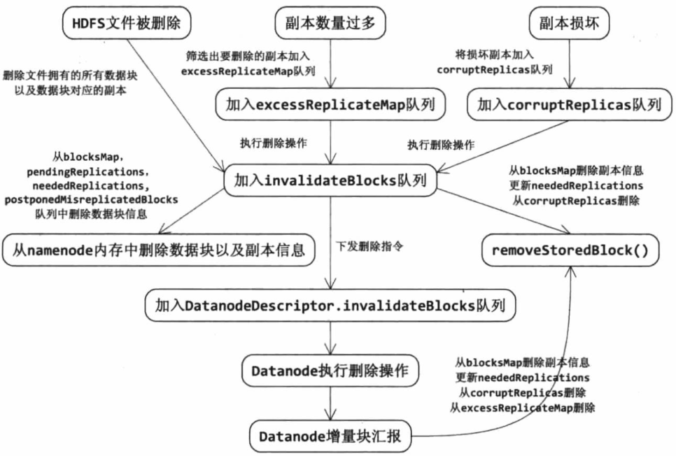

## RPC


### Reactor模式


## 第三章 Namenode

### 3.1文件系统目录树

#### 3.1.4 FSImage

##### 1 fsimage和edits文件

fsimage和edits文件都是经过`序列化(protocol)`的，在NameNode启动的时候，它会将fsimage文件中的所有内容加载到内存中，之后再执行edits文件中的各项操作。使得内存中的元数据和实际的数据同步，存在内存中的元数据支持客户端的读操作。 

在NameNode启动之后，hdfs中的更新操作会重新写到edits文件中，因为fsimage文件一般情况下都是非常大的，可以达到GB级别甚至更高，如果所有的更新操作都向fsimage中添加的话，势必会导致系统运行的越来越慢。但是如果向edits文件中写的话就不会导致这样的情况出现，每次执行写操作后，且在向客户端发送成功代码之前，edits文件都需要同步更新的。 如果一个文件比较大，会使得写操作需要向多台机器进行操作，只有当所有的写操作都执行完成之后，写操作才可以称之为成功。这样的优势就是在任何的操作下都不会因为机器的故障而导致元数据不同步的情况出现。

fsimage包含hadoop文件系统中的所有的目录和文件IDnode的序列化信息。**对于文件来说，包含的信息有修改时间、访问时间、块大小和组成一个文件块信息等**；**对于目录来说，包含的信息主要有修改时间、访问控制权等信息**。**fsimage并不包含DataNode的信息，而是包含DataNode上块的映射信息，并存在内存中**。当一个新的DataNode加入集群时，DataNode都会向NameNode提供块的信息，并且NameNode也会定期的获取块的信息，以便NameNode拥有最新的块映射信息。又因为fsimage包含hadoop文件系统中的所有目录和文件IDnode的序列化信息，所有一旦fsimage出现丢失或者损坏的情况，那么即使DataNode上有块的数据，但是我们没有文件到块的映射关系，所以我们也是没有办法使用DataNode上的数据。所以定期且及时的备份fsimage和edits文件非常重要.


##### 2 **Namenode维护着HDFS中最重要的关系**

1. HDFS文件系统的目录数以及文件的数据块索引，文件系统目录数在3.1节中已经介绍，文件的数据块索引即每个文件对应的数据块列表，这个信息保存在`INodeFile.blocks`字段中。
2. 数据块和数据节点的对应关系，即指定数据块的副本保存在哪些数据节点上的信息。这个信息是在`Datanode`启动时，由`Datanode`上报给`Namenode`的，也就是说这个信息是`Namenode`动态构建起来的，而不是从`fsimage`文件中加载的。

在3.1节中已经介绍了HDFS文件系统目录树的实现，我们知道`Namenode`会定期将文件系统目录树以及文件与数据块的对应关系保存至fsimage文件中，然后在`Namenode`启动时读取fsimage文件以重建HDFS第一关系。**要注意的是第二关系并不会保存至fsimage文件中，也就是说，fsimage并不记录数据块和数据节点的对应关系。**这部分数据是由`Datanode`主动将当前`Datanode`上保存的数据块信息汇报给`Namenode`，然后`Namenode`更新内存中的数据，以维护数据块和数据节点的对应关系。

### 3.2 数据块管理

#### 3.2.1 Block、Replica、BlocksMap

`BlocksMap`是`Namenode`上与数据块相关的最重要的类，它管理着`Namenode`上数据块的元数据，包括当前数据块属于哪个HDFS文件，以及当前数据块保存在哪些`Datanode`上，当`Datanode`启动时，会对`Datanode`的本地磁盘进行扫描，并将当前`Datanode`上保存的数据块信息汇报给`Namenode`。`Namenode`收到`Datanode`的汇报信息后，会建立数据块与保存这个数据块的数据节点的对应关系，并将这个信息保存在`BlocksMap`中，所以无论是获取某个数据块对应的`HDFS`文件，还是获取数据块保存在哪些数据节点上，都需要通过`BlocksMap`对象。

`BlocksMap`通过一个`GSet`对象维护了`Block->BlockInfo`的映射关系，`GSet`是`Hadoop`自己实现的一个比较特殊的集合类型，其特数的地方在于它是一个集合，但却提供类似映射的功能：

```java
private final int capacity;
private volatile GSet<Block,BlockInfo> blocks;
```

**为什么BlocksMap维护的是Block->BlockInfo的对应关系呢？**

这是因为`BlockInfo`保存数据节点的信息都是在`Datanode`启动时上报的，**也就是动态构建的**。而`Namenode`启动时内存中保存的关于数据块的信息只有`Block`类中维护的这么多，所以`Namenode`维护了`Block->BlockInfo`的对应关系，随着`Datanode`不断地上报数据块信息，`BlockInfo`地信息会不断地更新。

#### 3.2.2 数据块状态管理

###### （5）`postponedMisreplicatedBlocks`队列

当`Namenode`发生错误并进行`Actice`与`Standby`切换时，`Namenode`中保存的多余副本不能直接删除，需要先放入`postponedMisreplicatedBlocks`队列中，直到这个数据块地所有副本所在的`Datanode`都进行了块汇报。

为什么这样设计？

1. `blockA`有两个副本，副本1在`datanode1`上，副本2在`datanode2`上
2. 这时，`namenode1`发出删除指令，删除`datanode1`上的副本1
3. 发出删除指令后，`namenode1`发生错误，切换至`namenoe2`
4. 这时`datanode1`并没有进行块汇报，`namenode2`并不知道`datanode1`上已经删除了副本1，所以`namenode2`向`datanode2`发出删除操作
5. `datanode2`删除副本2，数据块地所有副本都被删除了，数据块也就丢失了


###### 数据块副本状态转换图


###### 数据块副本删除流程图




###### 数据块地复制

`Namenode`会在以下三种情况下将一个数据块副本加入`needReplications`队列中以执行数据块副本复制流程：

1. 客户端完成了一个文件地写操作，`Namenode`会检查这个文件包含地所有数据块是否有足够地副本数量，如果不足则加入`neededReplications`队列中
2. 当`Namenode`执行一个`Datanode`地撤销操作时，会将这个`Datanode`上保存的所有副本进行复制，也就是将这些副本加入`neededReplicsations`队列中。
3. `pendingReplications`队列中保存的数据块复制任务超时，会将这些任务重新加入`neededReplications`队列中。

当待复制数据块加入`neededReplications`队列后，会由`RedundancyMonitor`线程处理，调用`computeDatanodeWork()`方法定期从`needReplications`队列中筛选出数据块，然后为这些数据块选择复制的源`Datanode`和目标`Datanode`，再将数据块加入源`Datanode`对应的`DatanodeDescriptor`的`replicateBlocks`队列，生成复制数据块的指令通过心跳响应将指令带到源`Datanode`。完成名字节点指令的生成后，`computeDatnodeWork()`方法会将待复制数据块从`neededReplicatioins`队列中删除，然后加入`pendingReplications`队列。


##### 3 块汇报

为了提高`HDFS`的启动速度，`Namenode`会将`Datanode`的全量块汇报分为两种：启动时发送的第一次全量块汇报和周期性的全量块汇报。对于启动时发送的第一次全量汇报，为了提高响应速度，`Namenode`不会计算哪些元数据需要删除，不会计算无效副本，将这些处理都推迟到下一次块汇报时处理。


