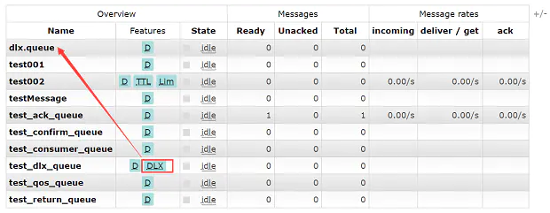
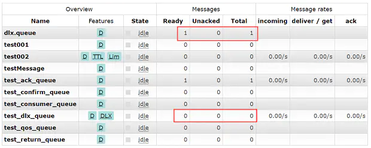

# RabbitMQ

采用Erlang语言实现的AMQP(Advanced Message Queued Protocol)的消息中间件，最初起源于金融系统，用在分布式系统存储转发消息。RabbitMQ的具体特点可以概括为以下几点:

1. 可靠性:RabbitMQ使用一些机制来保证可靠性，如持久化、传输确认及发布确认等。
2. 灵活的路由:在消息进入队列之前，通过交换器来路由消息。对于典型的路由功能，RabbitMQ己经提供了一些内置的交换器来实现。针对更复杂的路由功能，可以将多个交换器绑定在一起，也可以通过插件机制来实现自己的交换器。
3. 扩展性:多个RabbitMQ节点可以组成一个集群，也可以根据实际业务情况动态地扩展集群中节点。
4. 高可用性:队列可以在集群中的机器上设置镜像，使得在部分节点出现问题的情况下队仍然可用。
5. 多种协议:RabbitMQ除了原生支持AMQP协议，还支持STOMP，MQTT等多种消息中间件协议。
6. 多语言客户端:RabbitMQ几乎支持所有常用语言，比如Java、Python、Ruby、PHP、C#、JavaScript等。
7. 管理界面:RabbitMQ提供了一个易用的用户界面，使得用户可以监控和管理消息、集群中的节点等。
8. 插件机制:RabbitMQ提供了许多插件，以实现从多方面进行扩展，当然也可以编写自己的插件。


## RabbitMQ基本概念

1. Broker： 消息队列服务器实体 
2. Exchange： 消息交换机，它指定消息按特定规则，路由到哪个队列 
3. Queue： 消息队列载体，每个消息都会被投入到一个或多个队列 
4. Binding： 绑定，它的作用就是把exchange和queue按照路由规则绑定起来
5. Routing Key： 路由关键字，exchange根据这个关键字进行消息投递 
6. VHost： vhost 可以理解为虚拟 broker ，即 mini-RabbitMQ server。其内部均含有独立的 queue、exchange 和 binding 等，拥有独立的权限系统，可以做到 vhost 范围的用户控制
7. Producer： 消息生产者
8. Consumer： 消息消费者
9. Channel： 消息通道，在客户端的每个连接里，可建立多个channel，每个channel代表一个会话任务


## 死信队列

- 死信队列：DLX，`dead-letter-exchange`
- 利用DLX，当消息在一个队列中变成死信 `(dead message)` 之后，它能被重新publish到另一个Exchange，这个Exchange就是DLX

##### 消息变成死信有以下几种情况

- 消息被拒绝(basic.reject / basic.nack)，并且requeue = false
- 消息TTL过期
- 队列达到最大长度

##### 死信处理过程

- DLX也是一个正常的Exchange，和一般的Exchange没有区别，它能在任何的队列上被指定，实际上就是设置某个队列的属性。
- 当这个队列中有死信时，RabbitMQ就会自动的将这个消息重新发布到设置的Exchange上去，进而被路由到另一个队列。
- 可以监听这个队列中的消息做相应的处理。

##### 死信队列设置

1. 首先需要设置死信队列的exchange和queue，然后进行绑定：


```bash
Exchange: dlx.exchange
Queue: dlx.queue
RoutingKey: #
#表示只要有消息到达了Exchange，那么都会路由到这个queue上
```

1. 然后需要有一个监听，去监听这个队列进行处理
2. 然后我们进行正常声明交换机、队列、绑定，只不过我们需要在队列加上一个参数即可：`arguments.put(" x-dead-letter-exchange"，"dlx.exchange");`，这样消息在过期、requeue、 队列在达到最大长度时，消息就可以直接路由到死信队列！

##### 死信队列演示

生产端

```java
public class Producer {

    public static void main(String[] args) throws Exception {
        //1 创建ConnectionFactory
        ConnectionFactory connectionFactory = new ConnectionFactory();
        connectionFactory.setHost("192.168.43.157");
        connectionFactory.setPort(5672);
        connectionFactory.setVirtualHost("/");
        //2 获取Connection
        Connection connection = connectionFactory.newConnection();
        //3 通过Connection创建一个新的Channel
        Channel channel = connection.createChannel();
        
        String exchange = "test_dlx_exchange";
        String routingKey = "dlx.save";
        
        String msg = "Hello RabbitMQ DLX Message";
        
        AMQP.BasicProperties properties = new AMQP.BasicProperties.Builder()
                .deliveryMode(2)
                .contentEncoding("UTF-8")
                .expiration("10000")
                .build();
        //发送消息
        channel.basicPublish(exchange, routingKey, true, properties, msg.getBytes());
    }
}
```

自定义消费者

```java
public class MyConsumer extends DefaultConsumer {

    public MyConsumer(Channel channel) {
        super(channel);
    }

    @Override
    public void handleDelivery(String consumerTag, Envelope envelope, AMQP.BasicProperties properties, byte[] body) throws IOException {
        System.err.println("-----------consume message----------");
        System.err.println("consumerTag: " + consumerTag);
        System.err.println("envelope: " + envelope);
        System.err.println("properties: " + properties);
        System.err.println("body: " + new String(body));
    }
}
```

消费端

- 声明正常处理消息的交换机、队列及绑定规则
- 在正常交换机上指定死信发送的Exchange
- 声明死信交换机、队列及绑定规则
- 监听死信队列，进行后续处理，这里省略

```dart
public class Consumer {

    public static void main(String[] args) throws Exception {
        
        ConnectionFactory connectionFactory = new ConnectionFactory();
        connectionFactory.setHost("192.168.43.157");
        connectionFactory.setPort(5672);
        connectionFactory.setVirtualHost("/");
        
        Connection connection = connectionFactory.newConnection();
        Channel channel = connection.createChannel();
        
        // 声明一个普通的交换机 和 队列 以及路由
        String exchangeName = "test_dlx_exchange";
        String routingKey = "dlx.#";
        String queueName = "test_dlx_queue";
        
        channel.exchangeDeclare(exchangeName, "topic", true, false, null);
        //指定死信发送的Exchange
        Map<String, Object> agruments = new HashMap<String, Object>();
        agruments.put("x-dead-letter-exchange", "dlx.exchange");
        //这个agruments属性，要设置到声明队列上
        channel.queueDeclare(queueName, true, false, false, agruments);
        channel.queueBind(queueName, exchangeName, routingKey);
        
        //要进行死信队列的声明
        channel.exchangeDeclare("dlx.exchange", "topic", true, false, null);
        channel.queueDeclare("dlx.queue", true, false, false, null);
        channel.queueBind("dlx.queue", "dlx.exchange", "#");
        
        channel.basicConsume(queueName, true, new MyConsumer(channel));
    }
}
```

###### 运行说明

启动消费端，此时查看管控台，新增了两个Exchange，两个Queue。在`test_dlx_queue`上我们设置了DLX，也就代表死信消息会发送到指定的Exchange上，最终其实会路由到`dlx.queue`上。



此时关闭消费端，然后启动生产端，查看管控台队列的消息情况，`test_dlx_queue`的值为1，而`dlx_queue`的值为0。10s后的队列结果如图，由于生产端发送消息时指定了消息的过期时间为10s，而此时没有消费端进行消费，消息便被路由到死信队列中。



实际环境我们还需要对死信队列进行一个监听和处理，当然具体的处理逻辑和业务相关，这里只是简单演示死信队列是否生效。